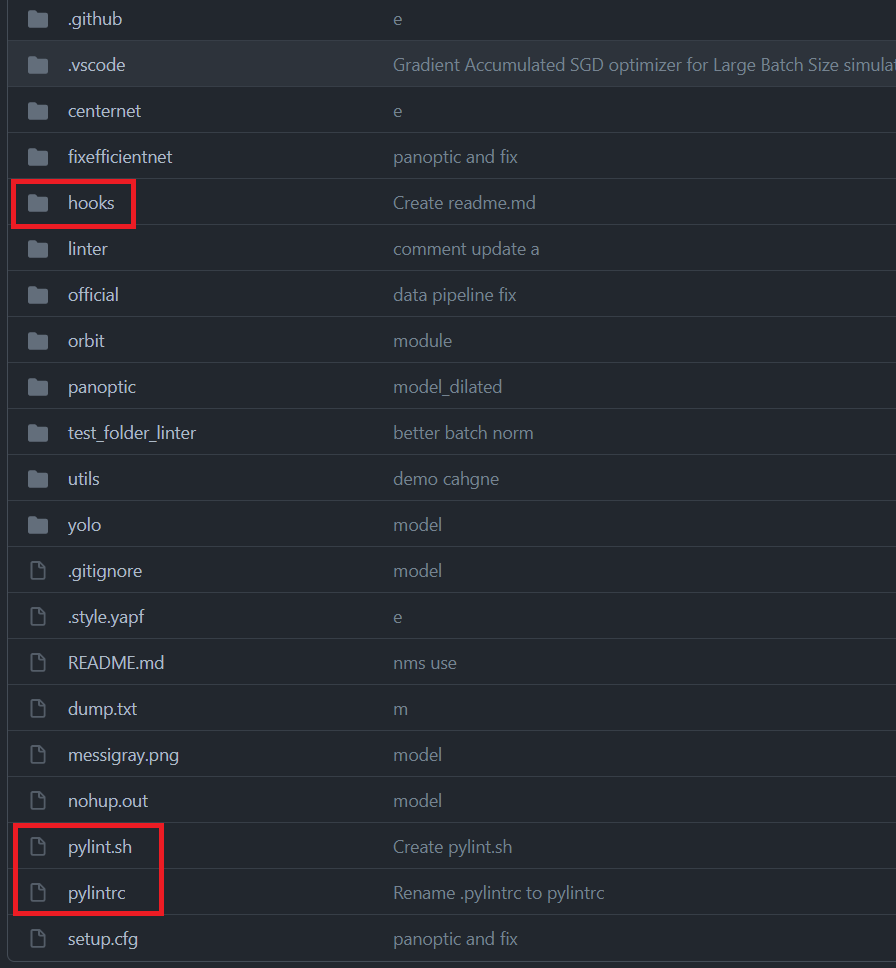
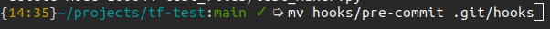
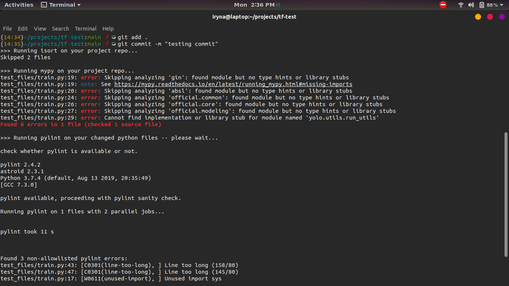

# About 
This folder contains a pre-commit hook that runs the following 
modules in bash when a user types "git commit":
- isort
- mypy
- pylint.sh 

# Dependencies 
You will need to have the following installed on your machine:
- isort 
- mypy 
- pylint

They will be installed through the ```install.sh``` script, or you can 
install them manually.

# Setup
## Required Files 
You will need to have the following in the root directory of your project:
- ```hooks``` directory, which contains the ```pre-commit``` hook script
- ```pylintrc``` config file
 
The files are located [here](https://github.com/PurdueCAM2Project/TensorFlowModels/tree/yolo_debug_linter)
in the root folder of the ```yolo_linter_debug``` branch:



## install.sh
You can easily set everything up by navigating into the ```hooks``` folder and running the 
install script with the following command in your terminal: ```bash install.sh```. 

__NOTE__: make sure your ```install.sh``` file is set up as an executable; if it isn't, run
the command ```chmod +x install.sh```. 

## Manual Installation 
If you want to set things up manually, what you can do is the following:
- copy and paste the ```pre-commit``` script into your local ```.git/hooks``` directory like so:

, OR 
- create a symbolic link from the ```hooks``` directory to the ```.git/hooks``` directory
using the following command (run the command in project root directory):
```ln -s -f ../../hooks/pre-commit .git/hooks/pre-commit```

And that's it! Now when you run ```git commit``` command on your local machine, 
you will see the following output: 



# Important Notes
- You need to make sure the ```pre-commit``` and the ```pylint.sh``` files are 
executables; if they're not, use the command ```sudo chmod +x {FILENAME}``` to
make them executables
- If you run into permission issues with "git add . " command when running the pre-commit hook, 
use the following command to fix the issue: ```sudo chown -R "${USER:-$(id -un)}" . ```
