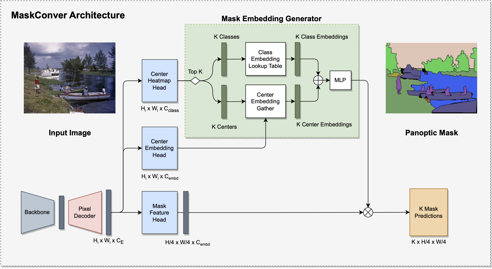
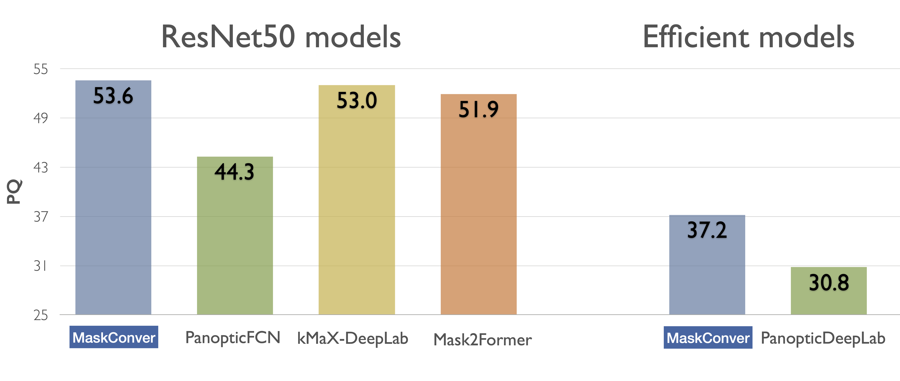
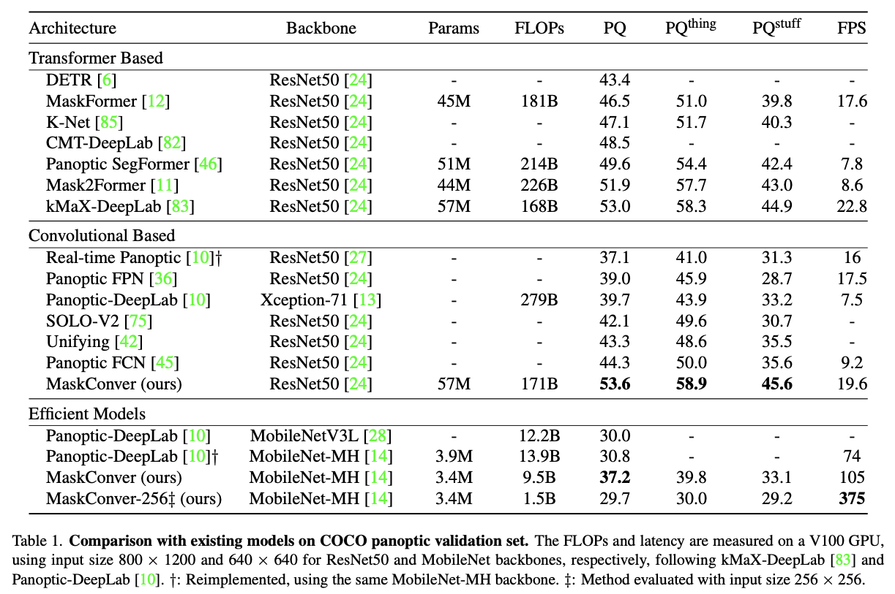

# MaskConver: Revisiting Pure Convolution Model for Panoptic Segmentation (WACV 2024)

[](https://arxiv.org/abs/2312.06052)


[MaskConver](https://arxiv.org/abs/2312.06052) is a pure convolutional panoptic
architecture. MaskConver proposes to fully unify things and stuff representation
by predicting their centers. To that extent, it creates a lightweight class
embedding module that can break the ties when multiple centers co-exist in the
same location. Furthermore, our study shows that the decoder design is critical
in ensuring that the model has sufficient context for accurate detection and
segmentation. We introduce a powerful ConvNeXt-UNet decoder that closes the
performance gap between convolution- and transformer based models. With ResNet50
backbone, our MaskConver achieves 53.6% PQ on the COCO panoptic val set,
outperforming the modern convolution-based model, Panoptic FCN, by 9.3% as well
as transformer-based models such as Mask2Former (+1.7% PQ) and kMaX-DeepLab
(+0.6% PQ). Additionally, MaskConver with a MobileNet backbone reaches 37.2% PQ,
improving over Panoptic-DeepLab by +6.4% under the same FLOPs/latency
constraints. A further optimized version of MaskConver achieves 29.7% PQ, while
running in real-time on mobile devices.


MaskConver meta-architecture:

<p align="center">

</p>

The meta architecture of MaskConver contains four components: backbone (gray),
pixel decoder (pink), prediction heads (light blue), and mask embedding
generator (green). The backbone is any commonly deployed neural network, e.g.,
ResNet50. We propose a novel ConvNeXt-UNet for the pixel decoder, which
effectively captures long-range context and high-level semantics by stacking
many ConvNeXt blocks at the highest level of backbone. We propose three
prediction heads: Center Heatmap Head (for predicting center point heatmaps),
Center Embedding Head (for predicting the embeddings for center points), and
Mask Feature Head (for generating mask features). The Mask Embedding Generator
first produces the class embeddings via a lookup table (Class Embedding Lookup
Table module) by taking the predicted semantic classes from the top-K center
points. The output mask embeddings are obtained by modulating the class
embeddings with the center embeddings (via addition and MLP) to mitigate the
center point collision between instances of different classes. In the end, the
mask features are multiplied with the mask embeddings to generate the final
binary masks. Unlike transformer-based methods, MaskConver only exploits
convolutions without any self- or cross-attentions.

<p align="center">

</p>

<p align="center">

</p>


## Performance Reference


| Backbone     | Image Size | Params | FLOPS | PQ   | Latency  | Link |
| ------------ | ---------- | ------ | ----- | ---- | -------- | ---- |
| MobileNet-MH | 256x256    | 3.4M   | 1.5B  | 29.7 | 17.12 ms | maskconver_mobilenetv3p5_rf_256_coco.yaml |
| MobileNet-MH | 640x640    | 3.4M   | 9.58B | 37.2 | 24.93 ms | maskconver_mobilenetv3p5_rf_640_coco.yaml|


### Citation

Should you find this repository useful, please consider citing:

```
@inproceedings{rashwan2024maskconver,
  title={MaskConver: Revisiting Pure Convolution Model for Panoptic Segmentation},
  author={Abdullah Rashwan and Jiageng Zhang and Ali Taalimi and Fan Yang and Xingyi Zhou and Chaochao Yan and Liang-Chieh Chen and Yeqing Li},
  year={2024},
  booktitle={2024 IEEE Winter Conference on Applications of Computer Vision (WACV)},
  organization={IEEE}
}
```


