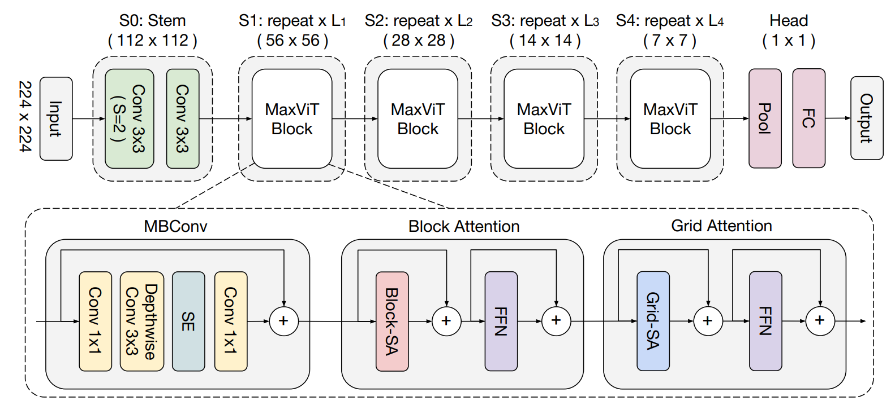
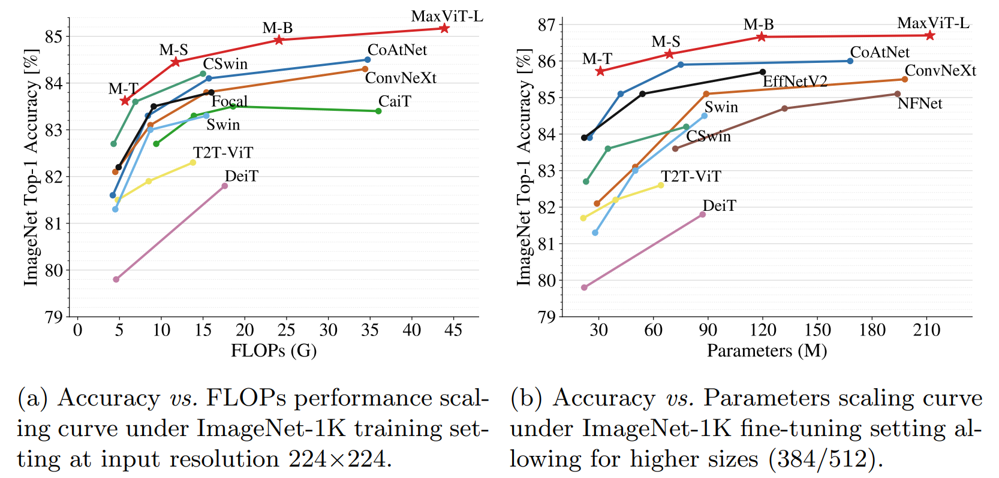
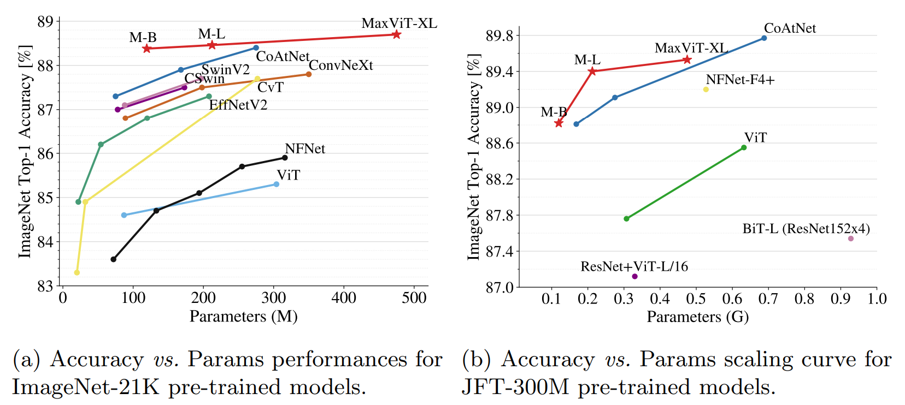

# MaxViT: Multi-Axis Vision Transformer (ECCV 2022)

[](https://arxiv.org/abs/2204.01697)

⚠️ **DISCLAIMER**: This implementation is still under development.

[TOC]

[MaxViT](https://arxiv.org/abs/2204.01697) is a family of hybrid (CNN + ViT)
vision backbone models, that achieves better performances across the board
for both parameter and FLOPs efficiency than both state-of-the-art ConvNets and
Transformers ([Blog](https://ai.googleblog.com/2022/09/a-multi-axis-approach-for-vision.html)).
They can also scale well on large dataset sizes like ImageNet-21K.
Notably, due to the linear-complexity of the grid attention used, MaxViT scales
well on tasks requiring large image sizes, such as object detection and
segmentation.

MaxViT meta-architecture: a homogeneously stacked backbone, wherein each MaxViT
block contains [MBConv](https://arxiv.org/abs/2104.00298), block attention
(window-based local attention), and grid attention (dilated global attention).

<p align="center">

</p>

Results on ImageNet-1k standard train and test:

<p align="center">

</p>

Results on ImageNet-21k and JFT pre-trained models:

<p align="center">

</p>


### Model Performance

Note: Deit ImageNet pretrain experimental settings are different from the
paper. These experiments follows the pre-training hyperparameters in
[paper](https://arxiv.org/abs/2204.01697) and only run pre-training for similar
number of steps. The paper suggested a short fine-tuning with different
hyper-parameters and EMA.

<section class="tabs">

#### Deit ImageNet pretrain {.new-tab}

Model         | Eval Size | Top-1 Acc   | Acc on Paper | #Param | #FLOPs | Config
------------- | --------- | :---------: | :----------: | :----: | :----: | :----:
MaxViT-Tiny   | 224x224   | 83.1 (-0.5) | 83.6         | 31M    | 5.6G   | [config](configs/experiments/maxvit_tiny_imagenet.yaml)
MaxViT-Small  | 224x224   | 84.1 (-0.3) | 84.4         | 69M    | 11.7G  | [config](configs/experiments/maxvit_small_imagenet.yaml)
MaxViT-Base   | 224x224   | 84.2 (-0.7) | 84.9         | 120M   | 23.4G  | [config](configs/experiments/maxvit_base_imagenet.yaml)
MaxViT-Large  | 224x224   | 84.6 (-0.6) | 85.2         | 212M   | 43.9G  | [config](configs/experiments/maxvit_large_imagenet.yaml)
MaxViT-XLarge | 224x224   | 84.8        | -            | 475M   | 97.9G  | [config](configs/experiments/maxvit_xlarge_imagenet.yaml)

#### Cascade RCNN models {.new-tab}

Model        | Image Size | Window Size | Epochs | box AP        | box AP on paper | mask AP | Config
------------ | ---------: | :---------: | :----: | :-----------: | :-------------: | :-----: | :----:
MaxViT-Tiny  | 640x640    | 20x20       | 200    | 49.97         | -               | 42.69   | [config](configs/experiments/coco_maxvitt_i640_crcnn.yaml)
MaxViT-Tiny  | 896x896    | 28x28       | 200    | 52.35 (+0.25) | 52.1            | 44.69   | -
MaxViT-Small | 640x640    | 20x20       | 200    | 50.79         | -               | 43.36   | -
MaxViT-Small | 896x896    | 28x28       | 200    | 53.54 (+0.44) | 53.1            | 45.79   | [config](configs/experiments/coco_maxvits_i896_crcnn.yaml)
MaxViT-Base  | 640x640    | 20x20       | 200    | 51.59         | -               | 44.07   | [config](configs/experiments/coco_maxvitb_i640_crcnn.yaml)
MaxViT-Base  | 896x896    | 28x28       | 200    | 53.47 (+0.07) | 53.4            | 45.96   | [config](configs/experiments/coco_maxvitb_i896_crcnn.yaml)

</section>


<section class="tabs">

#### JFT-300M supervised pretrain {.new-tab}

Model         | Pretrain Size | #Param | #FLOPs | globalPR-AUC
------------- | :------------ | :----: | :----: | :----------:
MaxViT-Base   | 224x224       | 120M   | 23.4G  | 52.75%
MaxViT-Large  | 224x224       | 212M   | 43.9G  | 53.77%
MaxViT-XLarge | 224x224       | 475M   | -      | 54.71%


#### ImageNet Finetuning {.new-tab}

Model         | Image Size | Top-1 Acc       | Acc on Paper | #Param | #FLOPs | Config
------------- | :--------- | :-------------: | :----------: | :----: | :----: | :----:
MaxViT-Base   | 384x384    | 88.37% (-0.32%) | 88.69%       | 120M   | 74.2G  | [config](configs/experiments/finetune_maxvitb_imagenet_i384.yaml)
MaxViT-Base   | 512x512    | 88.63% (-0.19%) | 88.82%       | 120M   | 138.3G | [config](configs/experiments/finetune_maxvitb_imagenet_i512.yaml)
MaxViT-Large  | 384x384    | 88.86% (-0.26%) | 89.12%       | 212M   | 128.7G | [config](configs/experiments/finetune_maxvitl_imagenet_i384.yaml)
MaxViT-Large  | 512x512    | 89.02% (-0.39%) | 89.41%       | 212M   | 245.2G | [config](configs/experiments/finetune_maxvitl_imagenet_i512.yaml)
MaxViT-XLarge | 384x384    | 89.21% (-0.15%) | 89.36%       | 475M   | 293.7G | [config](configs/experiments/finetune_maxvitxl_imagenet_i384.yaml)
MaxViT-XLarge | 512x512    | 89.31% (-0.22%) | 89.53%       | 475M   | 535.2G | [config](configs/experiments/finetune_maxvitxl_imagenet_i512.yaml)

#### Cascade RCNN models {.new-tab}

Model        | Image Size | Window Size | Epochs | box AP        | box AP on paper | mask AP | Config
------------ | ---------: | :---------: | :----: | :-----------: | :-------------: | :-----: | :----:
MaxViT-Base  | 896x896    | 28x28       | 200    | 54.31 (+0.91) | 53.4            | 46.31   | [config](configs/experiments/coco_maxvitb_i896_crcnn.yaml)
MaxViT-Large | 896x896    | 28x28       | 200    | 54.69         | -               | 46.59   | [config](configs/experiments/coco_maxvitl_i896_crcnn.yaml)

</section>

### Citation

Should you find this repository useful, please consider citing:

```
@article{tu2022maxvit,
  title={MaxViT: Multi-Axis Vision Transformer},
  author={Tu, Zhengzhong and Talebi, Hossein and Zhang, Han and Yang, Feng and Milanfar, Peyman and Bovik, Alan and Li, Yinxiao},
  journal={ECCV},
  year={2022},
}
```
