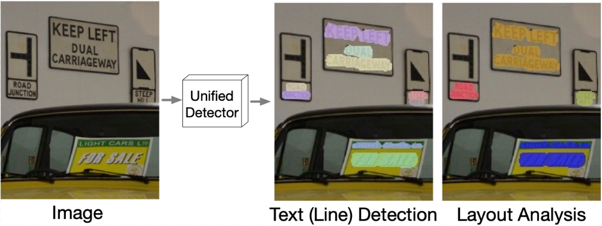

# Towards End-to-End Unified Scene Text Detection and Layout Analysis



[](https://arxiv.org/abs/2203.15143)

Official TensorFlow 2 implementation of the paper `Towards End-to-End Unified
Scene Text Detection and Layout Analysis`. If you encounter any issues using the
code, you are welcome to submit them to the Issues tab or send emails directly
to us: `hiertext@google.com`.

## Installation

### Set up TensorFlow Models

```bash
# (Optional) Create and enter a virtual environment
pip3 install --user virtualenv
virtualenv -p python3 unified_detector
source ./unified_detector/bin/activate

# First clone the TensorFlow Models project:
git clone https://github.com/tensorflow/models.git

# Install the requirements of TensorFlow Models and this repo:
cd models
pip3 install -r official/requirements.txt
pip3 install -r official/projects/unified_detector/requirements.txt

# Compile the protos
# If `protoc` is not installed, please follow: https://grpc.io/docs/protoc-installation/
export PYTHONPATH=${PYTHONPATH}:${PWD}/research/
cd research/object_detection/
protoc protos/string_int_label_map.proto --python_out=.
```

### Set up Deeplab2

```bash
# Clone Deeplab2 anywhere you like
cd <somewhere>
git clone https://github.com/google-research/deeplab2.git

# Compile the protos
protoc deeplab2/*.proto --python_out=.

# Add to PYTHONPATH the directory where deeplab2 sits.
export PYTHONPATH=${PYTHONPATH}:${PWD}
```

## Running the model on some images using the provided checkpoint.

### Download the checkpoint

Model                                                                                                                              | Input Resolution | #object query | line PQ (val) | paragraph PQ (val) | line PQ (test) | paragraph PQ (test)
---------------------------------------------------------------------------------------------------------------------------------- | ---------------- | ------------- | ------------- | ------------------ | -------------- | -------------------
Unified-Detector-Line ([ckpt](https://storage.cloud.google.com/tf_model_garden/vision/unified_detector/unified_detector_ckpt.tgz)) | 1024             | 384           | 61.04         | 52.84              | 62.20          | 53.52

### Demo on single images

```bash
# run from `models/`
python3 -m official.projects.unified_detector.run_inference \
--gin_file=official/projects/unified_detector/configs/gin_files/unified_detector_model.gin \
--ckpt_path=<path-of-the-ckpt> \
--img_file=<some-image> \
--output_path=<some-directory>/demo.jsonl \
--vis_dir=<some-directory>

```

The output will be stored in jsonl in the same hierarchical format as required
by the evaluation script of the HierText dataset. There will also be
visualizations of the word/line/paragraph boundaries. Note that, the unified
detector produces line-level masks and an affinity matrix for grouping lines
into paragraphs. For visualization purpose, we split each line mask into pixel
groups which are defined as connected components/pixels. We visualize these
groups as `words`. They are not necessarily at the word granularity, though. We
visualize lines and paragraphs as groupings of these `words` using axis-aligned
bounding boxes.

##### FAQ
1. __Q: What is `ckpt_path`__? A: If you download the checkpoint as instructed
above, you will obtain two files: `<some-directory>/ckpt.index` and
`<some-directory>/ckpt.data-00000-of-00001`.
You need to set `--ckpt_path=<some-directory>/ckpt`, i.e. removing the suffix.


## Inference and Evaluation on the HierText dataset

### Download the HierText dataset

Clone the [HierText repo](https://github.com/google-research-datasets/hiertext)
and download the dataset. The `requirements.txt` in this folder already covers
those in the HierText repo, so there is no need to create a new virtual
environment again.

### Inference and eval

The following command will run the model on the validation set and compute the
score. Note that the test set annotation is not released yet, so only validation
set is used here for demo purposes.

#### Inference

```bash
# Run from `models/`
python3 -m official.projects.unified_detector.run_inference \
--gin_file=official/projects/unified_detector/configs/gin_files/unified_detector_model.gin \
--ckpt_path=<path-of-the-ckpt> \
--img_dir=<the-directory-containing-validation-images> \
--output_path=<some-directory>/validation_output.jsonl

```

#### Evaluation

```bash
# Run from `hiertext/`
python3 eval.py \
--gt=gt/validation.jsonl \
--result=<some-directory>/validation_output.jsonl \
--output=./validation-score.txt \
--mask_stride=1 \
--eval_lines \
--eval_paragraphs \
--num_workers=0

```

## Train new models.

First, you will need to convert the HierText dataset into TFrecords:

```bash
# Run from `models/official/projects/unified_detector/data_conversion`
CUDA_VISIBLE_DEVICES='' python3 convert.py \
--gt_file=/path/to/gt.jsonl \
--img_dir=/path/to/image \
--out_file=/path/to/tfrecords/file-prefix

```

To train the unified detector, run the following script:

```bash
# Run from `models/`
python3 -m official.projects.unified_detector.train \
--mode=train \
--experiment=unified_detector \
--model_dir='<some path>' \
--gin_file='official/projects/unified_detector/configs/gin_files/unified_detector_train.gin' \
--gin_file='official/projects/unified_detector/configs/gin_files/unified_detector_model.gin' \
--gin_params='InputFn.input_paths = ["/path/to/tfrecords/file-prefix*"]'

```

## Citation

Please cite our [paper](https://arxiv.org/pdf/2203.15143.pdf) if you find this
work helpful:

```
@inproceedings{long2022towards,
  title={Towards End-to-End Unified Scene Text Detection and Layout Analysis},
  author={Long, Shangbang and Qin, Siyang and Panteleev, Dmitry and Bissacco, Alessandro and Fujii, Yasuhisa and Raptis, Michalis},
  booktitle={Proceedings of the IEEE/CVF Conference on Computer Vision and Pattern Recognition},
  year={2022}
}
```
