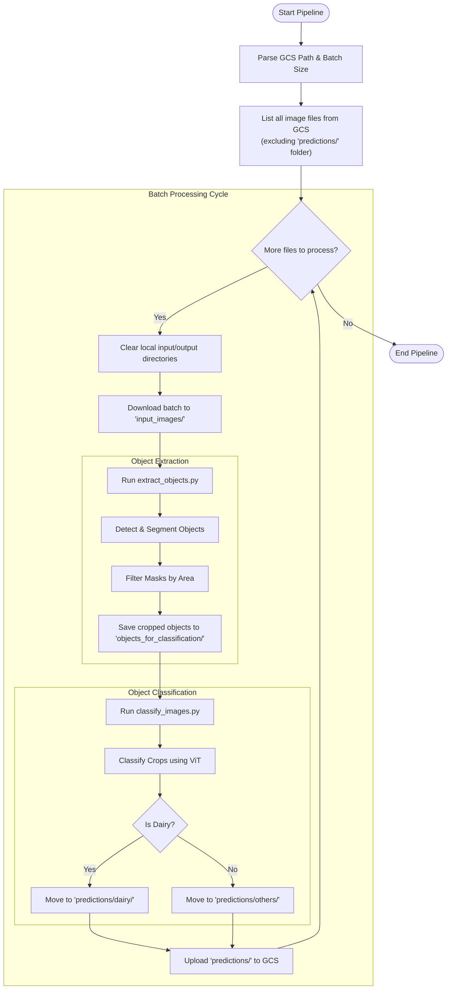

# Dairy Product Detection Pipeline

This pipeline detects and extracts dairy product packets from a folder of image
frames.

## Workflow
<!-- disableFinding(SNIPPET_INVALID_LANGUAGE) -->


We offer two types of deployment approaches:

## Deployment Approaches

*   [Automated Deployment](#automated-deployment)
*   [Manual Deployment](#manual-deployment)

## Automated Deployment

This project includes a fully automated deployment script, `deploy.sh`, that
provisions all the necessary GCP resources and deploys the milk pouch detection
service on a Google Compute Engine (GCE) instance.

The script will:
1.  Configure your GCP project.
2.  Enable all required service APIs.
3.  Create BigQuery dataset and table.
4.  Create GCS buckets for images. Existing buckets can also be used.
5.  Create an Artifact Registry repository.
6.  Build and push the container image using Cloud Build.
7.  Create a service account with the necessary permissions.
8.  Deploy a GCE instance with the container running.

### Prerequisites

-   You must have the [Google Cloud CLI (`gcloud`)](https://cloud.google.com/sdk/docs/install) installed and authenticated.
-   You need a GCP project with billing enabled.

### Usage

The `deploy.sh` script can be run from your local machine or a Cloudtop
environment.

```bash
./deploy.sh --gcp_project_id=<your-gcp-project-id> [options]
```

### Arguments

| Argument | Description | Required | Default |
| :--- | :--- | :--- | :--- |
| `--gcp_project_id` | Your Google Cloud Project ID. | **Yes** | |
| `--region` | The GCP region for resource deployment. | No | `us-central1` |
| `--zone` | The GCP zone for the GCE instance. | No | `us-central1-a` |
| `--device` | The type of hardware for processing. Can be `cpu` or `gpu`. | No | `gpu` |

### Example

To deploy the service with a GPU in your project:

```bash
./deploy.sh --gcp_project_id my-waste-detection-project --device gpu --compute gce
```

After the deployment is complete, you can start using the service by uploading
images to the source GCS bucket created by the script. The script output will
provide the name of the bucket.

```bash
gsutil cp your-local-image.jpg gs://<source-bucket-name>/
```
---

## Manual Deployment

### Prerequisites

- GCP account with Compute Engine access
- A GCP bucket folder containing images to process

### Setup Instructions

### 1. Create a VM Instance

Many VM configurations will work, but CUDA version should be 12.4. Here's a
supported configuration:
<p>
  <a href="https://cloud.google.com/compute/docs/gpus/create-gpu-vm-general-purpose">Create a Compute Engine virtual machine (VM) that has attached an NVIDIA T4 GPU</a>. Use the following settings on your VM:
</p>
<ul>
  <li><strong>Machine configuration</strong>:
    <ul>
      <li><strong>Type</strong>: GPUs</li>
      <li><strong>GPU type</strong>: NVIDIA T4</li>
      <li><strong>Number of GPUs</strong>: 1</li>
      <li><strong>Machine type</strong>: n1-standard-8 (8 vCPU, 4 core, 30 GB memory)</li>
    </ul>
  </li>
  <li><strong>OS and storage</strong>: Click
  <b>Change</b> and select the following:
    <ul>
      <li><strong>Operating system</strong>: Deep Learning on Linux</li>
      <li><strong>Version</strong>: Deep Learning VM with
      CUDA 12.4 preinstalled. Debian 11, Python 3.10. You can choose
      any <i>M</i> number with this configuration, for example, M129.</li>
      <li><strong>Boot disk type</strong>: Balanced persistent disk</li>
      <li><strong>Size (GB)</strong>: 200 GB</li>
    </ul>
  </li>
</ul>
<p>
  <strong>Note</strong>: Give your VM a name that is easy to remember and deploy in a region and a zone close to your physical location that allows GPUs.
</p>
<br>

### 2. Download the Setup Script

SSH into your VM instance. If this is the first access, you will be prompted
to install nVidia drivers. After this is complete, run:

```bash
curl -o setup.sh https://raw.githubusercontent.com/tensorflow/models/master/official/projects/waste_identification_ml/llm_applications/milk_pouch_detection/src/setup.sh
```

### 3. Run the Setup Script

Execute the setup script to download all required files and dependencies:

```bash
bash setup.sh
```

This will automatically download all necessary files for running the
detection pipeline.

### 4. Process Your Images

Given a gcs bucket path containing your test images, run:

```bash
bash milk_pouch_product/run_pipeline.sh --gcs_path=/path/to/test_images
```

Replace `/path/to/test_images` with the actual bucket path to your image
folder, for example:

```bash
bash milk_pouch_product/run_pipeline.sh --gcs_path=gs://dairy_product_detection/test_images/

# Results will be in:
# $gcs_path/predictions/dairy/
# $gcs_path/predictions/others/
```

### Troubleshooting

- Ensure your VM has sufficient memory and disk space
- Verify that all image files are in supported formats (JPG, PNG, etc.)
- Check that you have proper read/write permissions for the input directory

## Dataset Creation for Training ML Models

This guide explains how to create datasets for training image classifier, object
detection, or instance segmentation models from images of a particular
category.

### 1. Prepare Your Images

Organize your images into a folder. These should be images containing objects of
a particular category (e.g., dairy products, bottles, cans, etc.).

### 2. Run the Extract Objects Script

Execute the following command to extract objects and generate dataset files:

```python
python3 extract_objects.py --gcs_path=/test_path --category_name=${category}
```

Replace:

- `/test_path` with the path to your image folder.
- `category` with your category name (e.g., bottles, cans, plastic, etc.)

### 3. Generated Outputs

The script will generate two types of outputs:

#### For Image Classification Models

A folder named **objects_for_classification** will be created containing all
cropped objects extracted from the images. These cropped images can be
directly used to train an image classifier model

#### For Object Detection/Segmentation Models

A COCO JSON file will be generated containing:

- Annotations for all detected objects
- Bounding boxes and segmentation masks
- This file can be used to train object detection or instance segmentation models

### Example Usage

```python
# Extract dairy products from images
python3 extract_objects.py --gcs_path=/home/user/dairy_images --category_name=dairy

# Extract plastic bottles
python3 extract_objects.py --gcs_path=/home/user/bottle_images --category_name=bottles

# Extract metal cans
python3 extract_objects.py --gcs_path=/home/user/can_images --category_name=cans
```

### Output Structure

After running the script, your directory will look like:

```
/test_images/
├── image1.jpg
├── image2.jpg
├── objects_for_classification
│   ├── crop_001.jpg
│   ├── crop_002.jpg
│   └── ...
└── annotations.json  # COCO format file for detection/segmentation
```

### Use Cases

- **Image Classification Training/Finetuning**: Use images from
`objects_for_classification/` folder
- **Object Detection Training/Finetuning**: Use the COCO JSON file with
original images
- **Instance Segmentation Training/Finetuning**: Use the COCO JSON file with
segmentation masks

### Tips

- Ensure your images are clear and objects are visible
- Use consistent naming for category names across your datasets
- Verify the generated annotations before training your models