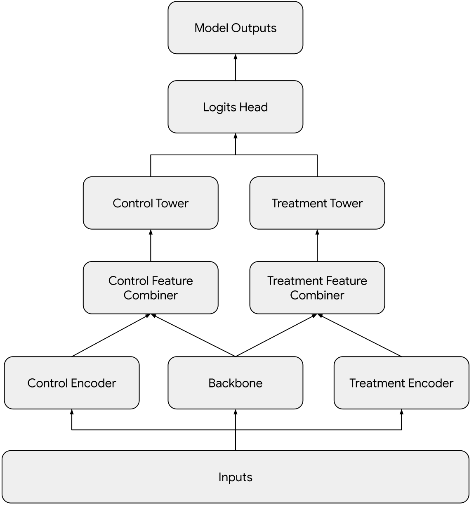

# Uplift Modeling Library

Uplift modeling is a predictive modeling technique that models the incremental
impact of a treatment on an individual. This repository contains a suite of
tools to build, train, evaluate and export an uplift model in TensorFlow 2. All
components are built in a modular fashion and integrate well with other TF-based
systems such as TFX, Tensorflow Transform (TFT) and Tensorflow Model Analysis
(TFMA). We use Keras as our modeling framework.

The library is divided into the following key directories:

-   **layers**: Keras layers related to uplift modeling.
-   **models**: Keras models that contain all the necessary logic to train,
    evaluate and do inference on an uplift model.
-   **metrics**: Keras metrics used in uplift modeling.
-   **losses**: Keras losses used in uplift modeling.

## Two Tower Uplift Model
The initial release focuses on the family of models that follow a two tower
uplift network architecture. The architecture draws inspiration from several
related works in the field of treatment effect estimation [^1] [^2] [^3] [^4]
[^5].




- **Inputs**: a mapping from feature names to feature tensors. The tensors can
be of different types, eg `tf.Tensor`, `tf.SparseTensor` and `tf.RaggedTensor`.
- **Backbone**: a trainable network that computes an embedding from the inputs
shared between the control and treatment arms.
- **Control & Treatment Feature Encoders**: trainable networks that compute
embeddings from control and treatment speficic features.
- **Control & Treatment Feature Combiners**: methods to combine the backbone's
shared embedding with the control/treatment specific embeddings.
- **Control Tower**: trainable network with zero or more hidden layers that
learns from control examples only.
- **Treatment Tower**: trainable network with zero or more hidden layers that
learns from treatment examples only.
- **Logits Head**: computes control and treatment logits. At training time, the
gradient flows from the control logits for control examples and from the
treatment logits for the treatment examples.

Example usage:

```python
# Create a two tower uplift model.
uplift_network = two_tower_uplift_network.TwoTowerUpliftNetwork(
    backbone=encoders.concat_features.ConcatFeatures(
        feature_names=["shared_feature_1", "shared_feature_2"]
    ),
    treatment_feature_encoder=encoders.concat_features.ConcatFeatures(
        feature_names=["treatment_feature_1", "treatment_feature_2"]
    ),
    treatment_input_combiner=tf.keras.layers.Concatenate(),
    treatment_tower=tf.keras.Sequential([
        tf.keras.layers.Dense(64, activation="relu"),
        tf.keras.layers.Dropout(0.1),
    ]),
    control_tower=tf.keras.Sequential([
        tf.keras.layers.Dense(128, activation="relu"),
        tf.keras.layers.Dropout(0.1),
        tf.keras.layers.Dense(32, activation="relu")
    ]),
    logits_head=two_tower_logits_head.TwoTowerLogitsHead(
        control_head=tf.keras.layers.Dense(1),
        treatment_head=tf.keras.layers.Dense(1),
    ),
)
model = two_tower_uplift_model.TwoTowerUpliftModel(
  treatment_indicator_feature_name="is_treatment",
  uplift_network=uplift_network,
)

# Compile and train the model.
model.compile(
  optimizer=tf.keras.optimizers.Adagrad(learning_rate=0.05),
  loss=true_logits_loss.TrueLogitsLoss(tf.keras.losses.mean_squared_error),
  metrics=[
    treatment_fraction.TreatmentFraction(),
    uplift_mean.UpliftMean(),
    label_mean.LabelMean(),
    label_variance.LabelVariance(),
  ]
)
model.fit(dataset, epochs=10)
```

[^1]: Johansson, Fredrik, Uri Shalit, and David Sontag. "Learning
    representations for counterfactual inference." *International conference
    on machine learning*. PMLR, 2016.
[^2]: Shalit, Uri, Fredrik D. Johansson, and David Sontag. "Estimating
    individual treatment effect: generalization bounds and algorithms."
    *International conference on machine learning*. PMLR, 2017.
[^3]: Johansson, Fredrik D., et al. "Learning weighted representations for
    generalization across designs." *arXiv preprint arXiv:1802.08598* (2018).
[^4]: Hassanpour, Negar and Russell Greiner. “CounterFactual Regression with
    Importance Sampling Weights.” *International Joint Conference on
    Artificial Intelligence* (2019).
[^5]: Hassanpour, Negar and Russell Greiner. “Learning Disentangled
    Representations for CounterFactual Regression.” *International Conference
    on Learning Representations* (2020).
