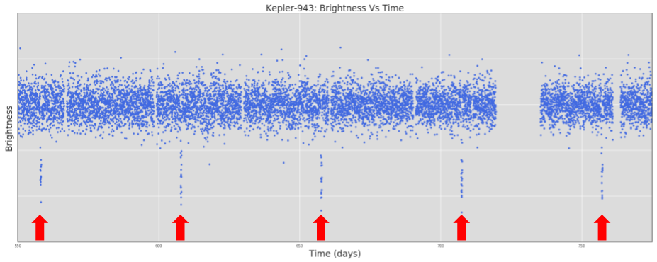
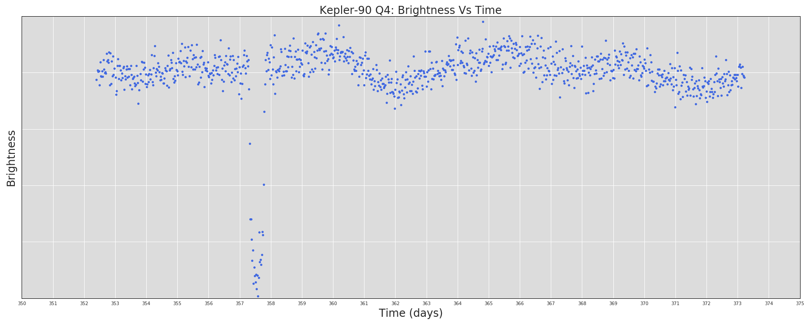
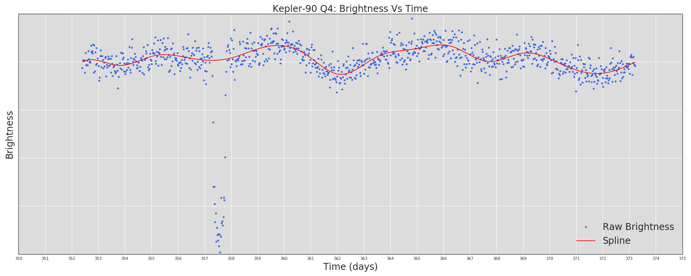
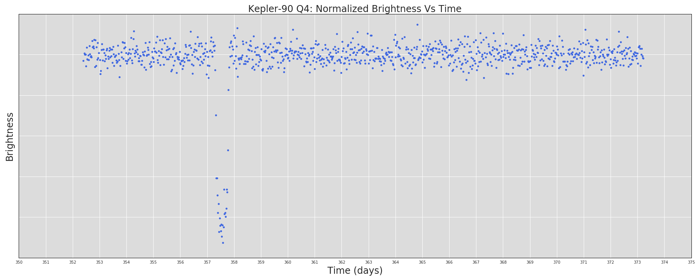
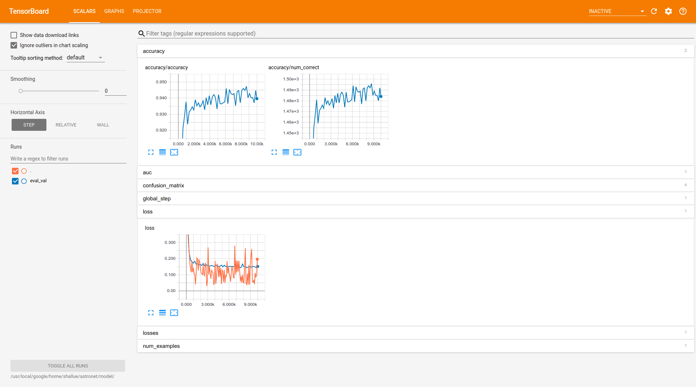
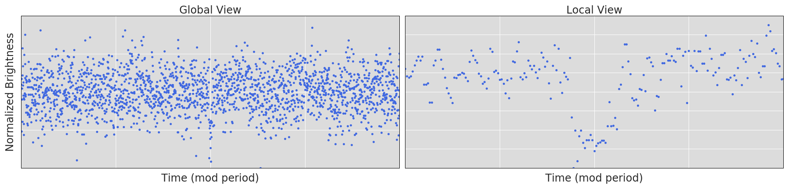

# AstroNet: A Neural Network for Identifying Exoplanets in Light Curves


## Contact

Chris Shallue: [@cshallue](https://github.com/cshallue)

## Background

This directory contains TensorFlow models and data processing code for
identifying exoplanets in astrophysical light curves. For complete background,
see [our paper](http://adsabs.harvard.edu/abs/2018AJ....155...94S) in
*The Astronomical Journal*.

For shorter summaries, see:

* ["Earth to Exoplanet"](https://www.blog.google/topics/machine-learning/hunting-planets-machine-learning/) on the Google blog
* [This blog post](https://www.cfa.harvard.edu/~avanderb/page1.html#kepler90) by Andrew Vanderburg
* [This great article](https://milesobrien.com/artificial-intelligence-gains-intuition-hunting-exoplanets/) by Fedor Kossakovski
* [NASA's press release](https://www.nasa.gov/press-release/artificial-intelligence-nasa-data-used-to-discover-eighth-planet-circling-distant-star) article

## Citation

If you find this code useful, please cite our paper:

Shallue, C. J., & Vanderburg, A. (2018). Identifying Exoplanets with Deep
Learning: A Five-planet Resonant Chain around Kepler-80 and an Eighth Planet
around Kepler-90. *The Astronomical Journal*, 155(2), 94.

Full text available at [*The Astronomical Journal*](http://iopscience.iop.org/article/10.3847/1538-3881/aa9e09/meta).

## Code Directories

[astronet/](astronet/)

* [TensorFlow](https://www.tensorflow.org/) code for:
  * Downloading and preprocessing Kepler data.
  * Building different types of neural network classification models.
  * Training and evaluating a new model.
  * Using a trained model to generate new predictions.

[light_curve_util/](light_curve_util)

* Utilities for operating on light curves. These include:
  * Reading Kepler data from `.fits` files.
  * Applying a median filter to smooth and normalize a light curve.
  * Phase folding, splitting, removing periodic events, etc.
* In addition, some C++ implementations of light curve utilities are located in
[light_curve_util/cc/](light_curve_util/cc).

[third_party/](third_party/)

* Utilities derived from third party code.


## Walkthrough

### Install Required Packages

First, ensure that you have installed the following required packages:

* **TensorFlow** ([instructions](https://www.tensorflow.org/install/))
* **Pandas** ([instructions](http://pandas.pydata.org/pandas-docs/stable/install.html))
* **NumPy** ([instructions](https://docs.scipy.org/doc/numpy/user/install.html))
* **AstroPy** ([instructions](http://www.astropy.org/))
* **PyDl** ([instructions](https://pypi.python.org/pypi/pydl))
* **Bazel** ([instructions](https://docs.bazel.build/versions/master/install.html))
* **Abseil Python Common Libraries** ([instructions](https://github.com/abseil/abseil-py))
    * Optional: only required for unit tests.

### Optional: Run Unit Tests

Verify that all dependencies are satisfied by running the unit tests:

```bash
bazel test astronet/... light_curve_util/... third_party/...
```

### Download Kepler Data

A *light curve* is a plot of the brightness of a star over time. We will be
focusing on light curves produced by the Kepler space telescope, which monitored
the brightness of 200,000 stars in our milky way galaxy for 4 years. An example
light curve produced by Kepler is shown below.


To train a model to identify planets in Kepler light curves, you will need a
training set of labeled *Threshold Crossing Events* (TCEs). A TCE is a periodic
signal that has been detected in a Kepler light curve, and is associated with a
*period* (the number of days between each occurrence of the detected signal),
a *duration* (the time taken by each occurrence of the signal), an *epoch* (the
time of the first observed occurrence of the signal), and possibly additional
metadata like the signal-to-noise ratio. An example TCE is shown below. The
labels are ground truth classifications (decided by humans) that indicate which
TCEs in the training set are actual planets signals and which are caused by
other phenomena.



You can download the DR24 TCE Table in CSV format from the [NASA Exoplanet
Archive](https://exoplanetarchive.ipac.caltech.edu/cgi-bin/TblView/nph-tblView?app=ExoTbls&config=q1_q17_dr24_tce). Ensure the following columns are selected:

* `rowid`: Integer ID of the row in the TCE table.
* `kepid`: Kepler ID of the target star.
* `tce_plnt_num`: TCE number within the target star.
* `tce_period`: Period of the detected event, in days.
* `tce_time0bk`: The time corresponding to the center of the first detected
      event in Barycentric Julian Day (BJD) minus a constant offset of
      2,454,833.0 days.
* `tce_duration`: Duration of the detected event, in hours.
* `av_training_set`: Autovetter training set label; one of PC (planet candidate),
      AFP (astrophysical false positive), NTP (non-transiting phenomenon),
      UNK (unknown).

Next, you will need to download the light curves of the stars corresponding to
the TCEs in the training set. These are available at the
[Mikulski Archive for Space Telescopes](https://archive.stsci.edu/). However,
you almost certainly don't want all of the Kepler data, which consists of almost
3 million files, takes up over a terabyte of space, and may take several weeks
to download! To train our model, we only need to download the subset of light
curves that are associated with TCEs in the DR24 file. To download just those
light curves, follow these steps:

**NOTE:** Even though we are only downloading a subset of the entire Kepler
dataset, the files downloaded by the following script take up about **90 GB**.

```bash
# Filename containing the CSV file of TCEs in the training set.
TCE_CSV_FILE="${HOME}/astronet/dr24_tce.csv"

# Directory to download Kepler light curves into.
KEPLER_DATA_DIR="${HOME}/astronet/kepler/"

# Generate a bash script that downloads the Kepler light curves in the training set.
python astronet/data/generate_download_script.py \
  --kepler_csv_file=${TCE_CSV_FILE} \
  --download_dir=${KEPLER_DATA_DIR}

# Run the download script to download Kepler light curves.
./get_kepler.sh
```

The final line should read: `Finished downloading 12669 Kepler targets to
${KEPLER_DATA_DIR}`

Let's explore the downloaded light curve of the Kepler-90 star! Note that Kepler
light curves are divided into
[four quarters each year](https://keplerscience.arc.nasa.gov/data-products.html#kepler-data-release-notes), which are separated by the quarterly rolls that the spacecraft
made to reorient its solar panels. In the downloaded light curves, each `.fits`
file corresponds to a specific Kepler quarter, but some quarters are divided
into multiple `.fits` files.

```python
# Launch iPython (or Python) from the tensorflow_models/astronet/ directory.
ipython

In[1]:
from light_curve_util import kepler_io
import matplotlib.pyplot as plt
import numpy as np

In[2]:
KEPLER_DATA_DIR = "/path/to/kepler/"
KEPLER_ID = 11442793  # Kepler-90.

In[3]:
# Read the light curve.
file_names = kepler_io.kepler_filenames(KEPLER_DATA_DIR, KEPLER_ID)
assert file_names, "Failed to find .fits files in {}".format(KEPLER_DATA_DIR)
all_time, all_flux = kepler_io.read_kepler_light_curve(file_names)
print("Read light curve with {} segments".format(len(all_time)))

In[4]:
# Plot the fourth segment.
plt.plot(all_time[3], all_flux[3], ".")
plt.show()

In[5]:
# Plot all light curve segments. We first divide by the median flux in each
# segment, because the segments are on different scales.
for f in all_flux:
  f /= np.median(f)
plt.plot(np.concatenate(all_time), np.concatenate(all_flux), ".")
plt.show()
```
The output plots should look something like this:




The first plot is a single segment of approximately 20 days. You can see a
planet transit --- that's Kepler-90 g! Also, notice that the brightness of the
star is not flat over time --- there is natural variation in the brightness,
even away from the planet transit.

The second plot is the full light curve over the entire Kepler mission
(aproximately 4 years). You can easily see two transiting planets by eye ---
they are Kepler-90 h (the biggest known planet in the system with the deepest
transits) and Kepler-90 g (the second biggest known planet in the system with
the second deepest transits).


### Process Kepler Data

To train a model to identify exoplanets, you will need to provide TensorFlow
with training data in
[TFRecord](https://www.tensorflow.org/programmers_guide/datasets) format. The
TFRecord format consists of a set of sharded files containing serialized
`tf.Example` [protocol buffers](https://developers.google.com/protocol-buffers/).

The command below will generate a set of sharded TFRecord files for the TCEs in
the training set. Each `tf.Example` proto will contain the following light curve
representations:

* `global_view`: Vector of length 2001: a "global view" of the TCE.
* `local_view`: Vector of length 201: a "local view" of the TCE.

In addition, each `tf.Example` will contain the value of each column in the
input TCE CSV file. The columns include:

* `rowid`: Integer ID of the row in the TCE table.
* `kepid`: Kepler ID of the target star.
* `tce_plnt_num`: TCE number within the target star.
* `av_training_set`: Autovetter training set label.
* `tce_period`: Period of the detected event, in days.

```bash
# Use Bazel to create executable Python scripts.
#
# Alternatively, since all code is pure Python and does not need to be compiled,
# we could invoke the source scripts with the following addition to PYTHONPATH:
#     export PYTHONPATH="/path/to/source/dir/:${PYTHONPATH}"
bazel build astronet/...

# Directory to save output TFRecord files into.
TFRECORD_DIR="${HOME}/astronet/tfrecord"

# Preprocess light curves into sharded TFRecord files using 5 worker processes.
bazel-bin/astronet/data/generate_input_records \
  --input_tce_csv_file=${TCE_CSV_FILE} \
  --kepler_data_dir=${KEPLER_DATA_DIR} \
  --output_dir=${TFRECORD_DIR} \
  --num_worker_processes=5
```

When the script finishes you will find 8 training files, 1 validation file and
1 test file in `TFRECORD_DIR`. The files will match the patterns
`train-0000?-of-00008`, `val-00000-of-00001` and `test-00000-of-00001`
respectively.

Here's a quick description of what the script does. For a full description, see
Section 3 of [our paper](http://iopscience.iop.org/article/10.3847/1538-3881/aa9e09/meta).

For each light curve, we first fit a normalization spline to remove any
low-frequency variability (that is, the natural variability in light from star)
without removing any deviations caused by planets or other objects. For example,
the following image shows the normalization spline for the segment of Kepler-90
that we considered above:



Next, we divide by the spline to make the star's baseline brightness
approximately flat. Notice that after normalization the transit of Kepler-90 g
is still preserved:



Finally, for each TCE in the input CSV table, we generate two representations of
the light curve of that star. Both representations are *phase-folded*, which
means that we combine all periods of the detected TCE into a single curve, with
the detected event centered.

Let's explore the generated representations of Kepler-90 g in the output.

```python
# Launch iPython (or Python) from the tensorflow_models/astronet/ directory.
ipython

In[1]:
import matplotlib.pyplot as plt
import numpy as np
import os.path
import tensorflow as tf

In[2]:
KEPLER_ID = 11442793  # Kepler-90
TFRECORD_DIR = "/path/to/tfrecords/dir"

In[3]:
# Helper function to find the tf.Example corresponding to a particular TCE.
def find_tce(kepid, tce_plnt_num, filenames):
  for filename in filenames:
    for record in tf.python_io.tf_record_iterator(filename):
      ex = tf.train.Example.FromString(record)
      if (ex.features.feature["kepid"].int64_list.value[0] == kepid and
          ex.features.feature["tce_plnt_num"].int64_list.value[0] == tce_plnt_num):
        print("Found {}_{} in file {}".format(kepid, tce_plnt_num, filename))
        return ex
  raise ValueError("{}_{} not found in files: {}".format(kepid, tce_plnt_num, filenames))

In[4]:
# Find Kepler-90 g.
filenames = tf.gfile.Glob(os.path.join(TFRECORD_DIR, "*"))
assert filenames, "No files found in {}".format(TFRECORD_DIR)
ex = find_tce(KEPLER_ID, 1, filenames)

In[5]:
# Plot the global and local views.
global_view = np.array(ex.features.feature["global_view"].float_list.value)
local_view = np.array(ex.features.feature["local_view"].float_list.value)
fig, axes = plt.subplots(1, 2, figsize=(20, 6))
axes[0].plot(global_view, ".")
axes[1].plot(local_view, ".")
plt.show()
```

The output should look something like this:


### Train an AstroNet Model

The [astronet](astronet/) directory contains several types of neural
network architecture and various configuration options. To train a convolutional
neural network to classify Kepler TCEs as either "planet" or "not planet",
using the best configuration from
[our paper](http://iopscience.iop.org/article/10.3847/1538-3881/aa9e09/meta),
run the following training script:

```bash
# Directory to save model checkpoints into.
MODEL_DIR="${HOME}/astronet/model/"

# Run the training script.
bazel-bin/astronet/train \
  --model=AstroCNNModel \
  --config_name=local_global \
  --train_files=${TFRECORD_DIR}/train* \
  --eval_files=${TFRECORD_DIR}/val* \
  --model_dir=${MODEL_DIR}
```

Optionally, you can also run a [TensorBoard](https://www.tensorflow.org/programmers_guide/summaries_and_tensorboard)
server in a separate process for real-time
monitoring of training progress and evaluation metrics.

```bash
# Launch TensorBoard server.
tensorboard --logdir ${MODEL_DIR}
```

The TensorBoard server will show a page like this:



### Evaluate an AstroNet Model

Run the following command to evaluate a model on the test set. The result will
be printed on the screen, and a summary file will also be written to the model
directory, which will be visible in TensorBoard.

```bash
# Run the evaluation script.
bazel-bin/astronet/evaluate \
  --model=AstroCNNModel \
  --config_name=local_global \
  --eval_files=${TFRECORD_DIR}/test* \
  --model_dir=${MODEL_DIR}
```

The output should look something like this:

```bash
INFO:tensorflow:Saving dict for global step 10000: accuracy/accuracy = 0.9625159, accuracy/num_correct = 1515.0, auc = 0.988882, confusion_matrix/false_negatives = 10.0, confusion_matrix/false_positives = 49.0, confusion_matrix/true_negatives = 1165.0, confusion_matrix/true_positives = 350.0, global_step = 10000, loss = 0.112445444, losses/weighted_cross_entropy = 0.11295206, num_examples = 1574.
```

### Make Predictions

Suppose you detect a weak TCE in the light curve of the Kepler-90 star, with
period 14.44912 days, duration 2.70408 hours (0.11267 days) beginning 2.2 days
after 12:00 on 1/1/2009 (the year the Kepler telescope launched). To run this
TCE though your trained model, execute the following command:

```bash
# Generate a prediction for a new TCE.
bazel-bin/astronet/predict \
  --model=AstroCNNModel \
  --config_name=local_global \
  --model_dir=${MODEL_DIR} \
  --kepler_data_dir=${KEPLER_DATA_DIR} \
  --kepler_id=11442793 \
  --period=14.44912 \
  --t0=2.2 \
  --duration=0.11267 \
  --output_image_file="${HOME}/astronet/kepler-90i.png"
```

The output should look like this:

```Prediction: 0.9480018```

This means the model is about 95% confident that the input TCE is a planet.
Of course, this is only a small step in the overall process of discovering and
validating an exoplanet: the model’s prediction is not proof one way or the
other. The process of validating this signal as a real exoplanet requires
significant follow-up work by an expert astronomer --- see Sections 6.3 and 6.4
of [our paper](http://iopscience.iop.org/article/10.3847/1538-3881/aa9e09/meta)
for the full details. In this particular case, our follow-up analysis validated
this signal as a bona fide exoplanet: it’s now called
[Kepler-90 i](https://www.nasa.gov/press-release/artificial-intelligence-nasa-data-used-to-discover-eighth-planet-circling-distant-star),
and is the record-breaking eighth planet discovered around the Kepler-90 star!

In addition to the output prediction, the script will also produce a plot of the
input representations. For Kepler-90 i, the plot should look something like
this:


