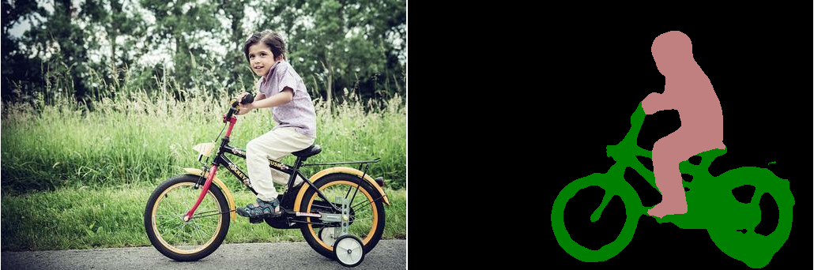
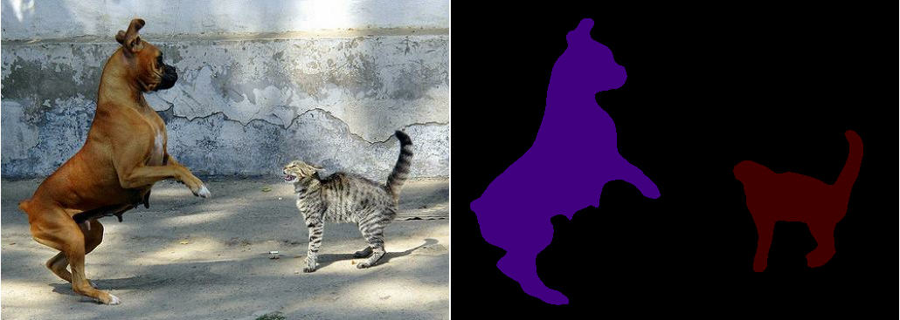
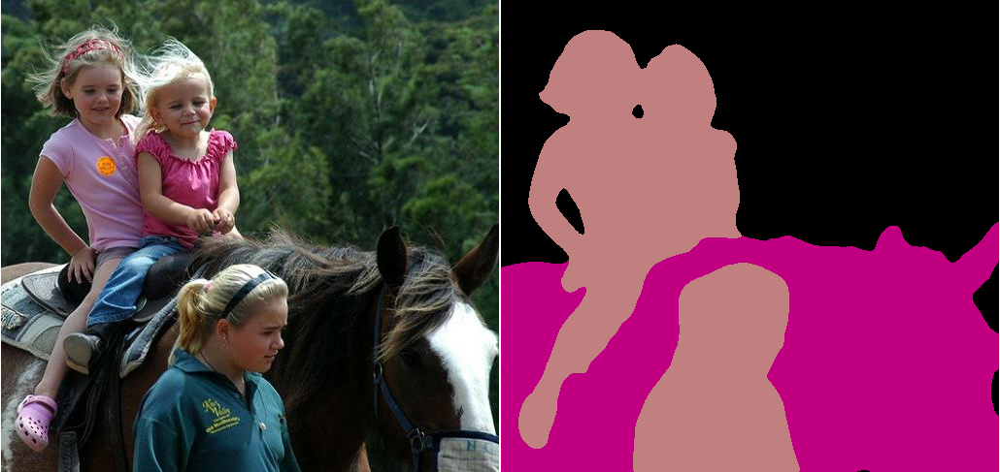

# DeepLab: Deep Labelling for Semantic Image Segmentation

DeepLab is a state-of-art deep learning model for semantic image segmentation,
where the goal is to assign semantic labels (e.g., person, dog, cat and so on)
to every pixel in the input image. Current implementation includes the following
features:

1.  DeepLabv1 [1]: We use *atrous convolution* to explicitly control the
    resolution at which feature responses are computed within Deep Convolutional
    Neural Networks.

2.  DeepLabv2 [2]: We use *atrous spatial pyramid pooling* (ASPP) to robustly
    segment objects at multiple scales with filters at multiple sampling rates
    and effective fields-of-views.

3.  DeepLabv3 [3]: We augment the ASPP module with *image-level feature* [5, 6]
    to capture longer range information. We also include *batch normalization*
    [7] parameters to facilitate the training. In particular, we applying atrous
    convolution to extract output features at different output strides during
    training and evaluation, which efficiently enables training BN at output
    stride = 16 and attains a high performance at output stride = 8 during
    evaluation.

4.  DeepLabv3+ [4]: We extend DeepLabv3 to include a simple yet effective
    decoder module to refine the segmentation results especially along object
    boundaries. Furthermore, in this encoder-decoder structure one can
    arbitrarily control the resolution of extracted encoder features by atrous
    convolution to trade-off precision and runtime.

If you find the code useful for your research, please consider citing our latest
works:

*   DeepLabv3+:

```
@inproceedings{deeplabv3plus2018,
  title={Encoder-Decoder with Atrous Separable Convolution for Semantic Image Segmentation},
  author={Liang-Chieh Chen and Yukun Zhu and George Papandreou and Florian Schroff and Hartwig Adam},
  booktitle={ECCV},
  year={2018}
}
```

*   MobileNetv2:

```
@inproceedings{mobilenetv22018,
  title={MobileNetV2: Inverted Residuals and Linear Bottlenecks},
  author={Mark Sandler and Andrew Howard and Menglong Zhu and Andrey Zhmoginov and Liang-Chieh Chen},
  booktitle={CVPR},
  year={2018}
}
```

*   MobileNetv3:

```
@inproceedings{mobilenetv32019,
  title={Searching for MobileNetV3},
  author={Andrew Howard and Mark Sandler and Grace Chu and Liang-Chieh Chen and Bo Chen and Mingxing Tan and Weijun Wang and Yukun Zhu and Ruoming Pang and Vijay Vasudevan and Quoc V. Le and Hartwig Adam},
  booktitle={ICCV},
  year={2019}
}
```

*  Architecture search for dense prediction cell:

```
@inproceedings{dpc2018,
  title={Searching for Efficient Multi-Scale Architectures for Dense Image Prediction},
  author={Liang-Chieh Chen and Maxwell D. Collins and Yukun Zhu and George Papandreou and Barret Zoph and Florian Schroff and Hartwig Adam and Jonathon Shlens},
  booktitle={NIPS},
  year={2018}
}

```

*  Auto-DeepLab (also called hnasnet in core/nas_network.py):

```
@inproceedings{autodeeplab2019,
  title={Auto-DeepLab: Hierarchical Neural Architecture Search for Semantic
Image Segmentation},
  author={Chenxi Liu and Liang-Chieh Chen and Florian Schroff and Hartwig Adam
  and Wei Hua and Alan Yuille and Li Fei-Fei},
  booktitle={CVPR},
  year={2019}
}

```


In the current implementation, we support adopting the following network
backbones:

1.  MobileNetv2 [8] and MobileNetv3 [16]: A fast network structure designed
    for mobile devices.

2.  Xception [9, 10]: A powerful network structure intended for server-side
    deployment.

3.  ResNet-v1-{50,101} [14]: We provide both the original ResNet-v1 and its
    'beta' variant where the 'stem' is modified for semantic segmentation.

4.  PNASNet [15]: A Powerful network structure found by neural architecture
    search.

5.  Auto-DeepLab (called HNASNet in the code): A segmentation-specific network
    backbone found by neural architecture search.

This directory contains our TensorFlow [11] implementation. We provide codes
allowing users to train the model, evaluate results in terms of mIOU (mean
intersection-over-union), and visualize segmentation results. We use PASCAL VOC
2012 [12] and Cityscapes [13] semantic segmentation benchmarks as an example in
the code.

Some segmentation results on Flickr images:
<p align="center">
    </br>
    </br>
    </br>
</p>

## Contacts (Maintainers)

*   Liang-Chieh Chen, github: [aquariusjay](https://github.com/aquariusjay)
*   YuKun Zhu, github: [yknzhu](https://github.com/YknZhu)
*   George Papandreou, github: [gpapan](https://github.com/gpapan)
*   Hui Hui, github: [huihui-personal](https://github.com/huihui-personal)
*   Maxwell D. Collins, github: [mcollinswisc](https://github.com/mcollinswisc)
*   Ting Liu: github: [tingliu](https://github.com/tingliu)

## Tables of Contents

Demo:

*   <a href='https://colab.sandbox.google.com/github/tensorflow/models/blob/master/research/deeplab/deeplab_demo.ipynb'>Colab notebook for off-the-shelf inference.</a><br>

Running:

*   <a href='g3doc/installation.md'>Installation.</a><br>
*   <a href='g3doc/pascal.md'>Running DeepLab on PASCAL VOC 2012 semantic segmentation dataset.</a><br>
*   <a href='g3doc/cityscapes.md'>Running DeepLab on Cityscapes semantic segmentation dataset.</a><br>
*   <a href='g3doc/ade20k.md'>Running DeepLab on ADE20K semantic segmentation dataset.</a><br>

Models:

*   <a href='g3doc/model_zoo.md'>Checkpoints and frozen inference graphs.</a><br>

Misc:

*   Please check <a href='g3doc/faq.md'>FAQ</a> if you have some questions before reporting the issues.<br>

## Getting Help

To get help with issues you may encounter while using the DeepLab Tensorflow
implementation, create a new question on
[StackOverflow](https://stackoverflow.com/) with the tag "tensorflow".

Please report bugs (i.e., broken code, not usage questions) to the
tensorflow/models GitHub [issue
tracker](https://github.com/tensorflow/models/issues), prefixing the issue name
with "deeplab".

## License

All the codes in deeplab folder is covered by the [LICENSE](https://github.com/tensorflow/models/blob/master/LICENSE)
under tensorflow/models. Please refer to the LICENSE for details.

## Change Logs

### November 20, 2019
* Supported MobileNetV3 large and small model variants on Cityscapes.
**Contributor**: Yukun Zhu.


### March 27, 2019

* Supported using different loss weights on different classes during training.
**Contributor**: Yuwei Yang.


### March 26, 2019

* Supported ResNet-v1-18. **Contributor**: Michalis Raptis.


### March 6, 2019

* Released the evaluation code (under the `evaluation` folder) for image
parsing, a.k.a. panoptic segmentation. In particular, the released code supports
evaluating the parsing results in terms of both the parsing covering and
panoptic quality metrics. **Contributors**: Maxwell Collins and Ting Liu.


### February 6, 2019

* Updated decoder module to exploit multiple low-level features with different
output_strides.

### December 3, 2018

* Released the MobileNet-v2 checkpoint on ADE20K.


### November 19, 2018

* Supported NAS architecture for feature extraction. **Contributor**: Chenxi Liu.

* Supported hard pixel mining during training.


### October 1, 2018

* Released MobileNet-v2 depth-multiplier = 0.5 COCO-pretrained checkpoints on
PASCAL VOC 2012, and Xception-65 COCO pretrained checkpoint (i.e., no PASCAL
pretrained).


### September 5, 2018

* Released Cityscapes pretrained checkpoints with found best dense prediction cell.


### May 26, 2018

* Updated ADE20K pretrained checkpoint.


### May 18, 2018
* Added builders for ResNet-v1 and Xception model variants.
* Added ADE20K support, including colormap and pretrained Xception_65 checkpoint.
* Fixed a bug on using non-default depth_multiplier for MobileNet-v2.


### March 22, 2018

* Released checkpoints using MobileNet-V2 as network backbone and pretrained on
PASCAL VOC 2012 and Cityscapes.


### March 5, 2018

* First release of DeepLab in TensorFlow including deeper Xception network
backbone. Included chekcpoints that have been pretrained on PASCAL VOC 2012
and Cityscapes.

## References

1.  **Semantic Image Segmentation with Deep Convolutional Nets and Fully Connected CRFs**<br />
    Liang-Chieh Chen+, George Papandreou+, Iasonas Kokkinos, Kevin Murphy, Alan L. Yuille (+ equal
    contribution). <br />
    [[link]](https://arxiv.org/abs/1412.7062). In ICLR, 2015.

2.  **DeepLab: Semantic Image Segmentation with Deep Convolutional Nets,**
    **Atrous Convolution, and Fully Connected CRFs** <br />
    Liang-Chieh Chen+, George Papandreou+, Iasonas Kokkinos, Kevin Murphy, and Alan L Yuille (+ equal
    contribution). <br />
    [[link]](http://arxiv.org/abs/1606.00915). TPAMI 2017.

3.  **Rethinking Atrous Convolution for Semantic Image Segmentation**<br />
    Liang-Chieh Chen, George Papandreou, Florian Schroff, Hartwig Adam.<br />
    [[link]](http://arxiv.org/abs/1706.05587). arXiv: 1706.05587, 2017.

4.  **Encoder-Decoder with Atrous Separable Convolution for Semantic Image Segmentation**<br />
    Liang-Chieh Chen, Yukun Zhu, George Papandreou, Florian Schroff, Hartwig Adam.<br />
    [[link]](https://arxiv.org/abs/1802.02611). In ECCV, 2018.

5.  **ParseNet: Looking Wider to See Better**<br />
    Wei Liu, Andrew Rabinovich, Alexander C Berg<br />
    [[link]](https://arxiv.org/abs/1506.04579). arXiv:1506.04579, 2015.

6.  **Pyramid Scene Parsing Network**<br />
    Hengshuang Zhao, Jianping Shi, Xiaojuan Qi, Xiaogang Wang, Jiaya Jia<br />
    [[link]](https://arxiv.org/abs/1612.01105). In CVPR, 2017.

7.  **Batch Normalization: Accelerating Deep Network Training by Reducing Internal Covariate shift**<br />
    Sergey Ioffe, Christian Szegedy <br />
    [[link]](https://arxiv.org/abs/1502.03167). In ICML, 2015.

8.  **MobileNetV2: Inverted Residuals and Linear Bottlenecks**<br />
    Mark Sandler, Andrew Howard, Menglong Zhu, Andrey Zhmoginov, Liang-Chieh Chen<br />
    [[link]](https://arxiv.org/abs/1801.04381). In CVPR, 2018.

9.  **Xception: Deep Learning with Depthwise Separable Convolutions**<br />
    François Chollet<br />
    [[link]](https://arxiv.org/abs/1610.02357). In CVPR, 2017.

10. **Deformable Convolutional Networks -- COCO Detection and Segmentation Challenge 2017 Entry**<br />
    Haozhi Qi, Zheng Zhang, Bin Xiao, Han Hu, Bowen Cheng, Yichen Wei, Jifeng Dai<br />
    [[link]](http://presentations.cocodataset.org/COCO17-Detect-MSRA.pdf). ICCV COCO Challenge
    Workshop, 2017.

11. **Tensorflow: Large-Scale Machine Learning on Heterogeneous Distributed Systems**<br />
    M. Abadi, A. Agarwal, et al. <br />
    [[link]](https://arxiv.org/abs/1603.04467). arXiv:1603.04467, 2016.

12. **The Pascal Visual Object Classes Challenge – A Retrospective,** <br />
    Mark Everingham, S. M. Ali Eslami, Luc Van Gool, Christopher K. I. Williams, John
    Winn, and Andrew Zisserma. <br />
    [[link]](http://host.robots.ox.ac.uk/pascal/VOC/voc2012/). IJCV, 2014.

13. **The Cityscapes Dataset for Semantic Urban Scene Understanding**<br />
    Cordts, Marius, Mohamed Omran, Sebastian Ramos, Timo Rehfeld, Markus Enzweiler, Rodrigo Benenson, Uwe Franke, Stefan Roth, Bernt Schiele. <br />
    [[link]](https://www.cityscapes-dataset.com/). In CVPR, 2016.

14. **Deep Residual Learning for Image Recognition**<br />
    Kaiming He, Xiangyu Zhang, Shaoqing Ren, Jian Sun. <br />
    [[link]](https://arxiv.org/abs/1512.03385). In CVPR, 2016.

15. **Progressive Neural Architecture Search**<br />
    Chenxi Liu, Barret Zoph, Maxim Neumann, Jonathon Shlens, Wei Hua, Li-Jia Li, Li Fei-Fei, Alan Yuille, Jonathan Huang, Kevin Murphy. <br />
    [[link]](https://arxiv.org/abs/1712.00559). In ECCV, 2018.

16 **Searching for MobileNetV3**<br />
    Andrew Howard, Mark Sandler, Grace Chu, Liang-Chieh Chen, Bo Chen, Mingxing Tan, Weijun Wang, Yukun Zhu, Ruoming Pang, Vijay Vasudevan, Quoc V. Le, Hartwig Adam. <br />
    [[link]](https://arxiv.org/abs/1905.02244). In ICCV, 2019.
