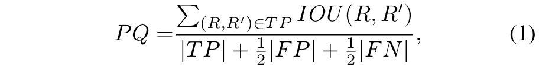
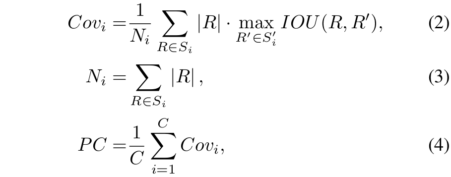

# Evaluation Metrics for Whole Image Parsing

Whole Image Parsing [1], also known as Panoptic Segmentation [2], generalizes
the tasks of semantic segmentation for "stuff" classes and instance
segmentation for "thing" classes, assigning both semantic and instance labels
to every pixel in an image.

Previous works evaluate the parsing result with separate metrics (e.g., one for
semantic segmentation result and one for object detection result). Recently,
Kirillov et al. propose the unified instance-based Panoptic Quality (PQ) metric
[2] into several benchmarks [3, 4].

However, we notice that the instance-based PQ metric often places
disproportionate emphasis on small instance parsing, as well as on "thing" over
"stuff" classes. To remedy these effects, we propose an alternative
region-based Parsing Covering (PC) metric [5], which adapts the Covering
metric [6], previously used for class-agnostics segmentation quality
evaluation, to the task of image parsing.

Here, we provide implementation of both PQ and PC for evaluating the parsing
results. We briefly explain both metrics below for reference.

## Panoptic Quality (PQ)

Given a groundtruth segmentation S and a predicted segmentation S', PQ is
defined as follows:

<p align="center">
    
</p>

where R and R' are groundtruth regions and predicted regions respectively,
and |TP|, |FP|, and |FN| are the number of true positives, false postives,
and false negatives. The matching is determined by a threshold of 0.5
Intersection-Over-Union (IOU).

PQ treats all regions of the same ‘stuff‘ class as one instance, and the
size of instances is not considered. For example, instances with 10 × 10
pixels contribute equally to the metric as instances with 1000 × 1000 pixels.
Therefore, PQ is sensitive to false positives with small regions and some
heuristics could improve the performance, such as removing those small
regions (as also pointed out in the open-sourced evaluation code from [2]).
Thus, we argue that PQ is suitable in applications where one cares equally for
the parsing quality of instances irrespective of their sizes.

## Parsing Covering (PC)

We notice that there are applications where one pays more attention to large
objects, e.g., autonomous driving (where nearby objects are more important
than far away ones). Motivated by this, we propose to also evaluate the
quality of image parsing results by extending the existing Covering metric [5],
which accounts for instance sizes. Specifically, our proposed metric, Parsing
Covering (PC), is defined as follows:

<p align="center">
    
</p>


where S<sub>i</sub> and S<sub>i</sub>' are the groundtruth segmentation and
predicted segmentation for the i-th semantic class respectively, and
N<sub>i</sub> is the total number of pixels of groundtruth regions from
S<sub>i</sub> . The Covering for class i, Cov<sub>i</sub> , is computed in
the same way as the original Covering metric except that only groundtruth
regions from S<sub>i</sub> and predicted regions from S<sub>i</sub>' are
considered. PC is then obtained by computing the average of Cov<sub>i</sub>
over C semantic classes.

A notable difference between PQ and the proposed PC is that there is no
matching involved in PC and hence no matching threshold. As an attempt to
treat equally "thing" and "stuff", the segmentation of "stuff" classes still
receives partial PC score if the segmentation is only partially correct. For
example, if one out of three equally-sized trees is perfectly segmented, the
model will get the same partial score by using PC regardless of considering
"tree" as "stuff" or "thing".

## Tutorial

To evaluate the parsing results with PQ and PC, we provide two options:

1. Python off-line evaluation with results saved in the [COCO format](http://cocodataset.org/#format-results).
2. TensorFlow on-line evaluation.

Below, we explain each option in detail.

#### 1. Python off-line evaluation with results saved in COCO format

[COCO result format](http://cocodataset.org/#format-results) has been
adopted by several benchmarks [3, 4]. Therefore, we provide a convenient
function, `eval_coco_format`, to evaluate the results saved in COCO format
in terms of PC and re-implemented PQ.

Before using the provided function, the users need to download the official COCO
panotpic segmentation task API. Please see [installation](../g3doc/installation.md#add-libraries-to-pythonpath)
for reference.

Once the official COCO panoptic segmentation task API is downloaded, the
users should be able to run the `eval_coco_format.py` to evaluate the parsing
results in terms of both PC and reimplemented PQ.

To be concrete, let's take a look at the function, `eval_coco_format` in
`eval_coco_format.py`:

```python
eval_coco_format(gt_json_file,
                 pred_json_file,
                 gt_folder=None,
                 pred_folder=None,
                 metric='pq',
                 num_categories=201,
                 ignored_label=0,
                 max_instances_per_category=256,
                 intersection_offset=None,
                 normalize_by_image_size=True,
                 num_workers=0,
                 print_digits=3):

```
where

1. `gt_json_file`: Path to a JSON file giving ground-truth annotations in COCO
format.
2. `pred_json_file`: Path to a JSON file for the predictions to evaluate.
3. `gt_folder`: Folder containing panoptic-format ID images to match
ground-truth annotations to image regions.
4. `pred_folder`: Path to a folder containing ID images for predictions.
5. `metric`: Name of a metric to compute. Set to `pc`, `pq` for evaluation in PC
or PQ, respectively.
6. `num_categories`: The number of segmentation categories (or "classes") in the
dataset.
7. `ignored_label`: A category id that is ignored in evaluation, e.g. the "void"
label in COCO panoptic segmentation dataset.
8. `max_instances_per_category`: The maximum number of instances for each
category to ensure unique instance labels.
9. `intersection_offset`: The maximum number of unique labels.
10. `normalize_by_image_size`: Whether to normalize groundtruth instance region
areas by image size when using PC.
11. `num_workers`: If set to a positive number, will spawn child processes to
compute parts of the metric in parallel by splitting the images between the
workers. If set to -1, will use the value of multiprocessing.cpu_count().
12. `print_digits`: Number of significant digits to print in summary of computed
metrics.

The input arguments have default values set for the COCO panoptic segmentation
dataset. Thus, users only need to provide the `gt_json_file` and the
`pred_json_file` (following the COCO format) to run the evaluation on COCO with
PQ. If users want to evaluate the results on other datasets, they may need
to change the default values.

As an example, the interested users could take a look at the provided unit
test, `test_compare_pq_with_reference_eval`, in `eval_coco_format_test.py`.

#### 2. TensorFlow on-line evaluation

Users may also want to run the TensorFlow on-line evaluation, similar to the
[tf.contrib.metrics.streaming_mean_iou](https://www.tensorflow.org/api_docs/python/tf/contrib/metrics/streaming_mean_iou).

Below, we provide a code snippet that shows how to use the provided
`streaming_panoptic_quality` and `streaming_parsing_covering`.

```python
metric_map = {}
metric_map['panoptic_quality'] = streaming_metrics.streaming_panoptic_quality(
    category_label,
    instance_label,
    category_prediction,
    instance_prediction,
    num_classes=201,
    max_instances_per_category=256,
    ignored_label=0,
    offset=256*256)
metric_map['parsing_covering'] = streaming_metrics.streaming_parsing_covering(
    category_label,
    instance_label,
    category_prediction,
    instance_prediction,
    num_classes=201,
    max_instances_per_category=256,
    ignored_label=0,
    offset=256*256,
    normalize_by_image_size=True)
metrics_to_values, metrics_to_updates = slim.metrics.aggregate_metric_map(
    metric_map)
```
where `metric_map` is a dictionary storing the streamed results of PQ and PC.

The `category_label` and the `instance_label` are the semantic segmentation and
instance segmentation groundtruth, respectively. That is, in the panoptic
segmentation format:
panoptic_label = category_label * max_instances_per_category + instance_label.
Similarly, the `category_prediction` and the `instance_prediction` are the
predicted semantic segmentation and instance segmentation, respectively.

Below, we provide a code snippet about how to summarize the results in the
context of tf.summary.

```python
summary_ops = []
for metric_name, metric_value in metrics_to_values.iteritems():
  if metric_name == 'panoptic_quality':
    [pq, sq, rq, total_tp, total_fn, total_fp] = tf.unstack(
      metric_value, 6, axis=0)
    panoptic_metrics = {
      # Panoptic quality.
      'pq': pq,
      # Segmentation quality.
      'sq': sq,
      # Recognition quality.
      'rq': rq,
      # Total true positives.
      'total_tp': total_tp,
      # Total false negatives.
      'total_fn': total_fn,
      # Total false positives.
      'total_fp': total_fp,
    }
    # Find the valid classes that will be used for evaluation. We will
    # ignore the `ignore_label` class and other classes which have (tp + fn
    # + fp) equal to 0.
    valid_classes = tf.logical_and(
        tf.not_equal(tf.range(0, num_classes), void_label),
        tf.not_equal(total_tp + total_fn + total_fp, 0))
    for target_metric, target_value in panoptic_metrics.iteritems():
      output_metric_name = '{}_{}'.format(metric_name, target_metric)
      op = tf.summary.scalar(
          output_metric_name,
          tf.reduce_mean(tf.boolean_mask(target_value, valid_classes)))
      op = tf.Print(op, [target_value], output_metric_name + '_classwise: ',
                    summarize=num_classes)
      op = tf.Print(
          op,
          [tf.reduce_mean(tf.boolean_mask(target_value, valid_classes))],
          output_metric_name + '_mean: ',
           summarize=1)
      summary_ops.append(op)
  elif metric_name == 'parsing_covering':
    [per_class_covering,
     total_per_class_weighted_ious,
     total_per_class_gt_areas] = tf.unstack(metric_value, 3, axis=0)
    # Find the valid classes that will be used for evaluation. We will
    # ignore the `void_label` class and other classes which have
    # total_per_class_weighted_ious + total_per_class_gt_areas equal to 0.
    valid_classes = tf.logical_and(
        tf.not_equal(tf.range(0, num_classes), void_label),
        tf.not_equal(
            total_per_class_weighted_ious + total_per_class_gt_areas, 0))
    op = tf.summary.scalar(
        metric_name,
        tf.reduce_mean(tf.boolean_mask(per_class_covering, valid_classes)))
    op = tf.Print(op, [per_class_covering], metric_name + '_classwise: ',
                  summarize=num_classes)
    op = tf.Print(
        op,
        [tf.reduce_mean(
            tf.boolean_mask(per_class_covering, valid_classes))],
        metric_name + '_mean: ',
        summarize=1)
    summary_ops.append(op)
  else:
    raise ValueError('The metric_name "%s" is not supported.' % metric_name)
```

Afterwards, the users could use the following code to run the evaluation in
TensorFlow.

Users can take a look at eval.py for reference which provides a simple
example to run the streaming evaluation of mIOU for semantic segmentation.

```python
metric_values = slim.evaluation.evaluation_loop(
  master=FLAGS.master,
  checkpoint_dir=FLAGS.checkpoint_dir,
  logdir=FLAGS.eval_logdir,
  num_evals=num_batches,
  eval_op=metrics_to_updates.values(),
  final_op=metrics_to_values.values(),
  summary_op=tf.summary.merge(summary_ops),
  max_number_of_evaluations=FLAGS.max_number_of_evaluations,
  eval_interval_secs=FLAGS.eval_interval_secs)
```


### References

1. **Image Parsing: Unifying Segmentation, Detection, and Recognition**<br />
   Zhuowen Tu, Xiangrong Chen, Alan L. Yuille, and Song-Chun Zhu<br />
   IJCV, 2005.

2. **Panoptic Segmentation**<br />
   Alexander Kirillov, Kaiming He, Ross Girshick, Carsten Rother and Piotr
   Dollár<br />
   arXiv:1801.00868, 2018.

3. **Microsoft COCO: Common Objects in Context**<br />
    Tsung-Yi Lin, Michael Maire, Serge Belongie, Lubomir Bourdev, Ross
    Girshick, James Hays, Pietro Perona, Deva Ramanan, C. Lawrence Zitnick,
    Piotr Dollar<br />
    In the Proc. of ECCV, 2014.

4. **The Mapillary Vistas Dataset for Semantic Understanding of Street Scenes**<br />
   Gerhard Neuhold, Tobias Ollmann, Samuel Rota Bulò, and Peter Kontschieder<br />
   In the Proc. of ICCV, 2017.

5. **DeeperLab: Single-Shot Image Parser**<br />
   Tien-Ju Yang, Maxwell D. Collins, Yukun Zhu, Jyh-Jing Hwang, Ting Liu,
   Xiao Zhang, Vivienne Sze, George Papandreou, Liang-Chieh Chen<br />
   arXiv: 1902.05093, 2019.

6. **Contour Detection and Hierarchical Image Segmentation**<br />
   Pablo Arbelaez, Michael Maire, Charless Fowlkes, and Jitendra Malik<br />
   PAMI, 2011
