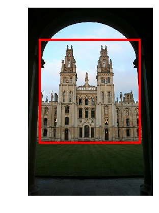
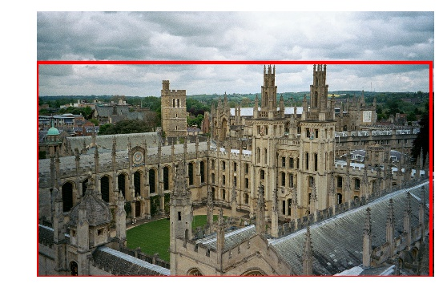

## Quick start: landmark detection

[](https://arxiv.org/abs/1812.01584)

### Install DELF library

To be able to use this code, please follow
[these instructions](INSTALL_INSTRUCTIONS.md) to properly install the DELF
library.

### Download Oxford buildings dataset

To illustrate detector usage, please download the Oxford buildings dataset, by
following the instructions
[here](EXTRACTION_MATCHING.md#download-oxford-buildings-dataset). Then, create
the file `list_images_detector.txt` as follows:

```bash
# From tensorflow/models/research/delf/delf/python/examples/
echo data/oxford5k_images/all_souls_000002.jpg >> list_images_detector.txt
echo data/oxford5k_images/all_souls_000035.jpg >> list_images_detector.txt
```

### Download detector model

Also, you will need to download the pre-trained detector model:

```bash
# From tensorflow/models/research/delf/delf/python/examples/
mkdir parameters && cd parameters
wget http://storage.googleapis.com/delf/d2r_frcnn_20190411.tar.gz
tar -xvzf d2r_frcnn_20190411.tar.gz
```

**Note**: this is the Faster-RCNN based model. We also release a MobileNet-SSD
model, see the [README](README.md#pre-trained-models) for download link. The
instructions should work seamlessly for both models.

### Detecting landmarks

Now that you have everything in place, running this command should detect boxes
for the images `all_souls_000002.jpg` and `all_souls_000035.jpg`, with a
threshold of 0.8, and produce visualizations.

```bash
# From tensorflow/models/research/delf/delf/python/examples/
python extract_boxes.py \
  --detector_path parameters/d2r_frcnn_20190411 \
  --detector_thresh 0.8 \
  --list_images_path list_images_detector.txt \
  --output_dir data/oxford5k_boxes \
  --output_viz_dir data/oxford5k_boxes_viz
```

Two images are generated in the `data/oxford5k_boxes_viz` directory, they should
look similar to these ones:




### Troubleshooting

#### `matplotlib`

`matplotlib` may complain with a message such as `no display name and no
$DISPLAY environment variable`. To fix this, one option is add the line
`backend : Agg` to the file `.config/matplotlib/matplotlibrc`. On this problem,
see the discussion
[here](https://stackoverflow.com/questions/37604289/tkinter-tclerror-no-display-name-and-no-display-environment-variable).
