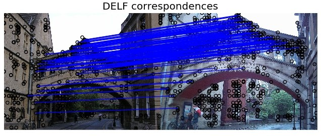

## Quick start: DELF extraction and matching

[](https://arxiv.org/abs/1612.06321)

### Install DELF library

To be able to use this code, please follow
[these instructions](INSTALL_INSTRUCTIONS.md) to properly install the DELF
library.

### Download Oxford buildings dataset

To illustrate DELF usage, please download the Oxford buildings dataset. To
follow these instructions closely, please download the dataset to the
`tensorflow/models/research/delf/delf/python/examples` directory, as in the
following commands:

```bash
# From tensorflow/models/research/delf/delf/python/examples/
mkdir data && cd data
wget http://www.robots.ox.ac.uk/~vgg/data/oxbuildings/oxbuild_images.tgz
mkdir oxford5k_images oxford5k_features
tar -xvzf oxbuild_images.tgz -C oxford5k_images/
cd ../
echo data/oxford5k_images/hertford_000056.jpg >> list_images.txt
echo data/oxford5k_images/oxford_000317.jpg >> list_images.txt
```

### Download pre-trained DELF model

Also, you will need to download the trained DELF model:

```bash
# From tensorflow/models/research/delf/delf/python/examples/
mkdir parameters && cd parameters
wget http://storage.googleapis.com/delf/delf_gld_20190411.tar.gz
tar -xvzf delf_gld_20190411.tar.gz
```

### DELF feature extraction

Now that you have everything in place, running this command should extract DELF
features for the images `hertford_000056.jpg` and `oxford_000317.jpg`:

```bash
# From tensorflow/models/research/delf/delf/python/examples/
python extract_features.py \
  --config_path delf_config_example.pbtxt \
  --list_images_path list_images.txt \
  --output_dir data/oxford5k_features
```

### Image matching using DELF features

After feature extraction, run this command to perform feature matching between
the images `hertford_000056.jpg` and `oxford_000317.jpg`:

```bash
python match_images.py \
  --image_1_path data/oxford5k_images/hertford_000056.jpg \
  --image_2_path data/oxford5k_images/oxford_000317.jpg \
  --features_1_path data/oxford5k_features/hertford_000056.delf \
  --features_2_path data/oxford5k_features/oxford_000317.delf \
  --output_image matched_images.png
```

The image `matched_images.png` is generated and should look similar to this one:



### Troubleshooting

#### `matplotlib`

`matplotlib` may complain with a message such as `no display name and no
$DISPLAY environment variable`. To fix this, one option is add the line
`backend : Agg` to the file `.config/matplotlib/matplotlibrc`. On this problem,
see the discussion
[here](https://stackoverflow.com/questions/37604289/tkinter-tclerror-no-display-name-and-no-display-environment-variable).

#### 'skimage'

By default, skimage 0.13.XX or 0.14.1 is installed if you followed the
instructions. According to
[https://github.com/scikit-image/scikit-image/issues/3649#issuecomment-455273659]
If you have scikit-image related issues, upgrading to a version above 0.14.1
with `pip install -U scikit-image` should fix the issue
