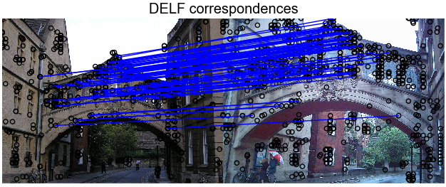

# DELF: DEep Local Features

This project presents code for extracting DELF features, which were introduced
with the paper ["Large-Scale Image Retrieval with Attentive Deep Local
Features"](https://arxiv.org/abs/1612.06321). A simple application is also
illustrated, where two images containing the same landmark can be matched to
each other, to obtain local image correspondences.

DELF is particularly useful for large-scale instance-level image recognition. It
detects and describes semantic local features which can be geometrically
verified between images showing the same object instance. The pre-trained model
released here has been optimized for landmark recognition, so expect it to work
well in this area. We also provide tensorflow code for building the DELF model,
which could then be used to train models for other types of objects.

If you make use of this code, please consider citing:

```
"Large-Scale Image Retrieval with Attentive Deep Local Features",
Hyeonwoo Noh, Andre Araujo, Jack Sim, Tobias Weyand, Bohyung Han,
Proc. ICCV'17
```

## News

-   DELF achieved state-of-the-art results in a CVPR'18 image retrieval paper:
    [Radenovic et al., "Revisiting Oxford and Paris: Large-Scale Image Retrieval
    Benchmarking"](https://arxiv.org/abs/1803.11285).
-   DELF was featured in
    [ModelDepot](https://modeldepot.io/mikeshi/delf/overview)
-   DELF is now available in
    [TF-Hub](https://www.tensorflow.org/hub/modules/google/delf/1)

## Dataset

The Google-Landmarks dataset has been released as part of two Kaggle challenges:
[Landmark Recognition](https://www.kaggle.com/c/landmark-recognition-challenge)
and [Landmark Retrieval](https://www.kaggle.com/c/landmark-retrieval-challenge).
If you make use of the dataset in your research, please consider citing the
paper mentioned above.

## Installation

To be able to use this code, please follow [these
instructions](INSTALL_INSTRUCTIONS.md) to properly install the DELF library.

## Quick start: DELF extraction and matching

Please follow [these instructions](EXTRACTION_MATCHING.md). At the end, you
should obtain a nice figure showing local feature matches, as:



## Code overview

DELF's code is located under the `delf` directory. There are two directories
therein, `protos` and `python`.

### `delf/protos`

This directory contains three protobufs:

-   `datum.proto`: general-purpose protobuf for serializing float tensors.
-   `feature.proto`: protobuf for serializing DELF features.
-   `delf_config.proto`: protobuf for configuring DELF extraction.

### `delf/python`

This directory contains files for several different purposes:

-   `datum_io.py`, `feature_io.py` are helper files for reading and writing
    tensors and features.
-   `delf_v1.py` contains the code to create DELF models.
-   `feature_extractor.py` contains the code to extract features using DELF.
    This is particularly useful for extracting features over multiple scales,
    with keypoint selection based on attention scores, and PCA/whitening
    post-processing.

Besides these, other files in this directory contain tests for different
modules.

The subdirectory `delf/python/examples` contains sample scripts to run DELF
feature extraction and matching:

-   `extract_features.py` enables DELF extraction from a list of images.
-   `match_images.py` supports image matching using DELF features extracted
    using `extract_features.py`.
-   `delf_config_example.pbtxt` shows an example instantiation of the DelfConfig
    proto, used for DELF feature extraction.

## Maintainers

Andr&eacute; Araujo (@andrefaraujo)

## Release history

### October 26, 2017

Initial release containing DELF-v1 code, including feature extraction and
matching examples.

**Thanks to contributors**: Andr&eacute; Araujo, Hyeonwoo Noh, Youlong Cheng,
Jack Sim.
