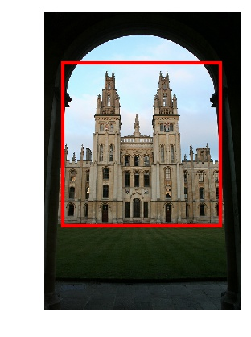

# DELF: DEep Local Features

[](https://github.com/tensorflow/tensorflow/releases/tag/v2.1.0)

This project presents code for extracting DELF features, which were introduced
with the paper
["Large-Scale Image Retrieval with Attentive Deep Local Features"](https://arxiv.org/abs/1612.06321).
It also contains code for the follow-up paper
["Detect-to-Retrieve: Efficient Regional Aggregation for Image Search"](https://arxiv.org/abs/1812.01584).

We also released pre-trained models based on the
[Google Landmarks dataset](https://www.kaggle.com/google/google-landmarks-dataset).

DELF is particularly useful for large-scale instance-level image recognition. It
detects and describes semantic local features which can be geometrically
verified between images showing the same object instance. The pre-trained models
released here have been optimized for landmark recognition, so expect it to work
well in this area. We also provide tensorflow code for building the DELF model,
and [NEW] code for model training.

If you make use of this code, please consider citing the following papers:

[](https://arxiv.org/abs/1612.06321)

```
"Large-Scale Image Retrieval with Attentive Deep Local Features",
H. Noh, A. Araujo, J. Sim, T. Weyand and B. Han,
Proc. ICCV'17
```

and/or

[](https://arxiv.org/abs/1812.01584)

```
"Detect-to-Retrieve: Efficient Regional Aggregation for Image Search",
M. Teichmann*, A. Araujo*, M. Zhu and J. Sim,
Proc. CVPR'19
```

## News

-   [Jun'19] DELF achieved 2nd place in
    [CVPR Visual Localization challenge (Local Features track)](https://sites.google.com/corp/view/ltvl2019).
    See our slides
    [here](https://docs.google.com/presentation/d/e/2PACX-1vTswzoXelqFqI_pCEIVl2uazeyGr7aKNklWHQCX-CbQ7MB17gaycqIaDTguuUCRm6_lXHwCdrkP7n1x/pub?start=false&loop=false&delayms=3000).
-   [Apr'19] Check out our CVPR'19 paper:
    ["Detect-to-Retrieve: Efficient Regional Aggregation for Image Search"](https://arxiv.org/abs/1812.01584)
-   [Jun'18] DELF achieved state-of-the-art results in a CVPR'18 image retrieval
    paper: [Radenovic et al., "Revisiting Oxford and Paris: Large-Scale Image
    Retrieval Benchmarking"](https://arxiv.org/abs/1803.11285).
-   [Apr'18] DELF was featured in
    [ModelDepot](https://modeldepot.io/mikeshi/delf/overview)
-   [Mar'18] DELF is now available in
    [TF-Hub](https://www.tensorflow.org/hub/modules/google/delf/1)

## Dataset

We have two Google-Landmarks dataset versions:

-   Initial version (v1) can be found
    [here](https://www.kaggle.com/google/google-landmarks-dataset). In includes
    the Google Landmark Boxes which were described in the Detect-to-Retrieve
    paper.
-   Second version (v2) has been released as part of two Kaggle challenges:
    [Landmark Recognition](https://www.kaggle.com/c/landmark-recognition-2019)
    and [Landmark Retrieval](https://www.kaggle.com/c/landmark-retrieval-2019).
    It can be downloaded from CVDF
    [here](https://github.com/cvdfoundation/google-landmark). See also
    [the CVPR'20 paper](https://arxiv.org/abs/2004.01804) on this new dataset
    version.

If you make use of these datasets in your research, please consider citing the
papers mentioned above.

## Installation

To be able to use this code, please follow
[these instructions](INSTALL_INSTRUCTIONS.md) to properly install the DELF
library.

## Quick start

### Pre-trained models

We release several pre-trained models. See instructions in the following
sections for examples on how to use the models.

**DELF pre-trained on the Google-Landmarks dataset v1**
([link](http://storage.googleapis.com/delf/delf_gld_20190411.tar.gz)). Presented
in the [CVPR'19 Detect-to-Retrieve paper](https://arxiv.org/abs/1812.01584).
Boosts performance by ~4% mAP compared to ICCV'17 DELF model.

**DELF pre-trained on Landmarks-Clean/Landmarks-Full dataset**
([link](http://storage.googleapis.com/delf/delf_v1_20171026.tar.gz)). Presented
in the [ICCV'17 DELF paper](https://arxiv.org/abs/1612.06321), model was trained
on the dataset released by the [DIR paper](https://arxiv.org/abs/1604.01325).

**Faster-RCNN detector pre-trained on Google Landmark Boxes**
([link](http://storage.googleapis.com/delf/d2r_frcnn_20190411.tar.gz)).
Presented in the
[CVPR'19 Detect-to-Retrieve paper](https://arxiv.org/abs/1812.01584).

**MobileNet-SSD detector pre-trained on Google Landmark Boxes**
([link](http://storage.googleapis.com/delf/d2r_mnetssd_20190411.tar.gz)).
Presented in the
[CVPR'19 Detect-to-Retrieve paper](https://arxiv.org/abs/1812.01584).

Besides these, we also release pre-trained codebooks for local feature
aggregation. See the
[Detect-to-Retrieve instructions](delf/python/detect_to_retrieve/DETECT_TO_RETRIEVE_INSTRUCTIONS.md)
for details.

### DELF extraction and matching

Please follow [these instructions](EXTRACTION_MATCHING.md). At the end, you
should obtain a nice figure showing local feature matches, as:


### DELF training

Please follow [these instructions](delf/python/training/README.md).

### Landmark detection

Please follow [these instructions](DETECTION.md). At the end, you should obtain
a nice figure showing a detection, as:



### Detect-to-Retrieve

Please follow
[these instructions](delf/python/detect_to_retrieve/DETECT_TO_RETRIEVE_INSTRUCTIONS.md).
At the end, you should obtain image retrieval results on the Revisited
Oxford/Paris datasets.

## Code overview

DELF/D2R code is located under the `delf` directory. There are two directories
therein, `protos` and `python`.

### `delf/protos`

This directory contains protobufs:

-   `aggregation_config.proto`: protobuf for configuring local feature
    aggregation.
-   `box.proto`: protobuf for serializing detected boxes.
-   `datum.proto`: general-purpose protobuf for serializing float tensors.
-   `delf_config.proto`: protobuf for configuring DELF extraction.
-   `feature.proto`: protobuf for serializing DELF features.

### `delf/python`

This directory contains files for several different purposes:

-   `box_io.py`, `datum_io.py`, `feature_io.py` are helper files for reading and
    writing tensors and features.
-   `delf_v1.py` contains code to create DELF models.
-   `feature_aggregation_extractor.py` contains a module to perform local
    feature aggregation.
-   `feature_aggregation_similarity.py` contains a module to perform similarity
    computation for aggregated local features.
-   `feature_extractor.py` contains the code to extract features using DELF.
    This is particularly useful for extracting features over multiple scales,
    with keypoint selection based on attention scores, and PCA/whitening
    post-processing.

The subdirectory `delf/python/examples` contains sample scripts to run DELF
feature extraction/matching, and object detection:

-   `delf_config_example.pbtxt` shows an example instantiation of the DelfConfig
    proto, used for DELF feature extraction.
-   `detector.py` is a module to construct an object detector function.
-   `extract_boxes.py` enables object detection from a list of images.
-   `extract_features.py` enables DELF extraction from a list of images.
-   `extractor.py` is a module to construct a DELF local feature extraction
    function.
-   `match_images.py` supports image matching using DELF features extracted
    using `extract_features.py`.

The subdirectory `delf/python/detect_to_retrieve` contains sample
scripts/configs related to the Detect-to-Retrieve paper:

-   `aggregation_extraction.py` is a library to extract/save feature
    aggregation.
-   `boxes_and_features_extraction.py` is a library to extract/save boxes and
    DELF features.
-   `cluster_delf_features.py` for local feature clustering.
-   `dataset.py` for parsing/evaluating results on Revisited Oxford/Paris
    datasets.
-   `delf_gld_config.pbtxt` gives the DelfConfig used in Detect-to-Retrieve
    paper.
-   `extract_aggregation.py` for aggregated local feature extraction.
-   `extract_index_boxes_and_features.py` for index image local feature
    extraction / bounding box detection on Revisited datasets.
-   `extract_query_features.py` for query image local feature extraction on
    Revisited datasets.
-   `image_reranking.py` is a module to re-rank images with geometric
    verification.
-   `perform_retrieval.py` for performing retrieval/evaluating methods using
    aggregated local features on Revisited datasets.
-   `index_aggregation_config.pbtxt`, `query_aggregation_config.pbtxt` give
    AggregationConfig's for Detect-to-Retrieve experiments.

The subdirectory `delf/python/google_landmarks_dataset` contains sample
scripts/modules for computing GLD metrics:

-   `compute_recognition_metrics.py` performs recognition metric computation
    given input predictions and solution files.
-   `compute_retrieval_metrics.py` performs retrieval metric computation given
    input predictions and solution files.
-   `dataset_file_io.py` is a module for dataset-related file IO.
-   `metrics.py` is a module for GLD metric computation.

The subdirectory `delf/python/training` contains sample scripts/modules for
performing DELF training:

-   `datasets/googlelandmarks.py` is the dataset module used for training.
-   `model/delf_model.py` is the model module used for training.
-   `model/export_model.py` is a script for exporting trained models in the
    format used by the inference code.
-   `model/export_model_utils.py` is a module with utilities for model
    exporting.
-   `model/resnet50.py` is a module with a backbone RN50 implementation.
-   `build_image_dataset.py` converts downloaded dataset into TFRecords format
    for training.
-   `train.py` is the main training script.

Besides these, other files in the different subdirectories contain tests for the
various modules.

## Maintainers

Andr&eacute; Araujo (@andrefaraujo)

## Release history

### April, 2020 (version 2.0)

-   Initial DELF training code released.
-   Codebase is now fully compatible with TF 2.1.

**Thanks to contributors**: Arun Mukundan, Yuewei Na and Andr&eacute; Araujo.

### April, 2019

Detect-to-Retrieve code released.

Includes pre-trained models to detect landmark boxes, and DELF model pre-trained
on Google Landmarks v1 dataset.

**Thanks to contributors**: Andr&eacute; Araujo, Marvin Teichmann, Menglong Zhu,
Jack Sim.

### October, 2017

Initial release containing DELF-v1 code, including feature extraction and
matching examples. Pre-trained DELF model from ICCV'17 paper is released.

**Thanks to contributors**: Andr&eacute; Araujo, Hyeonwoo Noh, Youlong Cheng,
Jack Sim.
