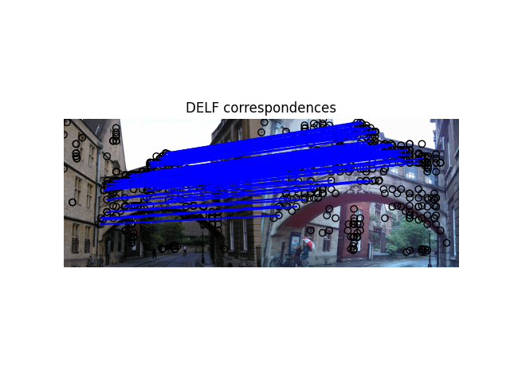

# DELF/DELG Training Instructions

This README documents the end-to-end process for training a local and/or global
image feature model on the
[Google Landmarks Dataset v2](https://github.com/cvdfoundation/google-landmark)
(GLDv2). This can be achieved following these steps:

1.  Install the DELF Python library.
2.  Download the raw images of the GLDv2 dataset.
3.  Prepare the training data.
4.  Run the training.

The next sections will cove each of these steps in greater detail.

## Prerequisites

Clone the [TensorFlow Model Garden](https://github.com/tensorflow/models)
repository and move into the `models/research/delf/delf/python/training`folder.

```
git clone https://github.com/tensorflow/models.git
cd models/research/delf/delf/python/training
```

## Install the DELF Library

To be able to use this code, please follow
[these instructions](../../../INSTALL_INSTRUCTIONS.md) to properly install the
DELF library.

## Download the GLDv2 Training Data

The [GLDv2](https://github.com/cvdfoundation/google-landmark) images are grouped
in 3 datasets: TRAIN, INDEX, TEST. Images in each dataset are grouped into
`*.tar` files and individually referenced in `*.csv`files containing training
metadata and licensing information. The number of `*.tar` files per dataset is
as follows:

*   TRAIN: 500 files.
*   INDEX: 100 files.
*   TEST: 20 files.

To download the GLDv2 images, run the
[`download_dataset.sh`](./download_dataset.sh) script like in the following
example:

```
bash download_dataset.sh 500 100 20
```

The script takes the following parameters, in order:

*   The number of image files from the TRAIN dataset to download (maximum 500).
*   The number of image files from the INDEX dataset to download (maximum 100).
*   The number of image files from the TEST dataset to download (maximum 20).

The script downloads the GLDv2 images under the following directory structure:

*   gldv2_dataset/
    *   train/ - Contains raw images from the TRAIN dataset.
    *   index/ - Contains raw images from the INDEX dataset.
    *   test/ - Contains raw images from the TEST dataset.

Each of the three folders `gldv2_dataset/train/`, `gldv2_dataset/index/` and
`gldv2_dataset/test/` contains the following:

*   The downloaded `*.tar` files.
*   The corresponding MD5 checksum files, `*.txt`.
*   The unpacked content of the downloaded files. (*Images are organized in
    folders and subfolders based on the first, second and third character in
    their file name.*)
*   The CSV files containing training and licensing metadata of the downloaded
    images.

*Please note that due to the large size of the GLDv2 dataset, the download can
take up to 12 hours and up to 1 TB of disk space. In order to save bandwidth and
disk space, you may want to start by downloading only the TRAIN dataset, the
only one required for the training, thus saving approximately ~95 GB, the
equivalent of the INDEX and TEST datasets. To further save disk space, the
`*.tar` files can be deleted after downloading and upacking them.*

## Prepare the Data for Training

Preparing the data for training consists of creating
[TFRecord](https://www.tensorflow.org/tutorials/load_data/tfrecord) files from
the raw GLDv2 images grouped into TRAIN and VALIDATION splits. The training set
produced contains only the *clean* subset of the GLDv2 dataset. The
[CVPR'20 paper](https://arxiv.org/abs/2004.01804) introducing the GLDv2 dataset
contains a detailed description of the *clean* subset.

Generating the TFRecord files containing the TRAIN and VALIDATION splits of the
*clean* GLDv2 subset can be achieved by running the
[`build_image_dataset.py`](./build_image_dataset.py) script. Assuming that the
GLDv2 images have been downloaded to the `gldv2_dataset` folder, the script can
be run as follows:

```
python3 build_image_dataset.py \
  --train_csv_path=gldv2_dataset/train/train.csv \
  --train_clean_csv_path=gldv2_dataset/train/train_clean.csv \
  --train_directory=gldv2_dataset/train/*/*/*/ \
  --output_directory=gldv2_dataset/tfrecord/ \
  --num_shards=128 \
  --generate_train_validation_splits \
  --validation_split_size=0.2
```

*Please refer to the source code of the
[`build_image_dataset.py`](./build_image_dataset.py) script for a detailed
description of its parameters.*

The TFRecord files written in the `OUTPUT_DIRECTORY` will be prefixed as
follows:

*   TRAIN split: `train-*`
*   VALIDATION split: `validation-*`

The same script can be used to generate TFRecord files for the TEST split for
post-training evaluation purposes. This can be achieved by adding the
parameters:

```
--test_csv_path=gldv2_dataset/train/test.csv \
--test_directory=gldv2_dataset/test/*/*/*/ \
```

In this scenario, the TFRecord files of the TEST split written in the
`OUTPUT_DIRECTORY` will be named according to the pattern `test-*`.

*Please note that due to the large size of the GLDv2 dataset, the generation of
the TFRecord files can take up to 12 hours and up to 500 GB of space disk.*

## Running the Training

For the training to converge faster, it is possible to initialize the ResNet
backbone with the weights of a pretrained ImageNet model. The ImageNet
checkpoint is available at the following location:
[`http://storage.googleapis.com/delf/resnet50_imagenet_weights.tar.gz`](http://storage.googleapis.com/delf/resnet50_imagenet_weights.tar.gz).
To download and unpack it run the following commands on a Linux box:

```
curl -Os http://storage.googleapis.com/delf/resnet50_imagenet_weights.tar.gz
tar -xzvf resnet50_imagenet_weights.tar.gz
```

### Training with Local Features

Assuming the TFRecord files were generated in the `gldv2_dataset/tfrecord/`
directory, running the following command should start training a model and
output the results in the `gldv2_training` directory:

```
python3 train.py \
  --train_file_pattern=gldv2_dataset/tfrecord/train* \
  --validation_file_pattern=gldv2_dataset/tfrecord/validation* \
  --imagenet_checkpoint=resnet50_weights_tf_dim_ordering_tf_kernels_notop.h5 \
  --dataset_version=gld_v2_clean \
  --logdir=gldv2_training/
```

### Training with Local and Global Features

It is also possible to train the model with an improved global features head as
introduced in the [DELG paper](https://arxiv.org/abs/2001.05027). To do this,
specify the additional parameter `--delg_global_features` when launching the
training, like in the following example:

```
python3 train.py \
  --train_file_pattern=gldv2_dataset/tfrecord/train* \
  --validation_file_pattern=gldv2_dataset/tfrecord/validation* \
  --imagenet_checkpoint=resnet50_weights_tf_dim_ordering_tf_kernels_notop.h5 \
  --dataset_version=gld_v2_clean \
  --logdir=gldv2_training/ \
  --delg_global_features
```

### Hyperparameter Guidelines

In order to improve the convergence of the training, the following
hyperparameter values have been tested and validated on the following
infrastructures, the remaining `train.py` flags keeping their **default 
values**:
* 8 Tesla P100 GPUs: `--batch_size=256`, `--initial_lr=0.01`
* 4 Tesla P100 GPUs: `--batch_size=128`, `--initial_lr=0.005`

*NOTE*: We are currently working on adding the autoencoder described in the DELG
paper to this codebase. Currently, it is not yet implemented here. Stay tuned!

## Exporting the Trained Model

Assuming the training output, the TensorFlow checkpoint, is in the
`gldv2_training` directory, running the following commands exports the model.

### DELF local feature-only model

This should be used when you are only interested in having a local feature
model.

```
python3 model/export_local_model.py \
  --ckpt_path=gldv2_training/delf_weights \
  --export_path=gldv2_model_local \
  --block3_strides
```

### DELG global feature-only model

This should be used when you are only interested in having a global feature
model.

```
python3 model/export_global_model.py \
  --ckpt_path=gldv2_training/delf_weights \
  --export_path=gldv2_model_global \
  --delg_global_features
```

### DELG local+global feature model

This should be used when you are interested in jointly extracting local and
global features.

```
python3 model/export_local_and_global_model.py \
  --ckpt_path=gldv2_training/delf_weights \
  --export_path=gldv2_model_local_and_global \
  --delg_global_features \
  --block3_strides
```

### Kaggle-compatible global feature model

To export a global feature model in the format required by the
[2020 Landmark Retrieval challenge](https://www.kaggle.com/c/landmark-retrieval-2020),
you can use the following command:

*NOTE*: this command is helpful to use the model directly in the above-mentioned
Kaggle competition; however, this is a different format than the one required in
this DELF/DELG codebase (ie, if you export the model this way, the commands
found in the [DELG instructions](../delg/DELG_INSTRUCTIONS.md) would not work).
To export the model in a manner compatible to this codebase, use a similar
command as the "DELG global feature-only model" above.

```
python3 model/export_global_model.py \
  --ckpt_path=gldv2_training/delf_weights \
  --export_path=gldv2_model_global \
  --input_scales_list=0.70710677,1.0,1.4142135 \
  --multi_scale_pool_type=sum \
  --normalize_global_descriptor
```

## Testing the trained model

### Testing the trained local feature model

After the trained model has been exported, it can be used to extract DELF
features from 2 images of the same landmark and to perform a matching test
between the 2 images based on the extracted features to validate they represent
the same landmark.

Start by downloading the Oxford buildings dataset:

```
mkdir data && cd data
wget http://www.robots.ox.ac.uk/~vgg/data/oxbuildings/oxbuild_images.tgz
mkdir oxford5k_images oxford5k_features
tar -xvzf oxbuild_images.tgz -C oxford5k_images/
cd ../
echo data/oxford5k_images/hertford_000056.jpg >> list_images.txt
echo data/oxford5k_images/oxford_000317.jpg >> list_images.txt
```

Make a copy of the
[`delf_config_example.pbtxt`](../examples/delf_config_example.pbtxt) protobuffer
file which configures the DELF feature extraction. Update the file by making the
following changes:

*   set the `model_path` attribute to the directory containing the exported
    model, `gldv2_model_local` in this example
*   add at the root level the attribute `is_tf2_exported` with the value `true`
*   set to `false` the `use_pca` attribute inside `delf_local_config`

The ensuing file should resemble the following:

```
model_path: "gldv2_model_local"
image_scales: .25
image_scales: .3536
image_scales: .5
image_scales: .7071
image_scales: 1.0
image_scales: 1.4142
image_scales: 2.0
is_tf2_exported: true
delf_local_config {
  use_pca: false
  max_feature_num: 1000
  score_threshold: 100.0
}
```

Run the following command to extract DELF features for the images
`hertford_000056.jpg` and `oxford_000317.jpg`:

```
python3 ../examples/extract_features.py \
  --config_path delf_config_example.pbtxt \
  --list_images_path list_images.txt \
  --output_dir data/oxford5k_features
```

Run the following command to perform feature matching between the images
`hertford_000056.jpg` and `oxford_000317.jpg`:

```
python3 ../examples/match_images.py \
  --image_1_path data/oxford5k_images/hertford_000056.jpg \
  --image_2_path data/oxford5k_images/oxford_000317.jpg \
  --features_1_path data/oxford5k_features/hertford_000056.delf \
  --features_2_path data/oxford5k_features/oxford_000317.delf \
  --output_image matched_images.png
```

The generated image `matched_images.png` should look similar to this one:



### Testing the trained global (or global+local) feature model

Please follow the [DELG instructions](../delg/DELG_INSTRUCTIONS.md). The only
modification should be to pass a different `delf_config_path` when doing feature
extraction, which should point to the newly-trained model. As described in the
[DelfConfig](../../protos/delf_config.proto), you should set the
`use_local_features` and `use_global_features` in the right way, depending on
which feature modalities you are using. Note also that you should set
`is_tf2_exported` to `true`.
