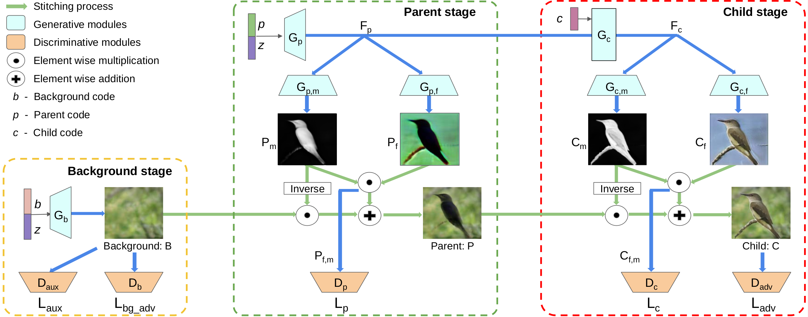

# finegan  
  
[](https://arxiv.org/abs/1811.11155) 
[](https://colab.research.google.com/github/Vishal-V/tf-models/blob/master/...)  

This repository is the unofficial implementation of the following [[Paper]](https://arxiv.org/abs/1811.11155).

* FineGAN: Unsupervised Hierarchical Disentanglement for Fine-Grained Object Generation and Discovery 

## Description

FineGAN, a novel unsupervised GAN framework, which disentangles the background, object shape, and object appearance to hierarchically generate images of fine-grained object categories. To disentangle the factors without supervision, the key idea is to use information theory to associate each factor to a latent code, and to condition the relationships between the codes in a specific way to induce the desired hierarchy. Through extensive experiments, FineGAN achieves the desired disentanglement to generate realistic and diverse images belonging to fine-grained classes of birds, dogs, and cars. FineGAN's automatically learned features can also cluster real images as a first attempt at solving the novel problem of unsupervised fine-grained object category discovery.
  
  
  
<!-- ## History

> :memo: Provide a changelog. -->
  
## Key Features

- [x] TensorFlow 2.2.0
- [ ] Inference example (Colab Demo)
- [ ] Transfer learning example
- [ ] Eager mode training with `tf.GradientTape` [If Required]
- [ ] Graph mode training with `model.train_on_batch`
- [x] Functional model with `tf.keras.layers`
- [ ] Input pipeline using `tf.data` and `tfds`
- [ ] Tensorflow Serving
- [ ] Vectorized transformations
- [x] GPU accelerated
- [ ] Fully integrated with `absl-py` from [abseil.io](https://abseil.io)
- [ ] Clean implementation
- [ ] Following the best practices
- [x] Apache 2.0 License

## Requirements

[](https://github.com/tensorflow/tensorflow/releases/tag/v2.2.0)
[](https://www.python.org/downloads/release/python-382/)

> :memo: Provide details of the software required.  
>  
> * Add a `requirements.txt` file to the root directory for installing the necessary dependencies.  
>   * Describe how to install requirements using pip.  
> * Alternatively, create INSTALL.md.  

To install requirements:

```setup
pip install -r requirements.txt
```

## Results
[](https://paperswithcode.com/sota/image-generation-on-cub-128-x-128?p=finegan-unsupervised-hierarchical)
  
[](https://paperswithcode.com/sota/image-generation-on-stanford-cars?p=finegan-unsupervised-hierarchical)  
  
[](https://paperswithcode.com/sota/image-generation-on-stanford-dogs?p=finegan-unsupervised-hierarchical)

> :memo: Provide a table with results. (e.g., accuracy, latency)  
>  
> * Provide links to the pre-trained models (checkpoint, SavedModel files).  
>   * Publish TensorFlow SavedModel files on TensorFlow Hub (tfhub.dev) if possible.  
> * Add links to [TensorBoard.dev](https://tensorboard.dev/) for visualizing metrics.  
>  
> An example table for image classification results  
>  
> ### Image Classification  
>  
> | Model name | Download | Top 1 Accuracy | Top 5 Accuracy |  
> |------------|----------|----------------|----------------|  
> | Model name | [Checkpoint](https://drive.google.com/...), [SavedModel](https://tfhub.dev/...) | xx% | xx% |  

## Dataset

> :memo: Provide information of the dataset used.  

## Training

> :memo: Provide training information.  
>  
> * Provide details for preprocessing, hyperparameters, random seeds, and environment.  
> * Provide a command line example for training.  

Please run this command line for training.

```shell
python3 ...
```

## Evaluation

> :memo: Provide an evaluation script with details of how to reproduce results.  
>  
> * Describe data preprocessing / postprocessing steps.  
> * Provide a command line example for evaluation.  

Please run this command line for evaluation.

```shell
python3 ...
```

## References

> :memo: Provide links to references.  

## Citation

> :memo: Make your repository citable.  
>  
> * Reference: [Making Your Code Citable](https://guides.github.com/activities/citable-code/)  

If you want to cite this repository in your research paper, please use the following information.

## Authors or Maintainers

* Vishal Vinod ([@Vishal-V](https://github.com/Vishal-V))
  
This project is licensed under the terms of the **Apache License 2.0**.
