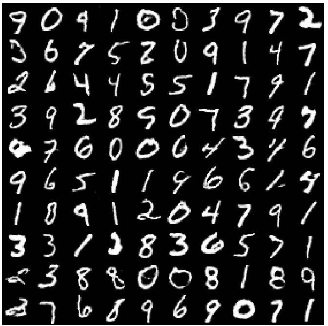
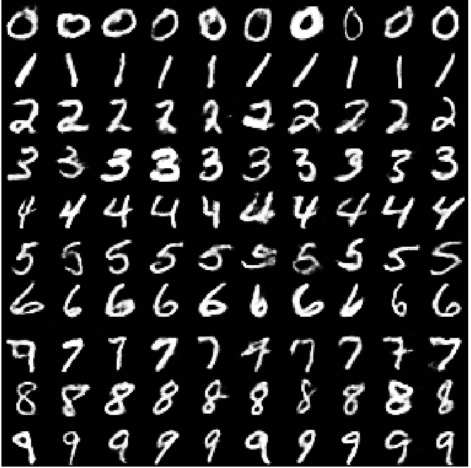
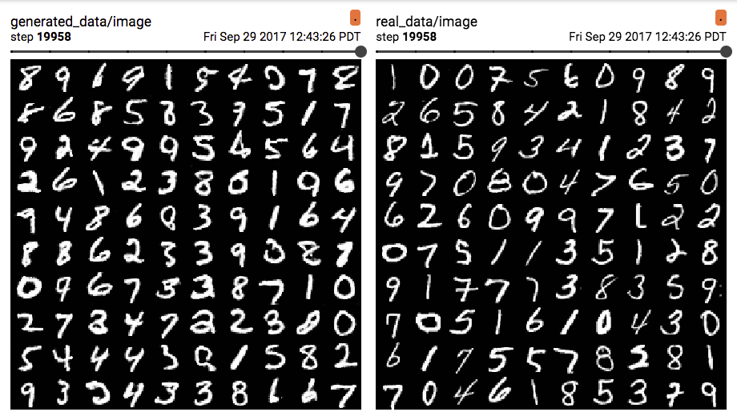
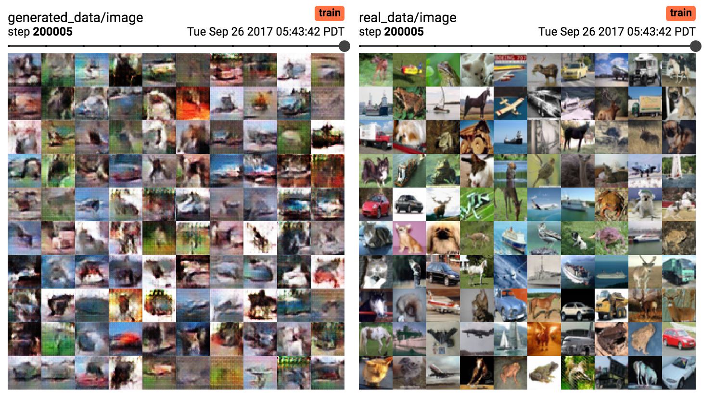
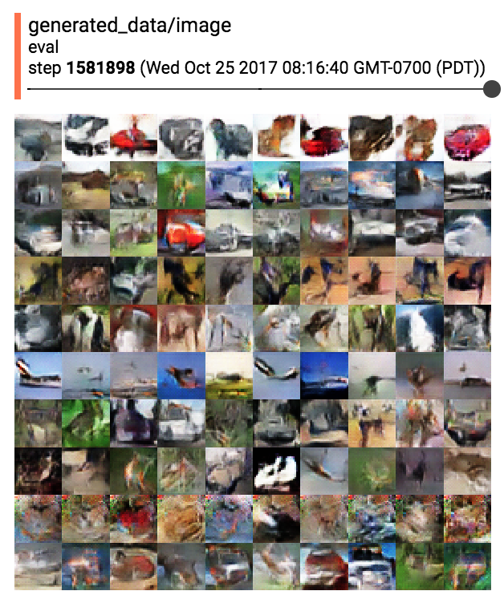
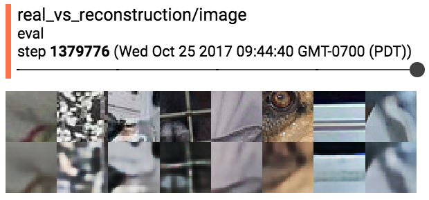
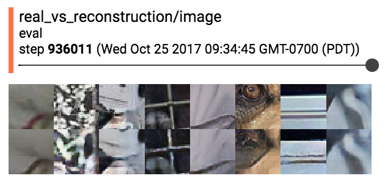

# TFGAN Examples

[TFGAN](https://github.com/tensorflow/tensorflow/tree/master/tensorflow/contrib/gan) is a lightweight library for training and evaluating Generative
Adversarial Networks (GANs). GANs have been in a wide range of tasks
including [image translation](https://arxiv.org/abs/1703.10593), [superresolution](https://arxiv.org/abs/1609.04802), and [data augmentation](https://arxiv.org/abs/1612.07828). This directory contains fully-working examples
that demonstrate the ease and flexibility of TFGAN. Each subdirectory contains a
different working example. The sub-sections below describe each of the problems,
and include some sample outputs. We've also included a [jupyter notebook](https://github.com/tensorflow/models/tree/master/research/gan/tutorial.ipynb), which
provides a walkthrough of TFGAN.

## Contacts

Maintainers of TFGAN:

* Joel Shor,
  github: [joel-shor](https://github.com/joel-shor)

## Table of contents

1. [MNIST](#mnist)

1. [MNIST with GANEstimator](#mnist_estimator)

1. [CIFAR10](#cifar10)

1. [Image compression (coming soon)](#compression)

## MNIST

We train a simple generator to produce [MNIST digits](http://yann.lecun.com/exdb/mnist/).
The unconditional case maps noise to MNIST digits. The conditional case maps
noise and digit class to MNIST digits. [InfoGAN](https://arxiv.org/abs/1606.03657) learns to produce
digits of a given class without labels, as well as controlling style. The
network architectures are defined [here](https://github.com/tensorflow/models/tree/master/research/gan/mnist/networks.py).

We use a classifier trained on MNIST digit classification for evaluation.

### Unconditional MNIST

### Conditional MNIST

### InfoGAN MNIST

## MNIST with GANEstimator

This setup is exactly the same as in the [unconditional MNIST example](#mnist), but
uses the `tf.Learn` `GANEstimator`.

## CIFAR10

We train a [DCGAN generator](https://arxiv.org/abs/1511.06434) to produce [CIFAR10 images](https://www.cs.toronto.edu/~kriz/cifar.html).
The unconditional case maps noise to CIFAR10 images. The conditional case maps
noise and image class to CIFAR10 images. The
network architectures are defined [here](https://github.com/tensorflow/models/tree/master/research/gan/cifar/networks.py).

We use the [Inception Score](https://arxiv.org/abs/1606.03498) to evaluate the images.

### Unconditional CIFAR10

### Conditional CIFAR10

## Image compression

In neural image compression, we attempt to reduce an image to a smaller representation
such that we can recreate the original image as closely as possible. See [`Full Resolution Image Compression with Recurrent Neural Networks`](https://arxiv.org/abs/1608.05148) for more details on using neural networks
for image compression.

In this example, we train an encoder to compress images to a compressed binary
representation and a decoder to map the binary representation back to the image.
We treat both systems together (encoder -> decoder) as the generator.

A typical image compression trained on L1 pixel loss will decode into
blurry images. We use an adversarial loss to force the outputs to be more
plausible.

This example also highlights the following infrastructure challenges:

* When you have custom code to keep track of your variables

Some other notes on the problem:

* Since the network is fully convolutional, we train on image patches.
* Bottleneck layer is floating point during training and binarized during
  evaluation.

### Results

#### No adversarial loss

#### Adversarial loss

### Architectures

#### Compression Network

The compression network is a DCGAN discriminator for the encoder and a DCGAN
generator for the decoder from [`Unsupervised Representation Learning with Deep Convolutional Generative Adversarial Networks`](https://arxiv.org/abs/1511.06434).
The binarizer adds uniform noise during training then binarizes during eval, as in
[`End-to-end Optimized Image Compression`](https://arxiv.org/abs/1611.01704).

#### Discriminator

The discriminator looks at 70x70 patches, as in
[`Image-to-Image Translation with Conditional Adversarial Networks`](https://arxiv.org/abs/1611.07004).

