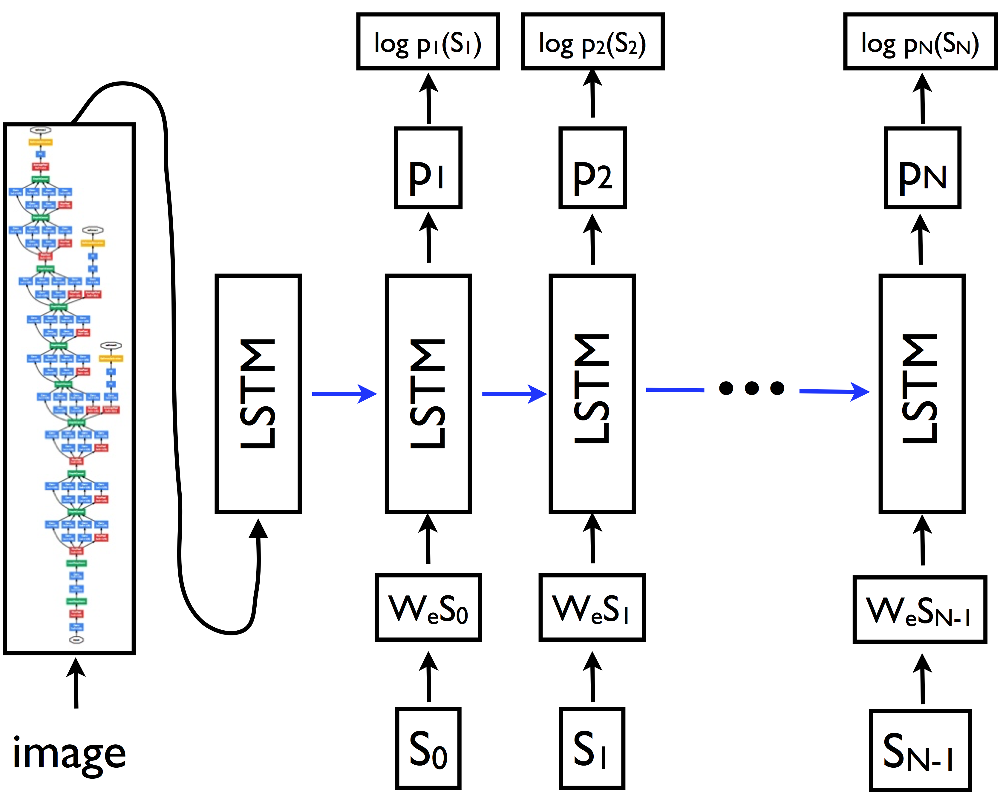

# Show and Tell: A Neural Image Caption Generator

A TensorFlow implementation of the image-to-text model described in the paper:

"Show and Tell: Lessons learned from the 2015 MSCOCO Image Captioning
Challenge."

Oriol Vinyals, Alexander Toshev, Samy Bengio, Dumitru Erhan.

*IEEE transactions on pattern analysis and machine intelligence (2016).*

Full text available at: http://arxiv.org/abs/1609.06647

## Contact
***Author:*** Chris Shallue

***Pull requests and issues:*** @cshallue

## Contents
* [Model Overview](#model-overview)
    * [Introduction](#introduction)
    * [Architecture](#architecture)
* [Getting Started](#getting-started)
    * [A Note on Hardware and Training Time](#a-note-on-hardware-and-training-time)
    * [Install Required Packages](#install-required-packages)
    * [Prepare the Training Data](#prepare-the-training-data)
    * [Download the Inception v3 Checkpoint](#download-the-inception-v3-checkpoint)
* [Training a Model](#training-a-model)
    * [Initial Training](#initial-training)
    * [Fine Tune the Inception v3 Model](#fine-tune-the-inception-v3-model)
* [Generating Captions](#generating-captions)

## Model Overview

### Introduction

The *Show and Tell* model is a deep neural network that learns how to describe
the content of images. For example:


### Architecture

The *Show and Tell* model is an example of an *encoder-decoder* neural network.
It works by first "encoding" an image into a fixed-length vector representation,
and then "decoding" the representation into a natural language description.

The image encoder is a deep convolutional neural network. This type of
network is widely used for image tasks and is currently state-of-the-art for
object recognition and detection. Our particular choice of network is the
[*Inception v3*](http://arxiv.org/abs/1512.00567) image recognition model
pretrained on the
[ILSVRC-2012-CLS](http://www.image-net.org/challenges/LSVRC/2012/) image
classification dataset.

The decoder is a long short-term memory (LSTM) network. This type of network is
commonly used for sequence modeling tasks such as language modeling and machine
translation. In the *Show and Tell* model, the LSTM network is trained as a
language model conditioned on the image encoding.

Words in the captions are represented with an embedding model. Each word in the
vocabulary is associated with a fixed-length vector representation that is
learned during training.

The following diagram illustrates the model architecture.



In this diagram, \{*s*<sub>0</sub>, *s*<sub>1</sub>, ..., *s*<sub>*N*-1</sub>\}
are the words of the caption and \{*w*<sub>*e*</sub>*s*<sub>0</sub>,
*w*<sub>*e*</sub>*s*<sub>1</sub>, ..., *w*<sub>*e*</sub>*s*<sub>*N*-1</sub>\}
are their corresponding word embedding vectors. The outputs \{*p*<sub>1</sub>,
*p*<sub>2</sub>, ..., *p*<sub>*N*</sub>\} of the LSTM are probability
distributions generated by the model for the next word in the sentence. The
terms \{log *p*<sub>1</sub>(*s*<sub>1</sub>),
log *p*<sub>2</sub>(*s*<sub>2</sub>), ...,
log *p*<sub>*N*</sub>(*s*<sub>*N*</sub>)\} are the log-likelihoods of the
correct word at each step; the negated sum of these terms is the minimization
objective of the model.

During the first phase of training the parameters of the *Inception v3* model
are kept fixed: it is simply a static image encoder function. A single trainable
layer is added on top of the *Inception v3* model to transform the image
embedding into the word embedding vector space. The model is trained with
respect to the parameters of the word embeddings, the parameters of the layer on
top of *Inception v3* and the parameters of the LSTM. In the second phase of
training, all parameters - including the parameters of *Inception v3* - are
trained to jointly fine-tune the image encoder and the LSTM.

Given a trained model and an image we use *beam search* to generate captions for
that image. Captions are generated word-by-word, where at each step *t* we use
the set of sentences already generated with length *t* - 1 to generate a new set
of sentences with length *t*. We keep only the top *k* candidates at each step,
where the hyperparameter *k* is called the *beam size*. We have found the best
performance with *k* = 3.

## Getting Started

### A Note on Hardware and Training Time

The time required to train the *Show and Tell* model depends on your specific
hardware and computational capacity. In this guide we assume you will be running
training on a single machine with a GPU. In our experience on an NVIDIA Tesla
K20m GPU the initial training phase takes 1-2 weeks. The second training phase
may take several additional weeks to achieve peak performance (but you can stop
this phase early and still get reasonable results).

It is possible to achieve a speed-up by implementing distributed training across
a cluster of machines with GPUs, but that is not covered in this guide.

Whilst it is possible to run this code on a CPU, beware that this may be
approximately 10 times slower.

### Install Required Packages
First ensure that you have installed the following required packages:

* **Bazel** ([instructions](http://bazel.io/docs/install.html))
* **Python 2.7**
* **TensorFlow** 1.0 or greater ([instructions](https://www.tensorflow.org/install/))
* **NumPy** ([instructions](http://www.scipy.org/install.html))
* **Natural Language Toolkit (NLTK)**:
    * First install NLTK ([instructions](http://www.nltk.org/install.html))
    * Then install the NLTK data package "punkt" ([instructions](http://www.nltk.org/data.html))
* **Unzip**
### Prepare the Training Data

To train the model you will need to provide training data in native TFRecord
format. The TFRecord format consists of a set of sharded files containing
serialized `tf.SequenceExample` protocol buffers. Each `tf.SequenceExample`
proto contains an image (JPEG format), a caption and metadata such as the image
id.

Each caption is a list of words. During preprocessing, a dictionary is created
that assigns each word in the vocabulary to an integer-valued id. Each caption
is encoded as a list of integer word ids in the `tf.SequenceExample` protos.

We have provided a script to download and preprocess the [MSCOCO](http://mscoco.org/) image captioning data set into this format. Downloading
and preprocessing the data may take several hours depending on your network and
computer speed. Please be patient.

Before running the script, ensure that your hard disk has at least 150GB of
available space for storing the downloaded and processed data.

```shell
# Location to save the MSCOCO data.
MSCOCO_DIR="${HOME}/im2txt/data/mscoco"

# Build the preprocessing script.
cd research/im2txt
bazel build //im2txt:download_and_preprocess_mscoco

# Run the preprocessing script.
bazel-bin/im2txt/download_and_preprocess_mscoco "${MSCOCO_DIR}"
```

The final line of the output should read:

```
2016-09-01 16:47:47.296630: Finished processing all 20267 image-caption pairs in data set 'test'.
```

When the script finishes you will find 256 training, 4 validation and 8 testing
files in `DATA_DIR`. The files will match the patterns `train-?????-of-00256`,
`val-?????-of-00004` and `test-?????-of-00008`, respectively.

### Download the Inception v3 Checkpoint

The *Show and Tell* model requires a pretrained *Inception v3* checkpoint file
to initialize the parameters of its image encoder submodel.

This checkpoint file is provided by the
[TensorFlow-Slim image classification library](https://github.com/tensorflow/models/tree/master/research/slim#tensorflow-slim-image-classification-library)
which provides a suite of pre-trained image classification models. You can read
more about the models provided by the library
[here](https://github.com/tensorflow/models/tree/master/research/slim#pre-trained-models).


Run the following commands to download the *Inception v3* checkpoint.

```shell
# Location to save the Inception v3 checkpoint.
INCEPTION_DIR="${HOME}/im2txt/data"
mkdir -p ${INCEPTION_DIR}

wget "http://download.tensorflow.org/models/inception_v3_2016_08_28.tar.gz"
tar -xvf "inception_v3_2016_08_28.tar.gz" -C ${INCEPTION_DIR}
rm "inception_v3_2016_08_28.tar.gz"
```

Note that the *Inception v3* checkpoint will only be used for initializing the
parameters of the *Show and Tell* model. Once the *Show and Tell* model starts
training it will save its own checkpoint files containing the values of all its
parameters (including copies of the *Inception v3* parameters). If training is
stopped and restarted, the parameter values will be restored from the latest
*Show and Tell* checkpoint and the *Inception v3* checkpoint will be ignored. In
other words, the *Inception v3* checkpoint is only used in the 0-th global step
(initialization) of training the *Show and Tell* model.

## Training a Model

### Initial Training

Run the training script.

```shell
# Directory containing preprocessed MSCOCO data.
MSCOCO_DIR="${HOME}/im2txt/data/mscoco"

# Inception v3 checkpoint file.
INCEPTION_CHECKPOINT="${HOME}/im2txt/data/inception_v3.ckpt"

# Directory to save the model.
MODEL_DIR="${HOME}/im2txt/model"

# Build the model.
cd research/im2txt
bazel build -c opt //im2txt/...

# Run the training script.
bazel-bin/im2txt/train \
  --input_file_pattern="${MSCOCO_DIR}/train-?????-of-00256" \
  --inception_checkpoint_file="${INCEPTION_CHECKPOINT}" \
  --train_dir="${MODEL_DIR}/train" \
  --train_inception=false \
  --number_of_steps=1000000
```

Run the evaluation script in a separate process. This will log evaluation
metrics to TensorBoard which allows training progress to be monitored in
real-time.

Note that you may run out of memory if you run the evaluation script on the same
GPU as the training script. You can run the command
`export CUDA_VISIBLE_DEVICES=""` to force the evaluation script to run on CPU.
If evaluation runs too slowly on CPU, you can decrease the value of
`--num_eval_examples`.

```shell
MSCOCO_DIR="${HOME}/im2txt/data/mscoco"
MODEL_DIR="${HOME}/im2txt/model"

# Ignore GPU devices (only necessary if your GPU is currently memory
# constrained, for example, by running the training script).
export CUDA_VISIBLE_DEVICES=""

# Run the evaluation script. This will run in a loop, periodically loading the
# latest model checkpoint file and computing evaluation metrics.
bazel-bin/im2txt/evaluate \
  --input_file_pattern="${MSCOCO_DIR}/val-?????-of-00004" \
  --checkpoint_dir="${MODEL_DIR}/train" \
  --eval_dir="${MODEL_DIR}/eval"
```

Run a TensorBoard server in a separate process for real-time monitoring of
training progress and evaluation metrics.

```shell
MODEL_DIR="${HOME}/im2txt/model"

# Run a TensorBoard server.
tensorboard --logdir="${MODEL_DIR}"
```

### Fine Tune the Inception v3 Model

Your model will already be able to generate reasonable captions after the first
phase of training. Try it out! (See [Generating Captions](#generating-captions)).

You can further improve the performance of the model by running a
second training phase to jointly fine-tune the parameters of the *Inception v3*
image submodel and the LSTM.

```shell
# Restart the training script with --train_inception=true.
bazel-bin/im2txt/train \
  --input_file_pattern="${MSCOCO_DIR}/train-?????-of-00256" \
  --train_dir="${MODEL_DIR}/train" \
  --train_inception=true \
  --number_of_steps=3000000  # Additional 2M steps (assuming 1M in initial training).
```

Note that training will proceed much slower now, and the model will continue to
improve by a small amount for a long time. We have found that it will improve
slowly for an additional 2-2.5 million steps before it begins to overfit. This
may take several weeks on a single GPU. If you don't care about absolutely
optimal performance then feel free to halt training sooner by stopping the
training script or passing a smaller value to the flag `--number_of_steps`. Your
model will still work reasonably well.

## Generating Captions

Your trained *Show and Tell* model can generate captions for any JPEG image! The
following command line will generate captions for an image from the test set.

```shell
# Path to checkpoint file or a directory containing checkpoint files. Passing
# a directory will only work if there is also a file named 'checkpoint' which
# lists the available checkpoints in the directory. It will not work if you
# point to a directory with just a copy of a model checkpoint: in that case,
# you will need to pass the checkpoint path explicitly.
CHECKPOINT_PATH="${HOME}/im2txt/model/train"

# Vocabulary file generated by the preprocessing script.
VOCAB_FILE="${HOME}/im2txt/data/mscoco/word_counts.txt"

# JPEG image file to caption.
IMAGE_FILE="${HOME}/im2txt/data/mscoco/raw-data/val2014/COCO_val2014_000000224477.jpg"

# Build the inference binary.
cd research/im2txt
bazel build -c opt //im2txt:run_inference

# Ignore GPU devices (only necessary if your GPU is currently memory
# constrained, for example, by running the training script).
export CUDA_VISIBLE_DEVICES=""

# Run inference to generate captions.
bazel-bin/im2txt/run_inference \
  --checkpoint_path=${CHECKPOINT_PATH} \
  --vocab_file=${VOCAB_FILE} \
  --input_files=${IMAGE_FILE}
```

Example output:

```
Captions for image COCO_val2014_000000224477.jpg:
  0) a man riding a wave on top of a surfboard . (p=0.040413)
  1) a person riding a surf board on a wave (p=0.017452)
  2) a man riding a wave on a surfboard in the ocean . (p=0.005743)
```

Note: you may get different results. Some variation between different models is
expected.

Here is the image:


