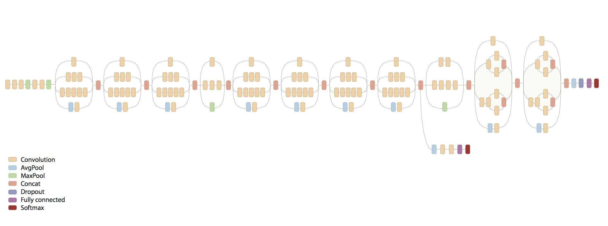

**NOTE: For the most part, you will find a newer version of this code at [models/research/slim](https://github.com/tensorflow/models/tree/master/research/slim).** In particular:

*   `inception_train.py` and `imagenet_train.py` should no longer be used. The slim editions for running on multiple GPUs are the current best examples.
*   `inception_distributed_train.py` and `imagenet_distributed_train.py` are still valid examples of distributed training.

For performance benchmarking, please see https://www.tensorflow.org/performance/benchmarks.

---

# Inception in TensorFlow

[ImageNet](http://www.image-net.org/) is a common academic data set in machine
learning for training an image recognition system. Code in this directory
demonstrates how to use TensorFlow to train and evaluate a type of convolutional
neural network (CNN) on this academic data set. In particular, we demonstrate
how to train the Inception v3 architecture as specified in:

_Rethinking the Inception Architecture for Computer Vision_

Christian Szegedy, Vincent Vanhoucke, Sergey Ioffe, Jonathon Shlens, Zbigniew
Wojna

http://arxiv.org/abs/1512.00567

This network achieves 21.2% top-1 and 5.6% top-5 error for single frame
evaluation with a computational cost of 5 billion multiply-adds per inference
and with using less than 25 million parameters. Below is a visualization of the
model architecture.



## Description of Code

The code base provides three core binaries for:

*   Training an Inception v3 network from scratch across multiple GPUs and/or
    multiple machines using the ImageNet 2012 Challenge training data set.
*   Evaluating an Inception v3 network using the ImageNet 2012 Challenge
    validation data set.
*   Retraining an Inception v3 network on a novel task and back-propagating the
    errors to fine tune the network weights.

The training procedure employs synchronous stochastic gradient descent across
multiple GPUs. The user may specify the number of GPUs they wish to harness. The
synchronous training performs *batch-splitting* by dividing a given batch across
multiple GPUs.

The training set up is nearly identical to the section [Training a Model Using
Multiple GPU Cards](https://www.tensorflow.org/tutorials/deep_cnn/index.html#launching_and_training_the_model_on_multiple_gpu_cards)
where we have substituted the CIFAR-10 model architecture with Inception v3. The
primary differences with that setup are:

*   Calculate and update the batch-norm statistics during training so that they
    may be substituted in during evaluation.
*   Specify the model architecture using a (still experimental) higher level
    language called TensorFlow-Slim.

For more details about TensorFlow-Slim, please see the [Slim README](inception/slim/README.md). Please note that this higher-level language is still
*experimental* and the API may change over time depending on usage and
subsequent research.

## Getting Started

Before you run the training script for the first time, you will need to download
and convert the ImageNet data to native TFRecord format. The TFRecord format
consists of a set of sharded files where each entry is a serialized `tf.Example`
proto. Each `tf.Example` proto contains the ImageNet image (JPEG encoded) as
well as metadata such as label and bounding box information. See
[`parse_example_proto`](inception/image_processing.py) for details.

We provide a single [script](inception/data/download_and_preprocess_imagenet.sh) for
downloading and converting ImageNet data to TFRecord format. Downloading and
preprocessing the data may take several hours (up to half a day) depending on
your network and computer speed. Please be patient.

To begin, you will need to sign up for an account with [ImageNet](http://image-net.org) to gain access to the data. Look for the sign up page,
create an account and request an access key to download the data.

After you have `USERNAME` and `PASSWORD`, you are ready to run our script. Make
sure that your hard disk has at least 500 GB of free space for downloading and
storing the data. Here we select `DATA_DIR=$HOME/imagenet-data` as such a
location but feel free to edit accordingly.

When you run the below script, please enter *USERNAME* and *PASSWORD* when
prompted. This will occur at the very beginning. Once these values are entered,
you will not need to interact with the script again.

```shell
# location of where to place the ImageNet data
DATA_DIR=$HOME/imagenet-data

# build the preprocessing script.
cd tensorflow-models/inception
bazel build //inception:download_and_preprocess_imagenet

# run it
bazel-bin/inception/download_and_preprocess_imagenet "${DATA_DIR}"
```

The final line of the output script should read:

```shell
2016-02-17 14:30:17.287989: Finished writing all 1281167 images in data set.
```

When the script finishes, you will find 1024 training files and 128 validation
files in the `DATA_DIR`. The files will match the patterns
`train-?????-of-01024` and `validation-?????-of-00128`, respectively.

[Congratulations!](https://www.youtube.com/watch?v=9bZkp7q19f0) You are now
ready to train or evaluate with the ImageNet data set.

## How to Train from Scratch

**WARNING** Training an Inception v3 network from scratch is a computationally
intensive task and depending on your compute setup may take several days or even
weeks.

*Before proceeding* please read the [Convolutional Neural Networks](https://www.tensorflow.org/tutorials/deep_cnn/index.html) tutorial; in
particular, focus on [Training a Model Using Multiple GPU Cards](https://www.tensorflow.org/tutorials/deep_cnn/index.html#launching_and_training_the_model_on_multiple_gpu_cards). The model training method is nearly identical to that described in the
CIFAR-10 multi-GPU model training. Briefly, the model training

*   Places an individual model replica on each GPU.
*   Splits the batch across the GPUs.
*   Updates model parameters synchronously by waiting for all GPUs to finish
    processing a batch of data.

The training procedure is encapsulated by this diagram of how operations and
variables are placed on CPU and GPUs respectively.

<div style="width:40%; margin:auto; margin-bottom:10px; margin-top:20px;">
  
</div>

Each tower computes the gradients for a portion of the batch and the gradients
are combined and averaged across the multiple towers in order to provide a
single update of the Variables stored on the CPU.

A crucial aspect of training a network of this size is *training speed* in terms
of wall-clock time. The training speed is dictated by many factors -- most
importantly the batch size and the learning rate schedule. Both of these
parameters are heavily coupled to the hardware set up.

Generally speaking, a batch size is a difficult parameter to tune as it requires
balancing memory demands of the model, memory available on the GPU and speed of
computation. Generally speaking, employing larger batch sizes leads to more
efficient computation and potentially more efficient training steps.

We have tested several hardware setups for training this model from scratch but
we emphasize that depending your hardware set up, you may need to adapt the
batch size and learning rate schedule.

Please see the comments in `inception_train.py` for a few selected learning rate
plans based on some selected hardware setups.

To train this model, you simply need to specify the following:

```shell
# Build the model. Note that we need to make sure the TensorFlow is ready to
# use before this as this command will not build TensorFlow.
cd tensorflow-models/inception
bazel build //inception:imagenet_train

# run it
bazel-bin/inception/imagenet_train --num_gpus=1 --batch_size=32 --train_dir=/tmp/imagenet_train --data_dir=/tmp/imagenet_data
```

The model reads in the ImageNet training data from `--data_dir`. If you followed
the instructions in [Getting Started](#getting-started), then set
`--data_dir="${DATA_DIR}"`. The script assumes that there exists a set of
sharded TFRecord files containing the ImageNet data. If you have not created
TFRecord files, please refer to [Getting Started](#getting-started)

Here is the output of the above command line when running on a Tesla K40c:

```shell
2016-03-07 12:24:59.922898: step 0, loss = 13.11 (5.3 examples/sec; 6.064 sec/batch)
2016-03-07 12:25:55.206783: step 10, loss = 13.71 (9.4 examples/sec; 3.394 sec/batch)
2016-03-07 12:26:28.905231: step 20, loss = 14.81 (9.5 examples/sec; 3.380 sec/batch)
2016-03-07 12:27:02.699719: step 30, loss = 14.45 (9.5 examples/sec; 3.378 sec/batch)
2016-03-07 12:27:36.515699: step 40, loss = 13.98 (9.5 examples/sec; 3.376 sec/batch)
2016-03-07 12:28:10.220956: step 50, loss = 13.92 (9.6 examples/sec; 3.327 sec/batch)
2016-03-07 12:28:43.658223: step 60, loss = 13.28 (9.6 examples/sec; 3.350 sec/batch)
...
```

In this example, a log entry is printed every 10 step and the line includes the
total loss (starts around 13.0-14.0) and the speed of processing in terms of
throughput (examples / sec) and batch speed (sec/batch).

The number of GPU devices is specified by `--num_gpus` (which defaults to 1).
Specifying `--num_gpus` greater then 1 splits the batch evenly split across the
GPU cards.

```shell
# Build the model. Note that we need to make sure the TensorFlow is ready to
# use before this as this command will not build TensorFlow.
cd tensorflow-models/inception
bazel build //inception:imagenet_train

# run it
bazel-bin/inception/imagenet_train --num_gpus=2 --batch_size=64 --train_dir=/tmp/imagenet_train
```

This model splits the batch of 64 images across 2 GPUs and calculates the
average gradient by waiting for both GPUs to finish calculating the gradients
from their respective data (See diagram above). Generally speaking, using larger
numbers of GPUs leads to higher throughput as well as the opportunity to use
larger batch sizes. In turn, larger batch sizes imply better estimates of the
gradient enabling the usage of higher learning rates. In summary, using more
GPUs results in simply faster training speed.

Note that selecting a batch size is a difficult parameter to tune as it requires
balancing memory demands of the model, memory available on the GPU and speed of
computation. Generally speaking, employing larger batch sizes leads to more
efficient computation and potentially more efficient training steps.

Note that there is considerable noise in the loss function on individual steps
in the previous log. Because of this noise, it is difficult to discern how well
a model is learning. The solution to the last problem is to launch TensorBoard
pointing to the directory containing the events log.

```shell
tensorboard --logdir=/tmp/imagenet_train
```

TensorBoard has access to the many Summaries produced by the model that describe
multitudes of statistics tracking the model behavior and the quality of the
learned model. In particular, TensorBoard tracks a exponentially smoothed
version of the loss. In practice, it is far easier to judge how well a model
learns by monitoring the smoothed version of the loss.

## How to Train from Scratch in a Distributed Setting

**NOTE** Distributed TensorFlow requires version 0.8 or later.

Distributed TensorFlow lets us use multiple machines to train a model faster.
This is quite different from the training with multiple GPU towers on a single
machine where all parameters and gradients computation are in the same place. We
coordinate the computation across multiple machines by employing a centralized
repository for parameters that maintains a unified, single copy of model
parameters. Each individual machine sends gradient updates to the centralized
parameter repository which coordinates these updates and sends back updated
parameters to the individual machines running the model training.

We term each machine that runs a copy of the training a `worker` or `replica`.
We term each machine that maintains model parameters a `ps`, short for
`parameter server`. Note that we might have more than one machine acting as a
`ps` as the model parameters may be sharded across multiple machines.

Variables may be updated with synchronous or asynchronous gradient updates. One
may construct a an [`Optimizer`](https://www.tensorflow.org/api_docs/python/train.html#optimizers) in TensorFlow
that constructs the necessary graph for either case diagrammed below from the
TensorFlow [Whitepaper](http://download.tensorflow.org/paper/whitepaper2015.pdf):

<div style="width:40%; margin:auto; margin-bottom:10px; margin-top:20px;">
  
</div>

In [a recent paper](https://arxiv.org/abs/1604.00981), synchronous gradient
updates have demonstrated to reach higher accuracy in a shorter amount of time.
In this distributed Inception example we employ synchronous gradient updates.

Note that in this example each replica has a single tower that uses one GPU.

The command-line flags `worker_hosts` and `ps_hosts` specify available servers.
The same binary will be used for both the `worker` jobs and the `ps` jobs.
Command line flag `job_name` will be used to specify what role a task will be
playing and `task_id` will be used to identify which one of the jobs it is
running. Several things to note here:

*   The numbers of `ps` and `worker` tasks are inferred from the lists of hosts
    specified in the flags. The `task_id` should be within the range `[0,
    num_ps_tasks)` for `ps` tasks and `[0, num_worker_tasks)` for `worker`
    tasks.
*   `ps` and `worker` tasks can run on the same machine, as long as that machine
    has sufficient resources to handle both tasks. Note that the `ps` task does
    not benefit from a GPU, so it should not attempt to use one (see below).
*   Multiple `worker` tasks can run on the same machine with multiple GPUs so
    machine_A with 2 GPUs may have 2 workers while machine_B with 1 GPU just has
    1 worker.
*   The default learning rate schedule works well for a wide range of number of
    replicas [25, 50, 100] but feel free to tune it for even better results.
*   The command line of both `ps` and `worker` tasks should include the complete
    list of `ps_hosts` and `worker_hosts`.
*   There is a chief `worker` among all workers which defaults to `worker` 0.
    The chief will be in charge of initializing all the parameters, writing out
    the summaries and the checkpoint. The checkpoint and summary will be in the
    `train_dir` of the host for `worker` 0.
*   Each worker processes a batch_size number of examples but each gradient
    update is computed from all replicas. Hence, the effective batch size of
    this model is batch_size * num_workers.

```shell
# Build the model. Note that we need to make sure the TensorFlow is ready to
# use before this as this command will not build TensorFlow.
cd tensorflow-models/inception
bazel build //inception:imagenet_distributed_train

# To start worker 0, go to the worker0 host and run the following (Note that
# task_id should be in the range [0, num_worker_tasks):
bazel-bin/inception/imagenet_distributed_train \
--batch_size=32 \
--data_dir=$HOME/imagenet-data \
--job_name='worker' \
--task_id=0 \
--ps_hosts='ps0.example.com:2222' \
--worker_hosts='worker0.example.com:2222,worker1.example.com:2222'

# To start worker 1, go to the worker1 host and run the following (Note that
# task_id should be in the range [0, num_worker_tasks):
bazel-bin/inception/imagenet_distributed_train \
--batch_size=32 \
--data_dir=$HOME/imagenet-data \
--job_name='worker' \
--task_id=1 \
--ps_hosts='ps0.example.com:2222' \
--worker_hosts='worker0.example.com:2222,worker1.example.com:2222'

# To start the parameter server (ps), go to the ps host and run the following (Note
# that task_id should be in the range [0, num_ps_tasks):
bazel-bin/inception/imagenet_distributed_train \
--job_name='ps' \
--task_id=0 \
--ps_hosts='ps0.example.com:2222' \
--worker_hosts='worker0.example.com:2222,worker1.example.com:2222'
```

If you have installed a GPU-compatible version of TensorFlow, the `ps` will also
try to allocate GPU memory although it is not helpful. This could potentially
crash the worker on the same machine as it has little to no GPU memory to
allocate. To avoid this, you can prepend the previous command to start `ps`
with: `CUDA_VISIBLE_DEVICES=''`

```shell
CUDA_VISIBLE_DEVICES='' bazel-bin/inception/imagenet_distributed_train \
--job_name='ps' \
--task_id=0 \
--ps_hosts='ps0.example.com:2222' \
--worker_hosts='worker0.example.com:2222,worker1.example.com:2222'
```

If you have run everything correctly, you should see a log in each `worker` job
that looks like the following. Note the training speed varies depending on your
hardware and the first several steps could take much longer.

```shell
INFO:tensorflow:PS hosts are: ['ps0.example.com:2222', 'ps1.example.com:2222']
INFO:tensorflow:Worker hosts are: ['worker0.example.com:2222', 'worker1.example.com:2222']
I tensorflow/core/distributed_runtime/rpc/grpc_channel.cc:206] Initialize HostPortsGrpcChannelCache for job ps -> {ps0.example.com:2222, ps1.example.com:2222}
I tensorflow/core/distributed_runtime/rpc/grpc_channel.cc:206] Initialize HostPortsGrpcChannelCache for job worker -> {localhost:2222, worker1.example.com:2222}
I tensorflow/core/distributed_runtime/rpc/grpc_server_lib.cc:202] Started server with target: grpc://localhost:2222
INFO:tensorflow:Created variable global_step:0 with shape () and init <function zeros_initializer at 0x7f6aa014b140>

...

INFO:tensorflow:Created variable logits/logits/biases:0 with shape (1001,) and init <function _initializer at 0x7f6a77f3cf50>
INFO:tensorflow:SyncReplicas enabled: replicas_to_aggregate=2; total_num_replicas=2
INFO:tensorflow:2016-04-13 01:56:26.405639 Supervisor
INFO:tensorflow:Started 2 queues for processing input data.
INFO:tensorflow:global_step/sec: 0
INFO:tensorflow:Worker 0: 2016-04-13 01:58:40.342404: step 0, loss = 12.97(0.0 examples/sec; 65.428  sec/batch)
INFO:tensorflow:global_step/sec: 0.0172907
...
```

and a log in each `ps` job that looks like the following:

```shell
INFO:tensorflow:PS hosts are: ['ps0.example.com:2222', 'ps1.example.com:2222']
INFO:tensorflow:Worker hosts are: ['worker0.example.com:2222', 'worker1.example.com:2222']
I tensorflow/core/distributed_runtime/rpc/grpc_channel.cc:206] Initialize HostPortsGrpcChannelCache for job ps -> {localhost:2222, ps1.example.com:2222}
I tensorflow/core/distributed_runtime/rpc/grpc_channel.cc:206] Initialize HostPortsGrpcChannelCache for job worker -> {worker0.example.com:2222, worker1.example.com:2222}
I tensorflow/core/distributed_runtime/rpc/grpc_server_lib.cc:202] Started server with target: grpc://localhost:2222
```

If you compiled TensorFlow (from v1.1-rc3) with VERBS support and you have the
required device and IB verbs SW stack, you can specify --protocol='grpc+verbs'
In order to use Verbs RDMA for Tensor passing between workers and ps.
Need to add the the --protocol flag in all tasks (ps and workers).
The default protocol is the TensorFlow default protocol of grpc.


[Congratulations!](https://www.youtube.com/watch?v=9bZkp7q19f0) You are now
training Inception in a distributed manner.

## How to Evaluate

Evaluating an Inception v3 model on the ImageNet 2012 validation data set
requires running a separate binary.

The evaluation procedure is nearly identical to [Evaluating a Model](https://www.tensorflow.org/tutorials/deep_cnn/index.html#evaluating_a_model)
described in the [Convolutional Neural Network](https://www.tensorflow.org/tutorials/deep_cnn/index.html) tutorial.

**WARNING** Be careful not to run the evaluation and training binary on the same
GPU or else you might run out of memory. Consider running the evaluation on a
separate GPU if available or suspending the training binary while running the
evaluation on the same GPU.

Briefly, one can evaluate the model by running:

```shell
# Build the model. Note that we need to make sure the TensorFlow is ready to
# use before this as this command will not build TensorFlow.
cd tensorflow-models/inception
bazel build //inception:imagenet_eval

# run it
bazel-bin/inception/imagenet_eval --checkpoint_dir=/tmp/imagenet_train --eval_dir=/tmp/imagenet_eval
```

Note that we point `--checkpoint_dir` to the location of the checkpoints saved
by `inception_train.py` above. Running the above command results in the
following output:

```shell
2016-02-17 22:32:50.391206: precision @ 1 = 0.735
...
```

The script calculates the precision @ 1 over the entire validation data
periodically. The precision @ 1 measures the how often the highest scoring
prediction from the model matched the ImageNet label -- in this case, 73.5%. If
you wish to run the eval just once and not periodically, append the `--run_once`
option.

Much like the training script, `imagenet_eval.py` also exports summaries that
may be visualized in TensorBoard. These summaries calculate additional
statistics on the predictions (e.g. recall @ 5) as well as monitor the
statistics of the model activations and weights during evaluation.

## How to Fine-Tune a Pre-Trained Model on a New Task

### Getting Started

Much like training the ImageNet model we must first convert a new data set to
the sharded TFRecord format which each entry is a serialized `tf.Example` proto.

We have provided a script demonstrating how to do this for small data set of of
a few thousand flower images spread across 5 labels:

```shell
daisy, dandelion, roses, sunflowers, tulips
```

There is a single automated script that downloads the data set and converts it
to the TFRecord format. Much like the ImageNet data set, each record in the
TFRecord format is a serialized `tf.Example` proto whose entries include a
JPEG-encoded string and an integer label. Please see [`parse_example_proto`](inception/image_processing.py) for details.

The script just takes a few minutes to run depending your network connection
speed for downloading and processing the images. Your hard disk requires 200MB
of free storage. Here we select `DATA_DIR=/tmp/flowers-data/` as such a location
but feel free to edit accordingly.

```shell
# location of where to place the flowers data
FLOWERS_DATA_DIR=/tmp/flowers-data/

# build the preprocessing script.
cd tensorflow-models/inception
bazel build //inception:download_and_preprocess_flowers

# run it
bazel-bin/inception/download_and_preprocess_flowers "${FLOWERS_DATA_DIR}"
```

If the script runs successfully, the final line of the terminal output should
look like:

```shell
2016-02-24 20:42:25.067551: Finished writing all 3170 images in data set.
```

When the script finishes you will find 2 shards for the training and validation
files in the `DATA_DIR`. The files will match the patterns `train-?????-of-00002`
and `validation-?????-of-00002`, respectively.

**NOTE** If you wish to prepare a custom image data set for transfer learning,
you will need to invoke [`build_image_data.py`](inception/data/build_image_data.py) on
your custom data set. Please see the associated options and assumptions behind
this script by reading the comments section of [`build_image_data.py`](inception/data/build_image_data.py). Also, if your custom data has a different
number of examples or classes, you need to change the appropriate values in
[`imagenet_data.py`](inception/imagenet_data.py).

The second piece you will need is a trained Inception v3 image model. You have
the option of either training one yourself (See [How to Train from Scratch](#how-to-train-from-scratch) for details) or you can download a pre-trained
model like so:

```shell
# location of where to place the Inception v3 model
INCEPTION_MODEL_DIR=$HOME/inception-v3-model
mkdir -p ${INCEPTION_MODEL_DIR}
cd ${INCEPTION_MODEL_DIR}

# download the Inception v3 model
curl -O http://download.tensorflow.org/models/image/imagenet/inception-v3-2016-03-01.tar.gz
tar xzf inception-v3-2016-03-01.tar.gz

# this will create a directory called inception-v3 which contains the following files.
> ls inception-v3
README.txt
checkpoint
model.ckpt-157585
```

[Congratulations!](https://www.youtube.com/watch?v=9bZkp7q19f0) You are now
ready to fine-tune your pre-trained Inception v3 model with the flower data set.

### How to Retrain a Trained Model on the Flowers Data

We are now ready to fine-tune a pre-trained Inception-v3 model on the flowers
data set. This requires two distinct changes to our training procedure:

1.  Build the exact same model as previously except we change the number of
    labels in the final classification layer.

2.  Restore all weights from the pre-trained Inception-v3 except for the final
    classification layer; this will get randomly initialized instead.

We can perform these two operations by specifying two flags:
`--pretrained_model_checkpoint_path` and `--fine_tune`. The first flag is a
string that points to the path of a pre-trained Inception-v3 model. If this flag
is specified, it will load the entire model from the checkpoint before the
script begins training.

The second flag `--fine_tune` is a boolean that indicates whether the last
classification layer should be randomly initialized or restored. You may set
this flag to false if you wish to continue training a pre-trained model from a
checkpoint. If you set this flag to true, you can train a new classification
layer from scratch.

In order to understand how `--fine_tune` works, please see the discussion on
`Variables` in the TensorFlow-Slim [`README.md`](inception/slim/README.md).

Putting this all together you can retrain a pre-trained Inception-v3 model on
the flowers data set with the following command.

```shell
# Build the model. Note that we need to make sure the TensorFlow is ready to
# use before this as this command will not build TensorFlow.
cd tensorflow-models/inception
bazel build //inception:flowers_train

# Path to the downloaded Inception-v3 model.
MODEL_PATH="${INCEPTION_MODEL_DIR}/inception-v3/model.ckpt-157585"

# Directory where the flowers data resides.
FLOWERS_DATA_DIR=/tmp/flowers-data/

# Directory where to save the checkpoint and events files.
TRAIN_DIR=/tmp/flowers_train/

# Run the fine-tuning on the flowers data set starting from the pre-trained
# Imagenet-v3 model.
bazel-bin/inception/flowers_train \
  --train_dir="${TRAIN_DIR}" \
  --data_dir="${FLOWERS_DATA_DIR}" \
  --pretrained_model_checkpoint_path="${MODEL_PATH}" \
  --fine_tune=True \
  --initial_learning_rate=0.001 \
  --input_queue_memory_factor=1
```

We have added a few extra options to the training procedure.

*   Fine-tuning a model a separate data set requires significantly lowering the
    initial learning rate. We set the initial learning rate to 0.001.
*   The flowers data set is quite small so we shrink the size of the shuffling
    queue of examples. See [Adjusting Memory Demands](#adjusting-memory-demands)
    for more details.

The training script will only reports the loss. To evaluate the quality of the
fine-tuned model, you will need to run `flowers_eval`:

```shell
# Build the model. Note that we need to make sure the TensorFlow is ready to
# use before this as this command will not build TensorFlow.
cd tensorflow-models/inception
bazel build //inception:flowers_eval

# Directory where we saved the fine-tuned checkpoint and events files.
TRAIN_DIR=/tmp/flowers_train/

# Directory where the flowers data resides.
FLOWERS_DATA_DIR=/tmp/flowers-data/

# Directory where to save the evaluation events files.
EVAL_DIR=/tmp/flowers_eval/

# Evaluate the fine-tuned model on a hold-out of the flower data set.
bazel-bin/inception/flowers_eval \
  --eval_dir="${EVAL_DIR}" \
  --data_dir="${FLOWERS_DATA_DIR}" \
  --subset=validation \
  --num_examples=500 \
  --checkpoint_dir="${TRAIN_DIR}" \
  --input_queue_memory_factor=1 \
  --run_once
```

We find that the evaluation arrives at roughly 93.4% precision@1 after the model
has been running for 2000 steps.

```shell
Successfully loaded model from /tmp/flowers/model.ckpt-1999 at step=1999.
2016-03-01 16:52:51.761219: starting evaluation on (validation).
2016-03-01 16:53:05.450419: [20 batches out of 20] (36.5 examples/sec; 0.684sec/batch)
2016-03-01 16:53:05.450471: precision @ 1 = 0.9340 recall @ 5 = 0.9960 [500 examples]
```

## How to Construct a New Dataset for Retraining

One can use the existing scripts supplied with this model to build a new dataset
for training or fine-tuning. The main script to employ is
[`build_image_data.py`](inception/data/build_image_data.py). Briefly, this script takes a
structured directory of images and converts it to a sharded `TFRecord` that can
be read by the Inception model.

In particular, you will need to create a directory of training images that
reside within `$TRAIN_DIR` and `$VALIDATION_DIR` arranged as such:

```shell
  $TRAIN_DIR/dog/image0.jpeg
  $TRAIN_DIR/dog/image1.jpg
  $TRAIN_DIR/dog/image2.png
  ...
  $TRAIN_DIR/cat/weird-image.jpeg
  $TRAIN_DIR/cat/my-image.jpeg
  $TRAIN_DIR/cat/my-image.JPG
  ...
  $VALIDATION_DIR/dog/imageA.jpeg
  $VALIDATION_DIR/dog/imageB.jpg
  $VALIDATION_DIR/dog/imageC.png
  ...
  $VALIDATION_DIR/cat/weird-image.PNG
  $VALIDATION_DIR/cat/that-image.jpg
  $VALIDATION_DIR/cat/cat.JPG
  ...
```
**NOTE**: This script will append an extra background class indexed at 0, so
your class labels will range from 0 to num_labels. Using the example above, the
corresponding class labels generated from `build_image_data.py` will be as
follows:
```shell
0
1 dog
2 cat
```

Each sub-directory in `$TRAIN_DIR` and `$VALIDATION_DIR` corresponds to a unique
label for the images that reside within that sub-directory. The images may be
JPEG or PNG images. We do not support other images types currently.

Once the data is arranged in this directory structure, we can run
`build_image_data.py` on the data to generate the sharded `TFRecord` dataset.
Each entry of the `TFRecord` is a serialized `tf.Example` protocol buffer. A
complete list of information contained in the `tf.Example` is described in the
comments of `build_image_data.py`.

To run `build_image_data.py`, you can run the following command line:

```shell
# location to where to save the TFRecord data.
OUTPUT_DIRECTORY=$HOME/my-custom-data/

# build the preprocessing script.
cd tensorflow-models/inception
bazel build //inception:build_image_data

# convert the data.
bazel-bin/inception/build_image_data \
  --train_directory="${TRAIN_DIR}" \
  --validation_directory="${VALIDATION_DIR}" \
  --output_directory="${OUTPUT_DIRECTORY}" \
  --labels_file="${LABELS_FILE}" \
  --train_shards=128 \
  --validation_shards=24 \
  --num_threads=8
```

where the `$OUTPUT_DIRECTORY` is the location of the sharded `TFRecords`. The
`$LABELS_FILE` will be a text file that is read by the script that provides
a list of all of the labels. For instance, in the case flowers data set, the
`$LABELS_FILE` contained the following data:

```shell
daisy
dandelion
roses
sunflowers
tulips
```

Note that each row of each label corresponds with the entry in the final
classifier in the model. That is, the `daisy` corresponds to the classifier for
entry `1`; `dandelion` is entry `2`, etc. We skip label `0` as a background
class.

After running this script produces files that look like the following:

```shell
  $TRAIN_DIR/train-00000-of-00128
  $TRAIN_DIR/train-00001-of-00128
  ...
  $TRAIN_DIR/train-00127-of-00128

and

  $VALIDATION_DIR/validation-00000-of-00024
  $VALIDATION_DIR/validation-00001-of-00024
  ...
  $VALIDATION_DIR/validation-00023-of-00024
```

where 128 and 24 are the number of shards specified for each dataset,
respectively. Generally speaking, we aim for selecting the number of shards such
that roughly 1024 images reside in each shard. Once this data set is built, you
are ready to train or fine-tune an Inception model on this data set.

Note, if you are piggy backing on the flowers retraining scripts, be sure to
update `num_classes()` and `num_examples_per_epoch()` in `flowers_data.py`
to correspond with your data.

## Practical Considerations for Training a Model

The model architecture and training procedure is heavily dependent on the
hardware used to train the model. If you wish to train or fine-tune this model
on your machine **you will need to adjust and empirically determine a good set
of training hyper-parameters for your setup**. What follows are some general
considerations for novices.

### Finding Good Hyperparameters

Roughly 5-10 hyper-parameters govern the speed at which a network is trained. In
addition to `--batch_size` and `--num_gpus`, there are several constants defined
in [inception_train.py](inception/inception_train.py) which dictate the learning
schedule.

```shell
RMSPROP_DECAY = 0.9                # Decay term for RMSProp.
MOMENTUM = 0.9                     # Momentum in RMSProp.
RMSPROP_EPSILON = 1.0              # Epsilon term for RMSProp.
INITIAL_LEARNING_RATE = 0.1        # Initial learning rate.
NUM_EPOCHS_PER_DECAY = 30.0        # Epochs after which learning rate decays.
LEARNING_RATE_DECAY_FACTOR = 0.16  # Learning rate decay factor.
```

There are many papers that discuss the various tricks and trade-offs associated
with training a model with stochastic gradient descent. For those new to the
field, some great references are:

*   Y Bengio, [Practical recommendations for gradient-based training of deep
    architectures](http://arxiv.org/abs/1206.5533)
*   I Goodfellow, Y Bengio and A Courville, [Deep Learning]
    (http://www.deeplearningbook.org/)

What follows is a summary of some general advice for identifying appropriate
model hyper-parameters in the context of this particular model training setup.
Namely, this library provides *synchronous* updates to model parameters based on
batch-splitting the model across multiple GPUs.

*   Higher learning rates leads to faster training. Too high of learning rate
    leads to instability and will cause model parameters to diverge to infinity
    or NaN.

*   Larger batch sizes lead to higher quality estimates of the gradient and
    permit training the model with higher learning rates.

*   Often the GPU memory is a bottleneck that prevents employing larger batch
    sizes. Employing more GPUs allows one to use larger batch sizes because
    this model splits the batch across the GPUs.

**NOTE** If one wishes to train this model with *asynchronous* gradient updates,
one will need to substantially alter this model and new considerations need to
be factored into hyperparameter tuning. See [Large Scale Distributed Deep
Networks](http://research.google.com/archive/large_deep_networks_nips2012.html)
for a discussion in this domain.

### Adjusting Memory Demands

Training this model has large memory demands in terms of the CPU and GPU. Let's
discuss each item in turn.

GPU memory is relatively small compared to CPU memory. Two items dictate the
amount of GPU memory employed -- model architecture and batch size. Assuming
that you keep the model architecture fixed, the sole parameter governing the GPU
demand is the batch size. A good rule of thumb is to try employ as large of
batch size as will fit on the GPU.

If you run out of GPU memory, either lower the `--batch_size` or employ more
GPUs on your desktop. The model performs batch-splitting across GPUs, thus N
GPUs can handle N times the batch size of 1 GPU.

The model requires a large amount of CPU memory as well. We have tuned the model
to employ about ~20GB of CPU memory. Thus, having access to about 40 GB of CPU
memory would be ideal.

If that is not possible, you can tune down the memory demands of the model via
lowering `--input_queue_memory_factor`. Images are preprocessed asynchronously
with respect to the main training across `--num_preprocess_threads` threads. The
preprocessed images are stored in shuffling queue in which each GPU performs a
dequeue operation in order to receive a `batch_size` worth of images.

In order to guarantee good shuffling across the data, we maintain a large
shuffling queue of 1024 x `input_queue_memory_factor` images. For the current
model architecture, this corresponds to about 4GB of CPU memory. You may lower
`input_queue_memory_factor` in order to decrease the memory footprint. Keep in
mind though that lowering this value drastically may result in a model with
slightly lower predictive accuracy when training from scratch. Please see
comments in [`image_processing.py`](inception/image_processing.py) for more details.

## Troubleshooting

#### The model runs out of CPU memory.

In lieu of buying more CPU memory, an easy fix is to decrease
`--input_queue_memory_factor`. See [Adjusting Memory Demands](#adjusting-memory-demands).

#### The model runs out of GPU memory.

The data is not able to fit on the GPU card. The simplest solution is to
decrease the batch size of the model. Otherwise, you will need to think about a
more sophisticated method for specifying the training which cuts up the model
across multiple `session.run()` calls or partitions the model across multiple
GPUs. See [Using GPUs](https://www.tensorflow.org/how_tos/using_gpu/index.html)
and [Adjusting Memory Demands](#adjusting-memory-demands) for more information.

#### The model training results in NaN's.

The learning rate of the model is too high. Turn down your learning rate.

#### I wish to train a model with a different image size.

The simplest solution is to artificially resize your images to `299x299` pixels.
See [Images](https://www.tensorflow.org/api_docs/python/image.html) section for
many resizing, cropping and padding methods. Note that the entire model
architecture is predicated on a `299x299` image, thus if you wish to change the
input image size, then you may need to redesign the entire model architecture.

#### What hardware specification are these hyper-parameters targeted for?

We targeted a desktop with 128GB of CPU ram connected to 8 NVIDIA Tesla K40 GPU
cards but we have run this on desktops with 32GB of CPU ram and 1 NVIDIA Tesla
K40. You can get a sense of the various training configurations we tested by
reading the comments in [`inception_train.py`](inception/inception_train.py).

#### How do I continue training from a checkpoint in distributed setting?

You only need to make sure that the checkpoint is in a location that can be
reached by all of the `ps` tasks. By specifying the checkpoint location with
`--train_dir` , the `ps` servers will load the checkpoint before commencing
training.
