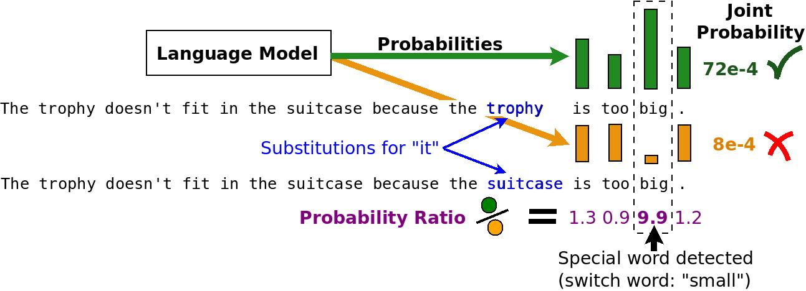

# A Simple Method for Commonsense Reasoning

This repository contains code to reproduce results from [*A Simple Method for Commonsense Reasoning*](https://arxiv.org/abs/1806.02847).

Authors and contact:

* Trieu H. Trinh (thtrieu@google.com, github: thtrieu)
* Quoc V. Le (qvl@google.com)

## TL;DR

Commonsense reasoning is a long-standing challenge for deep learning. For example,
it is difficult to use neural networks to tackle the Winograd Schema dataset - a difficult subset of Pronoun Disambiguation problems. In this work, we use language models to score substitued sentences to decide the correct reference of the ambiguous pronoun (see Figure below for an example). 



This simple unsupervised method achieves new state-of-the-art (*as of June 1st, 2018*) results on both benchmark PDP-60 and WSC-273 (See Table below), without using rule-based reasoning nor expensive annotated knowledge bases.

| Commonsense-reasoning test  | Previous best result   | Ours  |
| ----------------------------|:----------------------:|:-----:|
| Pronoun Disambiguation      | 66.7%                  | 70%   |
| Winograd Schema Challenge   | 52.8%                  | 63.7% |


## Citation

If you use our released models below in your publication, please cite the original paper:

@article{TBD}


## Requirements
* Python >=2.6
* Tensorflow >= v1.4
* Numpy >= 1.12.1

## Details of this release

The open-sourced components include:

* Test sets from Pronoun Disambiguation Problem (PDP-60) and Winograd Schema Challenges (WSC-273).
* Tensorflow metagraph and checkpoints of 14 language models (See Appendix A in the paper).
* A vocabulary file.
* Code to reproduce results from the original paper.

## How to run

### 1. Download data files

Download all files from the [Google Cloud Storage of this project](https://console.cloud.google.com/storage/browser/commonsense-reasoning/). The easiest way is to install and use `gsutil cp` command-line tool (See [install gsutil](https://cloud.google.com/storage/docs/gsutil_install)).


```shell
# Download everything from the project gs://commonsense-reasoning
$ gsutil cp -R gs://commonsense-reasoning/* .
Copying gs://commonsense-reasoning/reproduce/vocab.txt...
Copying gs://commonsense-reasoning/reproduce/commonsense_test/pdp60.json...     
Copying gs://commonsense-reasoning/reproduce/commonsense_test/wsc273.json...

...(omitted)
```

All downloaded content should be in `./reproduce/`. This includes two tests `pdp60.json` and `wsc273.json`, a vocabulary file `vocab.txt` and checkpoints for all 14 language models, each includes three files (`.data`, `.index` and `.meta`). All checkpoint names start with `ckpt-best` since they are saved at the best perplexity on a hold-out text corpus.

```shell
# Check for the content
$ ls reproduce/*
reproduce/vocab.txt

reproduce/commonsense_test:
pdp60.json  wsc273.json

reproduce/lm01:
ckpt-best.data-00000-of-00001  ckpt-best.index  ckpt-best.meta

reproduce/lm02:
ckpt-best.data-00000-of-00001  ckpt-best.index  ckpt-best.meta

reproduce/lm03:
ckpt-best.data-00000-of-00001  ckpt-best.index  ckpt-best.meta

reproduce/lm04:
ckpt-best.data-00000-of-00001  ckpt-best.index  ckpt-best.meta

reproduce/lm05:
ckpt-best.data-00000-of-00001  ckpt-best.index  ckpt-best.meta

reproduce/lm06:
ckpt-best.data-00000-of-00001  ckpt-best.index  ckpt-best.meta

reproduce/lm07:
ckpt-best.data-00000-of-00001  ckpt-best.index  ckpt-best.meta

reproduce/lm08:
ckpt-best.data-00000-of-00001  ckpt-best.index  ckpt-best.meta

reproduce/lm09:
ckpt-best.data-00000-of-00001  ckpt-best.index  ckpt-best.meta

reproduce/lm10:
ckpt-best.data-00000-of-00001  ckpt-best.index  ckpt-best.meta

reproduce/lm11:
ckpt-best.data-00000-of-00001  ckpt-best.index  ckpt-best.meta

reproduce/lm12:
ckpt-best.data-00000-of-00001  ckpt-best.index  ckpt-best.meta

reproduce/lm13:
ckpt-best.data-00000-of-00001  ckpt-best.index  ckpt-best.meta

reproduce/lm14:
ckpt-best.data-00000-of-00001  ckpt-best.index  ckpt-best.meta
```

### 2. Run evaluation code

To reproduce results from the paper, simply run `eval.py` script.

```shell
$ python eval.py --data_dir=reproduce

Restored from ./reproduce/lm01
Reset RNN states.
Processing patch (1, 1) / (2, 4)
Probs for 
[['Then' 'Dad' 'figured' ..., 'man' "'s" 'board-bill']
 ['Then' 'Dad' 'figured' ..., 'man' "'s" 'board-bill']
 ['Always' 'before' ',' ..., 'now' ',' 'for']
 ..., 
 ['Mark' 'was' 'close' ..., 'promising' 'him' ',']
 ['Mark' 'was' 'close' ..., 'promising' 'him' ',']
 ['Mark' 'was' 'close' ..., 'promising' 'him' ',']]
=
[[  1.64250596e-05   1.77780055e-06   4.14267970e-06 ...,   1.87315454e-03
    1.57723188e-01   6.31845817e-02]
 [  1.64250596e-05   1.77780055e-06   4.14267970e-06 ...,   1.87315454e-03
    1.57723188e-01   6.31845817e-02]
 [  1.28243030e-07   3.80435935e-03   1.12383246e-01 ...,   9.67682712e-03
    2.17407525e-01   1.08243264e-01]
 ..., 
 [  1.15557734e-04   2.92792241e-03   3.46455898e-04 ...,   2.72328052e-05
    3.37066874e-02   7.89367408e-02]
 [  1.15557734e-04   2.92792241e-03   3.46455898e-04 ...,   2.72328052e-05
    3.37066874e-02   7.89367408e-02]
 [  1.15557734e-04   2.92792241e-03   3.46455898e-04 ...,   2.72328052e-05
    3.37066874e-02   7.89367408e-02]]
Processing patch (1, 2) / (2, 4)

...(omitted)

Accuracy of 1 LM(s) on pdp60 = 0.6

...(omitted)

Accuracy of 5 LM(s) on pdp60 = 0.7

...(omitted)

Accuracy of 10 LM(s) on wsc273 = 0.615

...(omitted)

Accuracy of 14 LM(s) on wsc273 = 0.637
```
