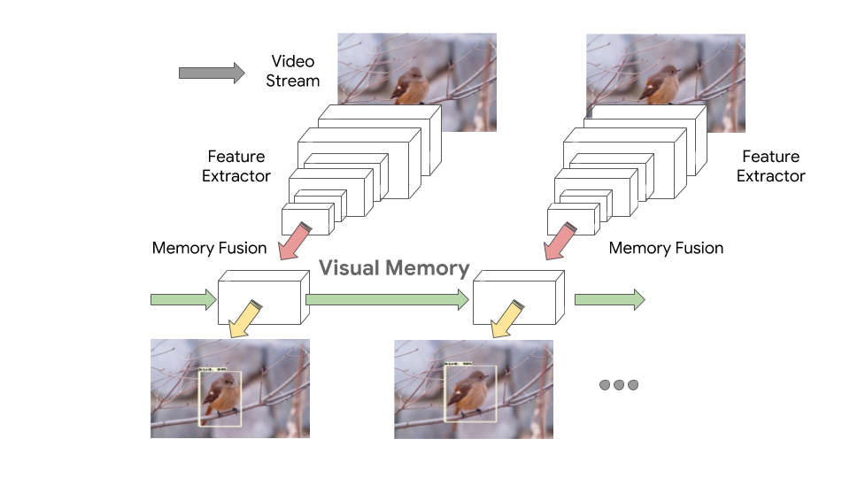
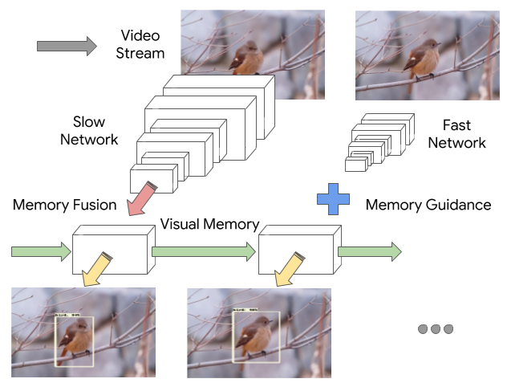

# Tensorflow Mobile Video Object Detection

Tensorflow mobile video object detection implementation proposed in the
following papers:

<p align="center">
  
</p>

```
"Mobile Video Object Detection with Temporally-Aware Feature Maps",
Liu, Mason and Zhu, Menglong, CVPR 2018.
```
\[[link](http://openaccess.thecvf.com/content_cvpr_2018/papers/Liu_Mobile_Video_Object_CVPR_2018_paper.pdf)\]\[[bibtex](
https://scholar.googleusercontent.com/scholar.bib?q=info:hq5rcMUUXysJ:scholar.google.com/&output=citation&scisig=AAGBfm0AAAAAXLdwXcU5g_wiMQ40EvbHQ9kTyvfUxffh&scisf=4&ct=citation&cd=-1&hl=en)\]


<p align="center">
  
</p>

```
"Looking Fast and Slow: Memory-Guided Mobile Video Object Detection",
Liu, Mason and Zhu, Menglong and White, Marie and Li, Yinxiao and Kalenichenko, Dmitry
```
\[[link](https://arxiv.org/abs/1903.10172)\]\[[bibtex](
https://scholar.googleusercontent.com/scholar.bib?q=info:rLqvkztmWYgJ:scholar.google.com/&output=citation&scisig=AAGBfm0AAAAAXLdwNf-LJlm2M1ymQHbq2wYA995MHpJu&scisf=4&ct=citation&cd=-1&hl=en)\]


## Maintainers
* masonliuw@gmail.com
* yinxiao@google.com
* menglong@google.com
* yongzhe@google.com


## Table of Contents

  * <a href='g3doc/exporting_models.md'>Exporting a trained model</a>
