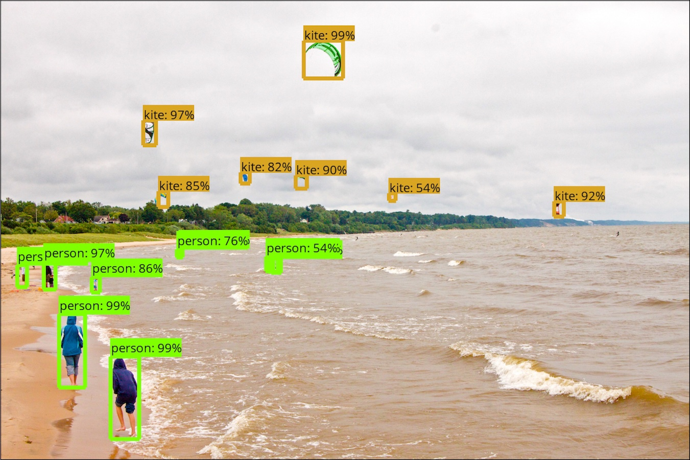

# Tensorflow Object Detection API
Creating accurate machine learning models capable of localizing and identifying
multiple objects in a single image remains a core challenge in computer vision.
The TensorFlow Object Detection API is an open source framework built on top of
TensorFlow that makes it easy to construct, train and deploy object detection
models.  At Google we’ve certainly found this codebase to be useful for our
computer vision needs, and we hope that you will as well.
<p align="center">
  
</p>
Contributions to the codebase are welcome and we would love to hear back from
you if you find this API useful.  Finally if you use the Tensorflow Object
Detection API for a research publication, please consider citing:

```
"Speed/accuracy trade-offs for modern convolutional object detectors."
Huang J, Rathod V, Sun C, Zhu M, Korattikara A, Fathi A, Fischer I, Wojna Z,
Song Y, Guadarrama S, Murphy K, CVPR 2017
```
\[[link](https://arxiv.org/abs/1611.10012)\]\[[bibtex](
https://scholar.googleusercontent.com/scholar.bib?q=info:l291WsrB-hQJ:scholar.google.com/&output=citation&scisig=AAGBfm0AAAAAWUIIlnPZ_L9jxvPwcC49kDlELtaeIyU-&scisf=4&ct=citation&cd=-1&hl=en&scfhb=1)\]

<p align="center">
  
</p>

## Maintainers

* Jonathan Huang, github: [jch1](https://github.com/jch1)
* Vivek Rathod, github: [tombstone](https://github.com/tombstone)
* Ronny Votel, github: [ronnyvotel](https://github.com/ronnyvotel)
* Derek Chow, github: [derekjchow](https://github.com/derekjchow)
* Chen Sun, github: [jesu9](https://github.com/jesu9)
* Menglong Zhu, github: [dreamdragon](https://github.com/dreamdragon)
* Alireza Fathi, github: [afathi3](https://github.com/afathi3)
* Zhichao Lu, github: [pkulzc](https://github.com/pkulzc)


## Table of contents

Setup:

  * <a href='g3doc/installation.md'>Installation</a><br>

Quick Start:

  * <a href='object_detection_tutorial.ipynb'>
      Quick Start: Jupyter notebook for off-the-shelf inference</a><br>
  * <a href="g3doc/running_pets.md">Quick Start: Training a pet detector</a><br>

Customizing a Pipeline:

  * <a href='g3doc/configuring_jobs.md'>
      Configuring an object detection pipeline</a><br>
  * <a href='g3doc/preparing_inputs.md'>Preparing inputs</a><br>

Running:

  * <a href='g3doc/running_locally.md'>Running locally</a><br>
  * <a href='g3doc/running_on_cloud.md'>Running on the cloud</a><br>

Extras:

  * <a href='g3doc/detection_model_zoo.md'>Tensorflow detection model zoo</a><br>
  * <a href='g3doc/exporting_models.md'>
      Exporting a trained model for inference</a><br>
  * <a href='g3doc/tpu_exporters.md'>
      Exporting a trained model for TPU inference</a><br>
  * <a href='g3doc/defining_your_own_model.md'>
      Defining your own model architecture</a><br>
  * <a href='g3doc/using_your_own_dataset.md'>
      Bringing in your own dataset</a><br>
  * <a href='g3doc/evaluation_protocols.md'>
      Supported object detection evaluation protocols</a><br>
  * <a href='g3doc/oid_inference_and_evaluation.md'>
      Inference and evaluation on the Open Images dataset</a><br>
  * <a href='g3doc/instance_segmentation.md'>
      Run an instance segmentation model</a><br>
  * <a href='g3doc/challenge_evaluation.md'>
      Run the evaluation for the Open Images Challenge 2018/2019</a><br>
  * <a href='g3doc/tpu_compatibility.md'>
      TPU compatible detection pipelines</a><br>
  * <a href='g3doc/running_on_mobile_tensorflowlite.md'>
      Running object detection on mobile devices with TensorFlow Lite</a><br>

## Getting Help

To get help with issues you may encounter using the Tensorflow Object Detection
API, create a new question on [StackOverflow](https://stackoverflow.com/) with
the tags "tensorflow" and "object-detection".

Please report bugs (actually broken code, not usage questions) to the
tensorflow/models GitHub
[issue tracker](https://github.com/tensorflow/models/issues), prefixing the
issue name with "object_detection".

Please check [FAQ](g3doc/faq.md) for frequently asked questions before
reporting an issue.


## Release information

### July 1st, 2019

We have released an updated set of utils and an updated
[tutorial](g3doc/challenge_evaluation.md) for all three tracks of the
[Open Images Challenge 2019](https://storage.googleapis.com/openimages/web/challenge2019.html)!

The Instance Segmentation metric for
[Open Images V5](https://storage.googleapis.com/openimages/web/index.html)
and [Challenge 2019](https://storage.googleapis.com/openimages/web/challenge2019.html)
is part of this release. Check out [the metric description](https://storage.googleapis.com/openimages/web/evaluation.html#instance_segmentation_eval)
on the Open Images website.

<b>Thanks to contributors</b>: Alina Kuznetsova, Rodrigo Benenson

### Feb 11, 2019

We have released detection models trained on the Open Images Dataset V4
in our detection model zoo, including

* Faster R-CNN detector with Inception Resnet V2 feature extractor
* SSD detector with MobileNet V2 feature extractor
* SSD detector with ResNet 101 FPN feature extractor (aka RetinaNet-101)

<b>Thanks to contributors</b>: Alina Kuznetsova, Yinxiao Li

### Sep 17, 2018

We have released Faster R-CNN detectors with ResNet-50 / ResNet-101 feature
extractors trained on the [iNaturalist Species Detection Dataset](https://github.com/visipedia/inat_comp/blob/master/2017/README.md#bounding-boxes).
The models are trained on the training split of the iNaturalist data for 4M
iterations, they achieve 55% and 58% mean AP@.5 over 2854 classes respectively.
For more details please refer to this [paper](https://arxiv.org/abs/1707.06642).

<b>Thanks to contributors</b>: Chen Sun

### July 13, 2018

There are many new updates in this release, extending the functionality and
capability of the API:

* Moving from slim-based training to [Estimator](https://www.tensorflow.org/api_docs/python/tf/estimator/Estimator)-based
training.
* Support for [RetinaNet](https://arxiv.org/abs/1708.02002), and a [MobileNet](https://ai.googleblog.com/2017/06/mobilenets-open-source-models-for.html)
adaptation of RetinaNet.
* A novel SSD-based architecture called the [Pooling Pyramid Network](https://arxiv.org/abs/1807.03284) (PPN).
* Releasing several [TPU](https://cloud.google.com/tpu/)-compatible models.
These can be found in the `samples/configs/` directory with a comment in the
pipeline configuration files indicating TPU compatibility.
* Support for quantized training.
* Updated documentation for new binaries, Cloud training, and [Tensorflow Lite](https://www.tensorflow.org/mobile/tflite/).

See also our [expanded announcement blogpost](https://ai.googleblog.com/2018/07/accelerated-training-and-inference-with.html) and accompanying tutorial at the [TensorFlow blog](https://medium.com/tensorflow/training-and-serving-a-realtime-mobile-object-detector-in-30-minutes-with-cloud-tpus-b78971cf1193).

<b>Thanks to contributors</b>: Sara Robinson, Aakanksha Chowdhery, Derek Chow,
Pengchong Jin, Jonathan Huang, Vivek Rathod, Zhichao Lu, Ronny Votel


### June 25, 2018

Additional evaluation tools for the [Open Images Challenge 2018](https://storage.googleapis.com/openimages/web/challenge.html) are out.
Check out our short tutorial on data preparation and running evaluation [here](g3doc/challenge_evaluation.md)!

<b>Thanks to contributors</b>: Alina Kuznetsova

### June 5, 2018

We have released the implementation of evaluation metrics for both tracks of the [Open Images Challenge 2018](https://storage.googleapis.com/openimages/web/challenge.html) as a part of the Object Detection API - see the [evaluation protocols](g3doc/evaluation_protocols.md) for more details.
Additionally, we have released a tool for hierarchical labels expansion for the Open Images Challenge: check out [oid_hierarchical_labels_expansion.py](dataset_tools/oid_hierarchical_labels_expansion.py).

<b>Thanks to contributors</b>: Alina Kuznetsova, Vittorio Ferrari, Jasper Uijlings

### April 30, 2018

We have released a Faster R-CNN detector with ResNet-101 feature extractor trained on [AVA](https://research.google.com/ava/) v2.1.
Compared with other commonly used object detectors, it changes the action classification loss function to per-class Sigmoid loss to handle boxes with multiple labels.
The model is trained on the training split of AVA v2.1 for 1.5M iterations, it achieves mean AP of 11.25% over 60 classes on the validation split of AVA v2.1.
For more details please refer to this [paper](https://arxiv.org/abs/1705.08421).

<b>Thanks to contributors</b>: Chen Sun, David Ross

### April 2, 2018

Supercharge your mobile phones with the next generation mobile object detector!
We are adding support for MobileNet V2 with SSDLite presented in
[MobileNetV2: Inverted Residuals and Linear Bottlenecks](https://arxiv.org/abs/1801.04381).
This model is 35% faster than Mobilenet V1 SSD on a Google Pixel phone CPU (200ms vs. 270ms) at the same accuracy.
Along with the model definition, we are also releasing a model checkpoint trained on the COCO dataset.

<b>Thanks to contributors</b>: Menglong Zhu, Mark Sandler, Zhichao Lu, Vivek Rathod, Jonathan Huang

### February 9, 2018

We now support instance segmentation!!  In this API update we support a number of instance segmentation models similar to those discussed in the [Mask R-CNN paper](https://arxiv.org/abs/1703.06870). For further details refer to
[our slides](http://presentations.cocodataset.org/Places17-GMRI.pdf) from the 2017 Coco + Places Workshop.
Refer to the section on [Running an Instance Segmentation Model](g3doc/instance_segmentation.md) for instructions on how to configure a model
that predicts masks in addition to object bounding boxes.

<b>Thanks to contributors</b>: Alireza Fathi, Zhichao Lu, Vivek Rathod, Ronny Votel, Jonathan Huang

### November 17, 2017

As a part of the Open Images V3 release we have released:

* An implementation of the Open Images evaluation metric and the [protocol](g3doc/evaluation_protocols.md#open-images).
* Additional tools to separate inference of detection and evaluation (see [this tutorial](g3doc/oid_inference_and_evaluation.md)).
* A new detection model trained on the Open Images V2 data release (see [Open Images model](g3doc/detection_model_zoo.md#open-images-models)).

See more information on the [Open Images website](https://github.com/openimages/dataset)!

<b>Thanks to contributors</b>: Stefan Popov, Alina Kuznetsova

### November 6, 2017

We have re-released faster versions of our (pre-trained) models in the
<a href='g3doc/detection_model_zoo.md'>model zoo</a>.  In addition to what
was available before, we are also adding Faster R-CNN models trained on COCO
with Inception V2 and Resnet-50 feature extractors, as well as a Faster R-CNN
with Resnet-101 model trained on the KITTI dataset.

<b>Thanks to contributors</b>: Jonathan Huang, Vivek Rathod, Derek Chow,
Tal Remez, Chen Sun.

### October 31, 2017

We have released a new state-of-the-art model for object detection using
the Faster-RCNN with the
[NASNet-A image featurization](https://arxiv.org/abs/1707.07012). This
model achieves mAP of 43.1% on the test-dev validation dataset for COCO,
improving on the best available model in the zoo by 6% in terms
of absolute mAP.

<b>Thanks to contributors</b>: Barret Zoph, Vijay Vasudevan, Jonathon Shlens, Quoc Le

### August 11, 2017

We have released an update to the [Android Detect
demo](https://github.com/tensorflow/tensorflow/tree/master/tensorflow/examples/android)
which will now run models trained using the Tensorflow Object
Detection API on an Android device.  By default, it currently runs a
frozen SSD w/Mobilenet detector trained on COCO, but we encourage
you to try out other detection models!

<b>Thanks to contributors</b>: Jonathan Huang, Andrew Harp


### June 15, 2017

In addition to our base Tensorflow detection model definitions, this
release includes:

* A selection of trainable detection models, including:
  * Single Shot Multibox Detector (SSD) with MobileNet,
  * SSD with Inception V2,
  * Region-Based Fully Convolutional Networks (R-FCN) with Resnet 101,
  * Faster RCNN with Resnet 101,
  * Faster RCNN with Inception Resnet v2
* Frozen weights (trained on the COCO dataset) for each of the above models to
  be used for out-of-the-box inference purposes.
* A [Jupyter notebook](object_detection_tutorial.ipynb) for performing
  out-of-the-box inference with one of our released models
* Convenient [local training](g3doc/running_locally.md) scripts as well as
  distributed training and evaluation pipelines via
  [Google Cloud](g3doc/running_on_cloud.md).


<b>Thanks to contributors</b>: Jonathan Huang, Vivek Rathod, Derek Chow,
Chen Sun, Menglong Zhu, Matthew Tang, Anoop Korattikara, Alireza Fathi, Ian Fischer, Zbigniew Wojna, Yang Song, Sergio Guadarrama, Jasper Uijlings,
Viacheslav Kovalevskyi, Kevin Murphy

