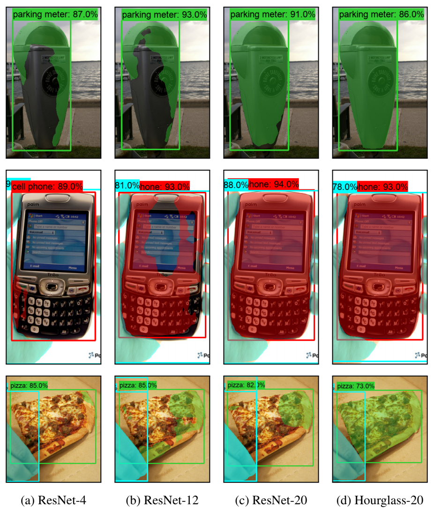

# DeepMAC model

<!-- TODO(vighneshb) add correct arxiv links and test this page.-->

**DeepMAC** (Deep Mask heads Above CenterNet) is a neural network architecture
that is designed for the partially supervised instance segmentation task. For
details see the
[The surprising impact of mask-head architecture on novel class segmentation](https://arxiv.org/abs/2104.00613)
paper. The figure below shows improved mask predictions for unseen classes as we
use better mask-head architectures.

<p align="center">

</p>

Just by using better mask-head architectures (no extra losses or modules) we
achieve state-of-the-art performance in the partially supervised instance
segmentation task.

## Code structure

*   `deepmac_meta_arch.py` implements our main architecture, DeepMAC, on top of
    the CenterNet detection architecture.
*   The proto message `DeepMACMaskEstimation` in `center_net.proto` controls the
    configuration of the mask head used.
*   The field `allowed_masked_classes_ids` controls which classes recieve mask
    supervision during training.
*   Mask R-CNN based ablations in the paper are implemented in the
    [TF model garden](../../../official/vision/beta/projects/deepmac_maskrcnn)
    code base.

## Prerequisites

1.  Follow [TF2 install instructions](tf2.md) to install Object Detection API.
2.  Generate COCO dataset by using
    [create_coco_tf_record.py](../../../official/vision/beta/data/create_coco_tf_record.py)

## Configurations

We provide pre-defined configs which can be run as a
[TF2 training pipeline](tf2_training_and_evaluation.md). Each of these
configurations needs to be passed as the `pipeline_config_path` argument to the
`object_detection/model_main_tf2.py` binary. Note that the `512x512` resolution
models require a TPU `v3-32` and the `1024x1024` resolution models require a TPU
`v3-128` to train. The configs can be found in the [configs/tf2](../configs/tf2)
directory. In the table below `X->Y` indicates that we train with masks from `X`
and evaluate with masks from `Y`. Performance is measured on the `coco-val2017`
set.

### Partially supervised models

Resolution | Mask head     | Train->Eval    | Config name                                        | Mask mAP
:--------- | :------------ | :------------- | :------------------------------------------------- | -------:
512x512    | Hourglass-52  | VOC -> Non-VOC | `center_net_deepmac_512x512_voc_only.config`       | 32.5
1024x1024  | Hourglass-100 | VOC -> Non-VOC | `center_net_deepmac_1024x1024_voc_only.config`     | 35.5
1024x1024  | Hourglass-100 | Non-VOC -> VOC | `center_net_deepmac_1024x1024_non_voc_only.config` | 39.1

### Fully supervised models

Here we report the Mask mAP averaged over all COCO classes on the `test-dev2017`
set .

Resolution | Mask head     | Config name                                | Mask mAP
:--------- | :------------ | :----------------------------------------- | -------:
1024x1024  | Hourglass-100 | `center_net_deepmac_1024x1024_coco.config` | 39.4

## Demos

*   [DeepMAC Colab](../colab_tutorials/deepmac_colab.ipynb) lets you run a
    pre-trained DeepMAC model on user-specified boxes. Note that you are not
    restricted to COCO classes!
*   [iWildCam Notebook](https://www.kaggle.com/vighneshbgoogle/iwildcam-visualize-instance-masks)
    to visualize instance masks generated by DeepMAC on the iWildCam dataset.

## Pre-trained models

*   [COCO Checkpoint](http://download.tensorflow.org/models/object_detection/tf2/20210329/deepmac_1024x1024_coco17.tar.gz) -
    Takes as input Image + Boxes and produces per-box instance masks as output.

## See also

*   [Mask RCNN code](https://github.com/tensorflow/models/tree/master/official/vision/beta/projects/deepmac_maskrcnn)
    in TF Model garden code base.
*   Project website - [git.io/deepmac](https://git.io/deepmac)

## Citation

```
@misc{birodkar2021surprising,
      title={The surprising impact of mask-head architecture on novel class segmentation},
      author={Vighnesh Birodkar and Zhichao Lu and Siyang Li and Vivek Rathod and Jonathan Huang},
      year={2021},
      eprint={2104.00613},
      archivePrefix={arXiv},
      primaryClass={cs.CV}
}
```
