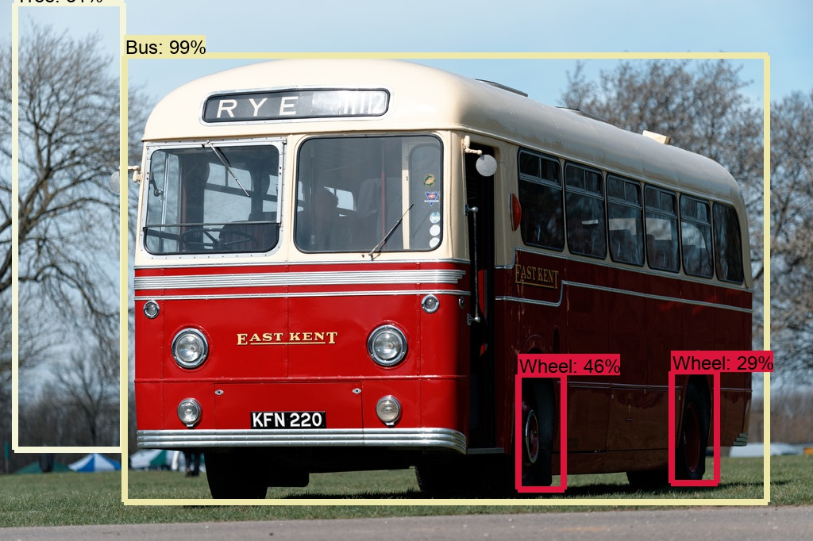
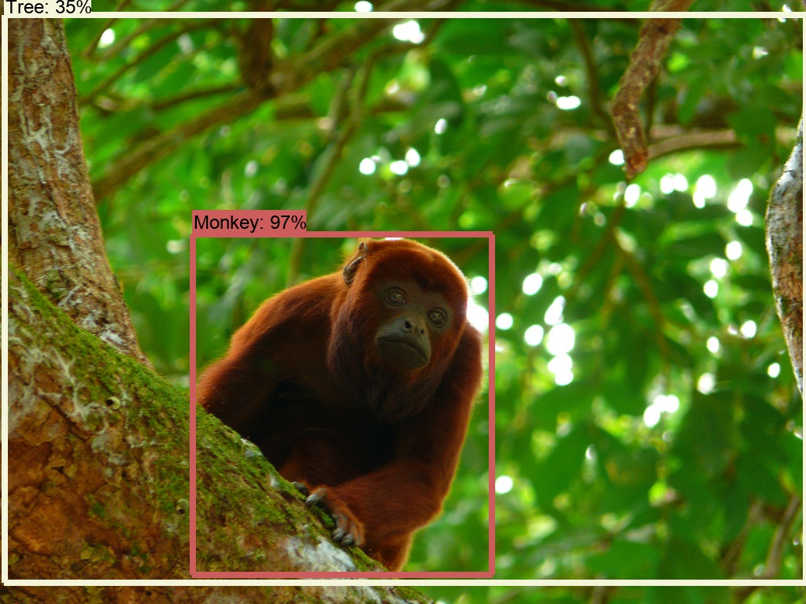

# Inference and evaluation on the Open Images dataset

This page presents a tutorial for running object detector inference and
evaluation measure computations on the [Open Images
dataset](https://github.com/openimages/dataset), using tools from the
[TensorFlow Object Detection
API](https://github.com/tensorflow/models/tree/master/research/object_detection).
It shows how to download the images and annotations for the validation and test
sets of Open Images; how to package the downloaded data in a format understood
by the Object Detection API; where to find a trained object detector model for
Open Images; how to run inference; and how to compute evaluation measures on the
inferred detections.

Inferred detections will look like the following:

{height="300"}
{height="300"}

On the validation set of Open Images, this tutorial requires 27GB of free disk
space and the inference step takes approximately 9 hours on a single NVIDIA
Tesla P100 GPU. On the test set -- 75GB and 27 hours respectively. All other
steps require less than two hours in total on both sets.

## Installing TensorFlow, the Object Detection API, and Google Cloud SDK

Please run through the [installation instructions](installation.md) to install
TensorFlow and all its dependencies. Ensure the Protobuf libraries are compiled
and the library directories are added to `PYTHONPATH`. You will also need to
`pip` install `pandas` and `contextlib2`.

Some of the data used in this tutorial lives in Google Cloud buckets. To access
it, you will have to [install the Google Cloud
SDK](https://cloud.google.com/sdk/downloads) on your workstation or laptop.

## Preparing the Open Images validation and test sets

In order to run inference and subsequent evaluation measure computations, we
require a dataset of images and ground truth boxes, packaged as TFRecords of
TFExamples. To create such a dataset for Open Images, you will need to first
download ground truth boxes from the [Open Images
website](https://github.com/openimages/dataset):

```bash
# From tensorflow/models/research
mkdir oid
cd oid
wget https://storage.googleapis.com/openimages/2017_07/annotations_human_bbox_2017_07.tar.gz
tar -xvf annotations_human_bbox_2017_07.tar.gz
```

Next, download the images. In this tutorial, we will use lower resolution images
provided by [CVDF](http://www.cvdfoundation.org). Please follow the instructions
on [CVDF's Open Images repository
page](https://github.com/cvdfoundation/open-images-dataset) in order to gain
access to the cloud bucket with the images. Then run:

```bash
# From tensorflow/models/research/oid
SPLIT=validation  # Set SPLIT to "test" to download the images in the test set
mkdir raw_images_${SPLIT}
gsutil -m rsync -r gs://open-images-dataset/$SPLIT raw_images_${SPLIT}
```

Another option for downloading the images is to follow the URLs contained in the
[image URLs and metadata CSV
files](https://storage.googleapis.com/openimages/2017_07/images_2017_07.tar.gz)
on the Open Images website.

At this point, your `tensorflow/models/research/oid` directory should appear as
follows:

```lang-none
|-- 2017_07
|   |-- test
|   |   `-- annotations-human-bbox.csv
|   |-- train
|   |   `-- annotations-human-bbox.csv
|   `-- validation
|       `-- annotations-human-bbox.csv
|-- raw_images_validation (if you downloaded the validation split)
|   `-- ... (41,620 files matching regex "[0-9a-f]{16}.jpg")
|-- raw_images_test (if you downloaded the test split)
|   `-- ... (125,436 files matching regex "[0-9a-f]{16}.jpg")
`-- annotations_human_bbox_2017_07.tar.gz
```

Next, package the data into TFRecords of TFExamples by running:

```bash
# From tensorflow/models/research/oid
SPLIT=validation  # Set SPLIT to "test" to create TFRecords for the test split
mkdir ${SPLIT}_tfrecords

PYTHONPATH=$PYTHONPATH:$(readlink -f ..) \
python -m object_detection/dataset_tools/create_oid_tf_record \
  --input_annotations_csv 2017_07/$SPLIT/annotations-human-bbox.csv \
  --input_images_directory raw_images_${SPLIT} \
  --input_label_map ../object_detection/data/oid_bbox_trainable_label_map.pbtxt \
  --output_tf_record_path_prefix ${SPLIT}_tfrecords/$SPLIT.tfrecord \
  --num_shards=100
```

This results in 100 TFRecord files (shards), written to
`oid/${SPLIT}_tfrecords`, with filenames matching
`${SPLIT}.tfrecord-000[0-9][0-9]-of-00100`. Each shard contains approximately
the same number of images and is defacto a representative random sample of the
input data. [This enables](#accelerating_inference) a straightforward work
division scheme for distributing inference and also approximate measure
computations on subsets of the validation and test sets.

## Inferring detections

Inference requires a trained object detection model. In this tutorial we will
use a model from the [detections model zoo](detection_model_zoo.md), which can
be downloaded and unpacked by running the commands below. More information about
the model, such as its architecture and how it was trained, is available in the
[model zoo page](detection_model_zoo.md).

```bash
# From tensorflow/models/research/oid
wget http://download.tensorflow.org/models/object_detection/faster_rcnn_inception_resnet_v2_atrous_oid_14_10_2017.tar.gz
tar -zxvf faster_rcnn_inception_resnet_v2_atrous_oid_14_10_2017.tar.gz
```

At this point, data is packed into TFRecords and we have an object detector
model. We can run inference using:

```bash
# From tensorflow/models/research/oid
SPLIT=validation  # or test
TF_RECORD_FILES=$(ls -1 ${SPLIT}_tfrecords/* | tr '\n' ',')

PYTHONPATH=$PYTHONPATH:$(readlink -f ..) \
python -m object_detection/inference/infer_detections \
  --input_tfrecord_paths=$TF_RECORD_FILES \
  --output_tfrecord_path=${SPLIT}_detections.tfrecord-00000-of-00001 \
  --inference_graph=faster_rcnn_inception_resnet_v2_atrous_oid/frozen_inference_graph.pb \
  --discard_image_pixels
```

Inference preserves all fields of the input TFExamples, and adds new fields to
store the inferred detections. This allows [computing evaluation
measures](#compute_evaluation_measures) on the output TFRecord alone, as ground
truth boxes are preserved as well. Since measure computations don't require
access to the images, `infer_detections` can optionally discard them with the
`--discard_image_pixels` flag. Discarding the images drastically reduces the
size of the output TFRecord.

### Accelerating inference {#accelerating_inference}

Running inference on the whole validation or test set can take a long time to
complete due to the large number of images present in these sets (41,620 and
125,436 respectively). For quick but approximate evaluation, inference and the
subsequent measure computations can be run on a small number of shards. To run
for example on 2% of all the data, it is enough to set `TF_RECORD_FILES` as
shown below before running `infer_detections`:

```bash
TF_RECORD_FILES=$(ls ${SPLIT}_tfrecords/${SPLIT}.tfrecord-0000[0-1]-of-00100 | tr '\n' ',')
```

Please note that computing evaluation measures on a small subset of the data
introduces variance and bias, since some classes of objects won't be seen during
evaluation. In the example above, this leads to 13.2% higher mAP on the first
two shards of the validation set compared to the mAP for the full set ([see mAP
results](#expected-maps)).

Another way to accelerate inference is to run it in parallel on multiple
TensorFlow devices on possibly multiple machines. The script below uses
[tmux](https://github.com/tmux/tmux/wiki) to run a separate `infer_detections`
process for each GPU on different partition of the input data.

```bash
# From tensorflow/models/research/oid
SPLIT=validation  # or test
NUM_GPUS=4
NUM_SHARDS=100

tmux new-session -d -s "inference"
function tmux_start { tmux new-window -d -n "inference:GPU$1" "${*:2}; exec bash"; }
for gpu_index in $(seq 0 $(($NUM_GPUS-1))); do
  start_shard=$(( $gpu_index * $NUM_SHARDS / $NUM_GPUS ))
  end_shard=$(( ($gpu_index + 1) * $NUM_SHARDS / $NUM_GPUS - 1))
  TF_RECORD_FILES=$(seq -s, -f "${SPLIT}_tfrecords/${SPLIT}.tfrecord-%05.0f-of-$(printf '%05d' $NUM_SHARDS)" $start_shard $end_shard)
  tmux_start ${gpu_index} \
  PYTHONPATH=$PYTHONPATH:$(readlink -f ..) CUDA_VISIBLE_DEVICES=$gpu_index \
  python -m object_detection/inference/infer_detections \
    --input_tfrecord_paths=$TF_RECORD_FILES \
    --output_tfrecord_path=${SPLIT}_detections.tfrecord-$(printf "%05d" $gpu_index)-of-$(printf "%05d" $NUM_GPUS) \
    --inference_graph=faster_rcnn_inception_resnet_v2_atrous_oid/frozen_inference_graph.pb \
    --discard_image_pixels
done
```

After all `infer_detections` processes finish, `tensorflow/models/research/oid`
will contain one output TFRecord from each process, with name matching
`validation_detections.tfrecord-0000[0-3]-of-00004`.

## Computing evaluation measures {#compute_evaluation_measures}

To compute evaluation measures on the inferred detections you first need to
create the appropriate configuration files:

```bash
# From tensorflow/models/research/oid
SPLIT=validation  # or test
NUM_SHARDS=1  # Set to NUM_GPUS if using the parallel evaluation script above

mkdir -p ${SPLIT}_eval_metrics

echo "
label_map_path: '../object_detection/data/oid_bbox_trainable_label_map.pbtxt'
tf_record_input_reader: { input_path: '${SPLIT}_detections.tfrecord@${NUM_SHARDS}' }
" > ${SPLIT}_eval_metrics/${SPLIT}_input_config.pbtxt

echo "
metrics_set: 'open_images_metrics'
" > ${SPLIT}_eval_metrics/${SPLIT}_eval_config.pbtxt
```

And then run:

```bash
# From tensorflow/models/research/oid
SPLIT=validation  # or test

PYTHONPATH=$PYTHONPATH:$(readlink -f ..) \
python -m object_detection/metrics/offline_eval_map_corloc \
  --eval_dir=${SPLIT}_eval_metrics \
  --eval_config_path=${SPLIT}_eval_metrics/${SPLIT}_eval_config.pbtxt \
  --input_config_path=${SPLIT}_eval_metrics/${SPLIT}_input_config.pbtxt
```

The first configuration file contains an `object_detection.protos.InputReader`
message that describes the location of the necessary input files. The second
file contains an `object_detection.protos.EvalConfig` message that describes the
evaluation metric. For more information about these protos see the corresponding
source files.

### Expected mAPs {#expected-maps}

The result of running `offline_eval_map_corloc` is a CSV file located at
`${SPLIT}_eval_metrics/metrics.csv`. With the above configuration, the file will
contain average precision at IoU≥0.5 for each of the classes present in the
dataset. It will also contain the mAP@IoU≥0.5. Both the per-class average
precisions and the mAP are computed according to the [Open Images evaluation
protocol](evaluation_protocols.md). The expected mAPs for the validation and
test sets of Open Images in this case are:

Set        | Fraction of data | Images  | mAP@IoU≥0.5
---------: | :--------------: | :-----: | -----------
validation | everything       | 41,620  | 39.2%
validation | first 2 shards   | 884     | 52.4%
test       | everything       | 125,436 | 37.7%
test       | first 2 shards   | 2,476   | 50.8%
