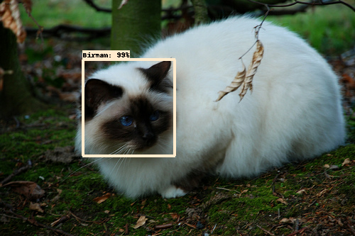
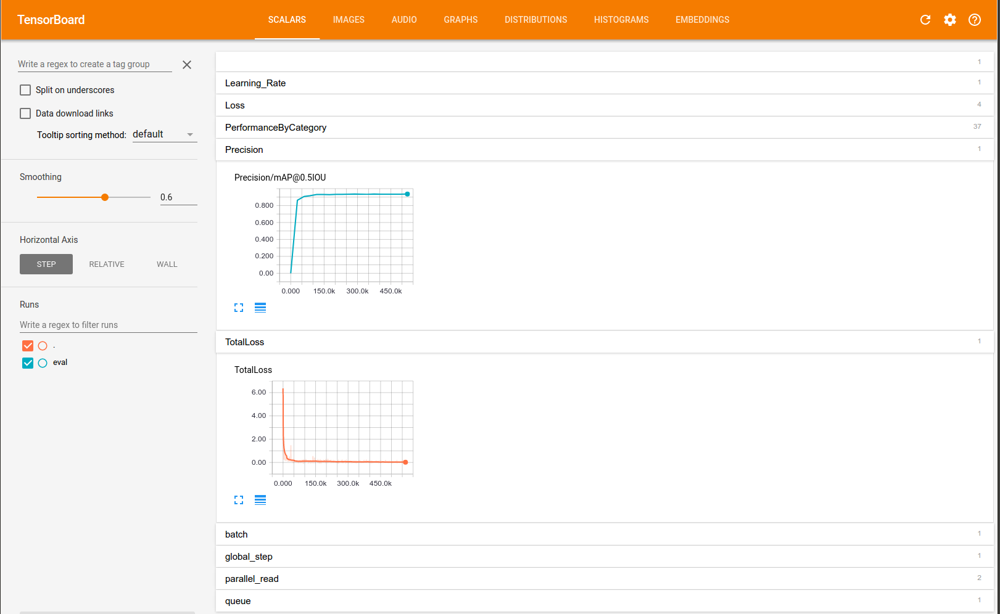
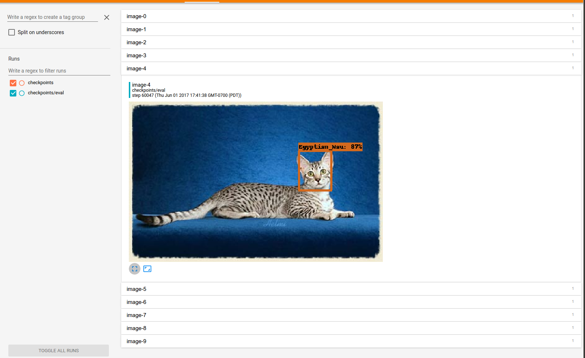

# Quick Start: Distributed Training on the Oxford-IIIT Pets Dataset on Google Cloud

This page is a walkthrough for training an object detector using the Tensorflow
Object Detection API. In this tutorial, we'll be training on the Oxford-IIIT Pets
dataset to build a system to detect various breeds of cats and dogs. The output
of the detector will look like the following:



## Setting up a Project on Google Cloud

To accelerate the process, we'll run training and evaluation on [Google Cloud
ML Engine](https://cloud.google.com/ml-engine/) to leverage multiple GPUs. To
begin, you will have to set up Google Cloud via the following steps (if you have
already done this, feel free to skip to the next section):

1. [Create a GCP project](https://cloud.google.com/resource-manager/docs/creating-managing-projects).
2. [Install the Google Cloud SDK](https://cloud.google.com/sdk/downloads) on
your workstation or laptop.
This will provide the tools you need to upload files to Google Cloud Storage and
start ML training jobs.
3. [Enable the ML Engine
APIs](https://console.cloud.google.com/flows/enableapi?apiid=ml.googleapis.com,compute_component&_ga=1.73374291.1570145678.1496689256).
By default, a new GCP project does not enable APIs to start ML Engine training
jobs. Use the above link to explicitly enable them.
4. [Set up a Google Cloud Storage (GCS)
bucket](https://cloud.google.com/storage/docs/creating-buckets). ML Engine
training jobs can only access files on a Google Cloud Storage bucket. In this
tutorial, we'll be required to upload our dataset and configuration to GCS.

Please remember the name of your GCS bucket, as we will reference it multiple
times in this document. Substitute `${YOUR_GCS_BUCKET}` with the name of
your bucket in this document. For your convenience, you should define the
environment variable below:

``` bash
export YOUR_GCS_BUCKET=${YOUR_GCS_BUCKET}
```

## Installing Tensorflow and the Tensorflow Object Detection API

Please run through the [installation instructions](installation.md) to install
Tensorflow and all it dependencies. Ensure the Protobuf libraries are
compiled and the library directories are added to `PYTHONPATH`.

## Getting the Oxford-IIIT Pets Dataset and Uploading it to Google Cloud Storage

In order to train a detector, we require a dataset of images, bounding boxes and
classifications. For this demo, we'll use the Oxford-IIIT Pets dataset. The raw
dataset for Oxford-IIIT Pets lives
[here](http://www.robots.ox.ac.uk/~vgg/data/pets/). You will need to download
both the image dataset [`images.tar.gz`](http://www.robots.ox.ac.uk/~vgg/data/pets/data/images.tar.gz)
and the groundtruth data [`annotations.tar.gz`](http://www.robots.ox.ac.uk/~vgg/data/pets/data/annotations.tar.gz)
to the `tensorflow/models/research/` directory and unzip them. This may take
some time.

``` bash
# From tensorflow/models/research/
wget http://www.robots.ox.ac.uk/~vgg/data/pets/data/images.tar.gz
wget http://www.robots.ox.ac.uk/~vgg/data/pets/data/annotations.tar.gz
tar -xvf images.tar.gz
tar -xvf annotations.tar.gz
```

After downloading the tarballs, your `tensorflow/models/research/` directory
should appear as follows:

```lang-none
- images.tar.gz
- annotations.tar.gz
+ images/
+ annotations/
+ object_detection/
... other files and directories
```

The Tensorflow Object Detection API expects data to be in the TFRecord format,
so we'll now run the `create_pet_tf_record` script to convert from the raw
Oxford-IIIT Pet dataset into TFRecords. Run the following commands from the
`tensorflow/models/research/` directory:

``` bash
# From tensorflow/models/research/
python object_detection/dataset_tools/create_pet_tf_record.py \
    --label_map_path=object_detection/data/pet_label_map.pbtxt \
    --data_dir=`pwd` \
    --output_dir=`pwd`
```

Note: It is normal to see some warnings when running this script. You may ignore
them.

Two TFRecord files named `pet_train.record` and `pet_val.record` should be
generated in the `tensorflow/models/research/` directory.

Now that the data has been generated, we'll need to upload it to Google Cloud
Storage so the data can be accessed by ML Engine. Run the following command to
copy the files into your GCS bucket (substituting `${YOUR_GCS_BUCKET}`):

``` bash
# From tensorflow/models/research/
gsutil cp pet_train.record gs://${YOUR_GCS_BUCKET}/data/pet_train.record
gsutil cp pet_val.record gs://${YOUR_GCS_BUCKET}/data/pet_val.record
gsutil cp object_detection/data/pet_label_map.pbtxt gs://${YOUR_GCS_BUCKET}/data/pet_label_map.pbtxt
```

Please remember the path where you upload the data to, as we will need this
information when configuring the pipeline in a following step.

## Downloading a COCO-pretrained Model for Transfer Learning

Training a state of the art object detector from scratch can take days, even
when using multiple GPUs! In order to speed up training, we'll take an object
detector trained on a different dataset (COCO), and reuse some of it's
parameters to initialize our new model.

Download our [COCO-pretrained Faster R-CNN with Resnet-101
model](http://storage.googleapis.com/download.tensorflow.org/models/object_detection/faster_rcnn_resnet101_coco_11_06_2017.tar.gz).
Unzip the contents of the folder and copy the `model.ckpt*` files into your GCS
Bucket.

``` bash
wget http://storage.googleapis.com/download.tensorflow.org/models/object_detection/faster_rcnn_resnet101_coco_11_06_2017.tar.gz
tar -xvf faster_rcnn_resnet101_coco_11_06_2017.tar.gz
gsutil cp faster_rcnn_resnet101_coco_11_06_2017/model.ckpt.* gs://${YOUR_GCS_BUCKET}/data/
```

Remember the path where you uploaded the model checkpoint to, as we will need it
in the following step.

## Configuring the Object Detection Pipeline

In the Tensorflow Object Detection API, the model parameters, training
parameters and eval parameters are all defined by a config file. More details
can be found [here](configuring_jobs.md). For this tutorial, we will use some
predefined templates provided with the source code. In the
`object_detection/samples/configs` folder, there are skeleton object_detection
configuration files. We will use `faster_rcnn_resnet101_pets.config` as a
starting point for configuring the pipeline. Open the file with your favourite
text editor.

We'll need to configure some paths in order for the template to work. Search the
file for instances of `PATH_TO_BE_CONFIGURED` and replace them with the
appropriate value (typically `gs://${YOUR_GCS_BUCKET}/data/`). Afterwards
upload your edited file onto GCS, making note of the path it was uploaded to
(we'll need it when starting the training/eval jobs).

``` bash
# From tensorflow/models/research/

# Edit the faster_rcnn_resnet101_pets.config template. Please note that there
# are multiple places where PATH_TO_BE_CONFIGURED needs to be set.
sed -i "s|PATH_TO_BE_CONFIGURED|"gs://${YOUR_GCS_BUCKET}"/data|g" \
    object_detection/samples/configs/faster_rcnn_resnet101_pets.config

# Copy edited template to cloud.
gsutil cp object_detection/samples/configs/faster_rcnn_resnet101_pets.config \
    gs://${YOUR_GCS_BUCKET}/data/faster_rcnn_resnet101_pets.config
```

## Checking Your Google Cloud Storage Bucket

At this point in the tutorial, you should have uploaded the training/validation
datasets (including label map), our COCO trained FasterRCNN finetune checkpoint and your job
configuration to your Google Cloud Storage Bucket. Your bucket should look like
the following:

```lang-none
+ ${YOUR_GCS_BUCKET}/
  + data/
    - faster_rcnn_resnet101_pets.config
    - model.ckpt.index
    - model.ckpt.meta
    - model.ckpt.data-00000-of-00001
    - pet_label_map.pbtxt
    - pet_train.record
    - pet_val.record
```

You can inspect your bucket using the [Google Cloud Storage
browser](https://console.cloud.google.com/storage/browser).

## Starting Training and Evaluation Jobs on Google Cloud ML Engine

Before we can start a job on Google Cloud ML Engine, we must:

1. Package the Tensorflow Object Detection code.
2. Write a cluster configuration for our Google Cloud ML job.

To package the Tensorflow Object Detection code, run the following commands from
the `tensorflow/models/research/` directory:

``` bash
# From tensorflow/models/research/
python setup.py sdist
(cd slim && python setup.py sdist)
```

You should see two tar.gz files created at `dist/object_detection-0.1.tar.gz`
and `slim/dist/slim-0.1.tar.gz`.

For running the training Cloud ML job, we'll configure the cluster to use 10
training jobs (1 master + 9 workers) and three parameters servers. The
configuration file can be found at `object_detection/samples/cloud/cloud.yml`.

Note: This sample is supported for use with 1.2 runtime version.

To start training, execute the following command from the
`tensorflow/models/research/` directory:

``` bash
# From tensorflow/models/research/
gcloud ml-engine jobs submit training `whoami`_object_detection_`date +%s` \
    --runtime-version 1.2 \
    --job-dir=gs://${YOUR_GCS_BUCKET}/train \
    --packages dist/object_detection-0.1.tar.gz,slim/dist/slim-0.1.tar.gz \
    --module-name object_detection.train \
    --region us-central1 \
    --config object_detection/samples/cloud/cloud.yml \
    -- \
    --train_dir=gs://${YOUR_GCS_BUCKET}/train \
    --pipeline_config_path=gs://${YOUR_GCS_BUCKET}/data/faster_rcnn_resnet101_pets.config
```

Once training has started, we can run an evaluation concurrently:

``` bash
# From tensorflow/models/research/
gcloud ml-engine jobs submit training `whoami`_object_detection_eval_`date +%s` \
    --runtime-version 1.2 \
    --job-dir=gs://${YOUR_GCS_BUCKET}/train \
    --packages dist/object_detection-0.1.tar.gz,slim/dist/slim-0.1.tar.gz \
    --module-name object_detection.eval \
    --region us-central1 \
    --scale-tier BASIC_GPU \
    -- \
    --checkpoint_dir=gs://${YOUR_GCS_BUCKET}/train \
    --eval_dir=gs://${YOUR_GCS_BUCKET}/eval \
    --pipeline_config_path=gs://${YOUR_GCS_BUCKET}/data/faster_rcnn_resnet101_pets.config
```

Note: Even though we're running an evaluation job, the `gcloud ml-engine jobs
submit training` command is correct. ML Engine does not distinguish between
training and evaluation jobs.

Users can monitor and stop training and evaluation jobs on the [ML Engine
Dashboard](https://console.cloud.google.com/mlengine/jobs).

## Monitoring Progress with Tensorboard

You can monitor progress of the training and eval jobs by running Tensorboard on
your local machine:

``` bash
# This command needs to be run once to allow your local machine to access your
# GCS bucket.
gcloud auth application-default login

tensorboard --logdir=gs://${YOUR_GCS_BUCKET}
```

Once Tensorboard is running, navigate to `localhost:6006` from your favourite
web browser. You should see something similar to the following:



You will also want to click on the images tab to see example detections made by
the model while it trains. After about an hour and a half of training, you can
expect to see something like this:



Note: It takes roughly 10 minutes for a job to get started on ML Engine, and
roughly an hour for the system to evaluate the validation dataset. It may take
some time to populate the dashboards. If you do not see any entries after half
an hour, check the logs from the [ML Engine
Dashboard](https://console.cloud.google.com/mlengine/jobs). Note that by default
the training jobs are configured to go for much longer than is necessary for
convergence.  To save money, we recommend killing your jobs once you've seen
that they've converged.

## Exporting the Tensorflow Graph

After your model has been trained, you should export it to a Tensorflow
graph proto. First, you need to identify a candidate checkpoint to export. You
can search your bucket using the [Google Cloud Storage
Browser](https://console.cloud.google.com/storage/browser). The file should be
stored under `${YOUR_GCS_BUCKET}/train`. The checkpoint will typically consist of
three files:

* `model.ckpt-${CHECKPOINT_NUMBER}.data-00000-of-00001`
* `model.ckpt-${CHECKPOINT_NUMBER}.index`
* `model.ckpt-${CHECKPOINT_NUMBER}.meta`

After you've identified a candidate checkpoint to export, run the following
command from `tensorflow/models/research/`:

``` bash
# From tensorflow/models/research/
gsutil cp gs://${YOUR_GCS_BUCKET}/train/model.ckpt-${CHECKPOINT_NUMBER}.* .
python object_detection/export_inference_graph.py \
    --input_type image_tensor \
    --pipeline_config_path object_detection/samples/configs/faster_rcnn_resnet101_pets.config \
    --trained_checkpoint_prefix model.ckpt-${CHECKPOINT_NUMBER} \
    --output_directory exported_graphs
```

Afterwards, you should see a directory named `exported_graphs` containing the
SavedModel and frozen graph.

## What's Next

Congratulations, you have now trained an object detector for various cats and
dogs! There different things you can do now:

1. [Test your exported model using the provided Jupyter notebook.](running_notebook.md)
2. [Experiment with different model configurations.](configuring_jobs.md)
3. Train an object detector using your own data.
