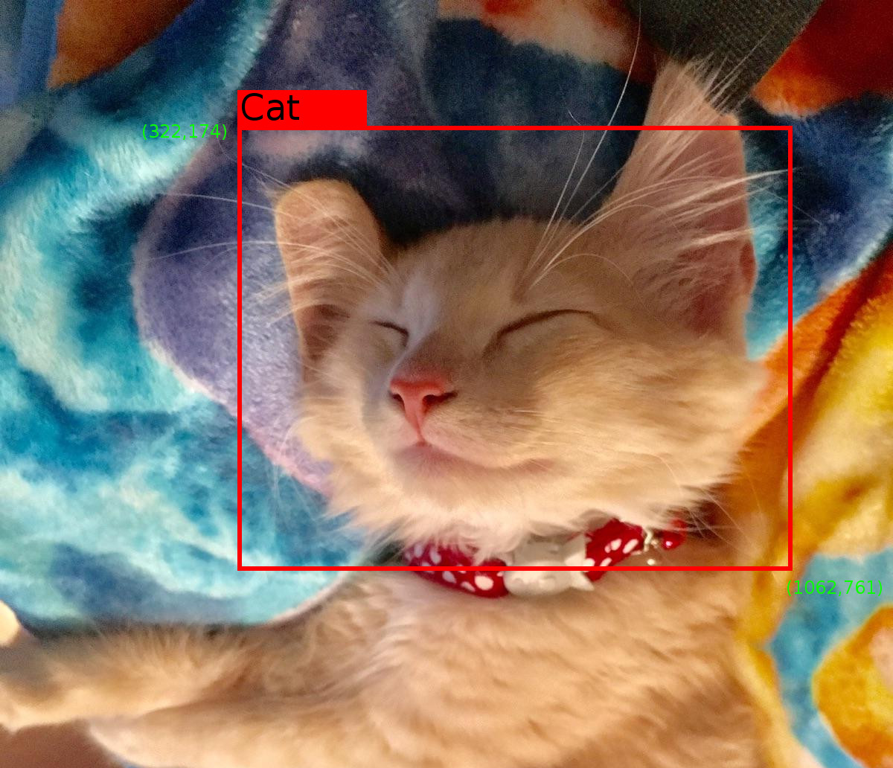

# Preparing Inputs

[TOC]

To use your own dataset in Tensorflow Object Detection API, you must convert it
into the [TFRecord file format](https://www.tensorflow.org/api_guides/python/python_io#tfrecords_format_details).
This document outlines how to write a script to generate the TFRecord file.

## Label Maps

Each dataset is required to have a label map associated with it. This label map
defines a mapping from string class names to integer class Ids. The label map
should be a `StringIntLabelMap` text protobuf. Sample label maps can be found in
object_detection/data. Label maps should always start from id 1.

## Dataset Requirements

For every example in your dataset, you should have the following information:

1. An RGB image for the dataset encoded as jpeg or png.
2. A list of bounding boxes for the image. Each bounding box should contain:
    1. A bounding box coordinates (with origin in top left corner) defined by 4
       floating point numbers [ymin, xmin, ymax, xmax]. Note that we store the
       _normalized_ coordinates (x / width, y / height) in the TFRecord dataset.
    2. The class of the object in the bounding box.

# Example Image

Consider the following image:



with the following label map:

```
item {
  id: 1
  name: 'Cat'
}


item {
  id: 2
  name: 'Dog'
}
```

We can generate a tf.Example proto for this image using the following code:

```python

def create_cat_tf_example(encoded_cat_image_data):
   """Creates a tf.Example proto from sample cat image.

  Args:
    encoded_cat_image_data: The jpg encoded data of the cat image.

  Returns:
    example: The created tf.Example.
  """

  height = 1032.0
  width = 1200.0
  filename = 'example_cat.jpg'
  image_format = b'jpg'

  xmins = [322.0 / 1200.0]
  xmaxs = [1062.0 / 1200.0]
  ymins = [174.0 / 1032.0]
  ymaxs = [761.0 / 1032.0]
  classes_text = ['Cat']
  classes = [1]

  tf_example = tf.train.Example(features=tf.train.Features(feature={
      'image/height': dataset_util.int64_feature(height),
      'image/width': dataset_util.int64_feature(width),
      'image/filename': dataset_util.bytes_feature(filename),
      'image/source_id': dataset_util.bytes_feature(filename),
      'image/encoded': dataset_util.bytes_feature(encoded_image_data),
      'image/format': dataset_util.bytes_feature(image_format),
      'image/object/bbox/xmin': dataset_util.float_list_feature(xmins),
      'image/object/bbox/xmax': dataset_util.float_list_feature(xmaxs),
      'image/object/bbox/ymin': dataset_util.float_list_feature(ymins),
      'image/object/bbox/ymax': dataset_util.float_list_feature(ymaxs),
      'image/object/class/text': dataset_util.bytes_list_feature(classes_text),
      'image/object/class/label': dataset_util.int64_list_feature(classes),
  }))
  return tf_example
```

## Conversion Script Outline {#conversion-script-outline}

A typical conversion script will look like the following:

```python

import tensorflow as tf

from object_detection.utils import dataset_util


flags = tf.app.flags
flags.DEFINE_string('output_path', '', 'Path to output TFRecord')
FLAGS = flags.FLAGS


def create_tf_example(example):
  # TODO(user): Populate the following variables from your example.
  height = None # Image height
  width = None # Image width
  filename = None # Filename of the image. Empty if image is not from file
  encoded_image_data = None # Encoded image bytes
  image_format = None # b'jpeg' or b'png'

  xmins = [] # List of normalized left x coordinates in bounding box (1 per box)
  xmaxs = [] # List of normalized right x coordinates in bounding box
             # (1 per box)
  ymins = [] # List of normalized top y coordinates in bounding box (1 per box)
  ymaxs = [] # List of normalized bottom y coordinates in bounding box
             # (1 per box)
  classes_text = [] # List of string class name of bounding box (1 per box)
  classes = [] # List of integer class id of bounding box (1 per box)

  tf_example = tf.train.Example(features=tf.train.Features(feature={
      'image/height': dataset_util.int64_feature(height),
      'image/width': dataset_util.int64_feature(width),
      'image/filename': dataset_util.bytes_feature(filename),
      'image/source_id': dataset_util.bytes_feature(filename),
      'image/encoded': dataset_util.bytes_feature(encoded_image_data),
      'image/format': dataset_util.bytes_feature(image_format),
      'image/object/bbox/xmin': dataset_util.float_list_feature(xmins),
      'image/object/bbox/xmax': dataset_util.float_list_feature(xmaxs),
      'image/object/bbox/ymin': dataset_util.float_list_feature(ymins),
      'image/object/bbox/ymax': dataset_util.float_list_feature(ymaxs),
      'image/object/class/text': dataset_util.bytes_list_feature(classes_text),
      'image/object/class/label': dataset_util.int64_list_feature(classes),
  }))
  return tf_example


def main(_):
  writer = tf.python_io.TFRecordWriter(FLAGS.output_path)

  # TODO(user): Write code to read in your dataset to examples variable

  for example in examples:
    tf_example = create_tf_example(example)
    writer.write(tf_example.SerializeToString())

  writer.close()


if __name__ == '__main__':
  tf.app.run()

```

Note: You may notice additional fields in some other datasets. They are
currently unused by the API and are optional.

Note: Please refer to the section on [Running an Instance Segmentation
Model](instance_segmentation.md) for instructions on how to configure a model
that predicts masks in addition to object bounding boxes.

## Sharding datasets

When you have more than a few thousand examples, it is beneficial to shard your
dataset into multiple files:

*   tf.data.Dataset API can read input examples in parallel improving
    throughput.
*   tf.data.Dataset API can shuffle the examples better with sharded files which
    improves performance of the model slightly.

Instead of writing all tf.Example protos to a single file as shown in
[conversion script outline](#conversion-script-outline), use the snippet below.

```python
import contextlib2
from google3.third_party.tensorflow_models.object_detection.dataset_tools import tf_record_creation_util

num_shards=10
output_filebase='/path/to/train_dataset.record'

with contextlib2.ExitStack() as tf_record_close_stack:
  output_tfrecords = tf_record_creation_util.open_sharded_output_tfrecords(
      tf_record_close_stack, output_filebase, num_shards)
  for index, example in examples:
    tf_example = create_tf_example(example)
    output_shard_index = index % num_shards
    output_tfrecords[output_shard_index].write(tf_example.SerializeToString())
```

This will produce the following output files

```bash
/path/to/train_dataset.record-00000-00010
/path/to/train_dataset.record-00001-00010
...
/path/to/train_dataset.record-00009-00010
```

which can then be used in the config file as below.

```bash
tf_record_input_reader {
  input_path: "/path/to/train_dataset.record-?????-of-00010"
}
```
