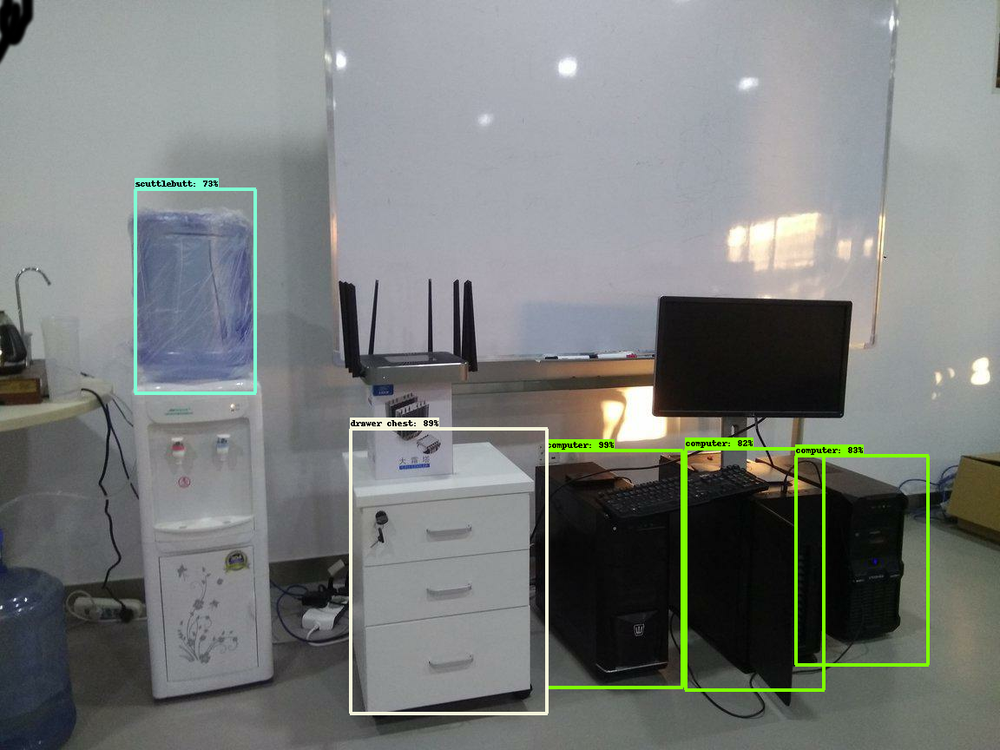

# 简介
http://edu.csdn.net/lecturer/1427

# TinymMind上GPU运行费用较贵，每 CPU 每小时 $0.09，每 GPU 每小时 $0.99，所有作业内容推荐先在本地运行出一定的结果，保证运行正确之后，再上传到TinyMind上运行。初始运行推荐使用CPU运行资源，待所有代码确保没有问题之后，再启动GPU运行。

## 作业
利用slim框架和object_detection框架，做一个物体检测的模型。通过这个作业，学员可以了解到物体检测模型的数据准备，训练和验证的过程。

>使用tinymind进行作业的学员，为保证作业顺利进行，文件名，配置等请严格按照本文档要求。

### 数据集

>本次作业使用我们已经准备好的数据集即可，自行制作数据集作为练习项目。

#### 自行制作数据集
数据集制作分以下步骤：
- 确定要识别的物体，需要把待识别的物体进行分类，类与类之间要有比较明显的区别特征，比如苹果和香蕉就是两个比较好的分类，而橘子和橙子就不是两个比较好的分类。
- 采集图片，根据不同的目的，可以采用不同方式对数据进行采集。比如针对一些常见类别，可以直接使用imagenet，coco等已经标定好的数据集，取出需要的分类即可。如果有特定的场景需求，可以针对特定场景需求对图片进行采集，要求要尽量覆盖所有的应用场景。
- 图片筛选和预处理，需要将图片中不含有待识别物体或者图片很不清晰的去掉。另外相机或者手机拍的图片，尺寸都比较大，建议将图片缩放到1080x720像素或者更低，这样可以避免训练框架运行的时候出现内存不足的问题。
- 数据标定，使用LableImg工具进行，具体内容阅读一下LabelImg的文档就可以。需要注意数据集的labels文件需要提前准备好，LabelImg有默认的labels设置，不指定的话，在标定的过程中输入labels比较容易出错。
- 数据整理，将标定好的数据xml和jpg分开存放。推荐按照voc的层级格式存放，图片放到images下面，xml文件放到annotations/xmls下面。

>LabelImg工具地址：https://github.com/tzutalin/labelImg.git
>需要注意LabelImg工具对中文的支持不是很好，label尽量使用英文。


#### 使用已经准备好的数据集
这里已经准备好了一个数据集，拥有5个分类，共150张图片，每张图片都做了标注，标注数据格式与voc数据集相同。数据地址如下：
https://gitee.com/ai100/quiz-w8-data.git

数据集中的物品分类如下：
- computer
- monitor
- scuttlebutt
- water dispenser
- drawer chest


数据集中各目录如下
- images， 图片目录，数据集中所有图片都在这个目录下面。
- annotations/xmls, 针对图片中的物体，使用LabelImg工具标注产生的xml文件都在这里，每个xml文件对应一个图片文件，每个xml文件里面包含图片中多个物体的位置和种类信息。


### 代码
本次代码使用tensorflow官方代码，代码地址如下：
https://github.com/tensorflow/models/tree/r1.5

> 因为最新的代码做了一些变化，需要使用pycocotool这个库，但是这个库的安装很复杂，目前暂时无法在tinymind上进行，所以这里使用比较老版本的代码

主要使用的是research/object_detection目录下的物体检测框架的代码。这个框架同时引用slim框架的部分内容，需要对运行路径做一下设置，不然会出现找不到module的错误。
设置运行路径的方式有两种：

- 直接在代码中插入路径，使用**sys.path.insert**，具体内容留作学员作业，请自行查找相关资料

- 使用环境变量PYTHONPATH，参考https://github.com/tensorflow/models/blob/master/research/object_detection/g3doc/installation.md，具体内容留作学员作业，请自行查找相关资料

>本次作业代码中，run.sh已经做好相关的path设置工作，在tinymind上运行可以不用考虑这个问题。

### 预训练模型
object_detection框架提供了一些预训练的模型以加快模型训练的速度，不同的模型及检测框架的预训练模型不同，常用的模型有resnet，mobilenet以及最近google发布的nasnet，检测框架有faster_rcnn，ssd等，本次作业使用mobilenet模型ssd检测框架，其预训练模型请自行在model_zoo中查找:
https://github.com/tensorflow/models/blob/master/research/object_detection/g3doc/detection_model_zoo.md

>ssd论文：https://arxiv.org/abs/1512.02325

>mobilenet论文：https://arxiv.org/abs/1704.04861

### 模型的导出和验证
参考**要点提示**中的内容

### 结果评估

#### 数据准备完成-30分
学员的模型引用的数据集中，应包含以下文件，文件名需要跟此处文件名一致。
- model.ckpt.data-00000-of-00001  预训练模型相关文件
- model.ckpt.index  预训练模型相关文件
- model.ckpt.meta  预训练模型相关文件
- labels_items.txt  数据集中的label_map文件
- pet_train.record  数据准备过程中，从原始数据生成的tfrecord格式的数据
- pet_val.record  数据准备过程中，从原始数据生成的tfrecord格式的数据
- test.jpg  验证图片，取任意一张训练集图片即可
#### 训练过程正常运行并结束-30分
出现以下log，没有明显异常退出的提示，没有明显错误：
```
INFO:tensorflow:depth of additional conv before box predictor: 0
INFO:tensorflow:depth of additional conv before box predictor: 0
INFO:tensorflow:Summary name /clone_loss is illegal; using clone_loss instead.
...............
INFO:tensorflow:Restoring parameters from /path/to/model.ckpt
INFO:tensorflow:Starting Session.
INFO:tensorflow:Saving checkpoint to path /path/to/train/model.ckpt
INFO:tensorflow:Starting Queues.
INFO:tensorflow:global_step/sec: 0
INFO:tensorflow:global step 15: loss = 10.6184 (0.212 sec/step)
INFO:tensorflow:global step 16: loss = 10.7582 (0.221 sec/step)
INFO:tensorflow:global step 17: loss = 9.4801 (0.209 sec/step)
INFO:tensorflow:global step 18: loss = 9.4556 (0.219 sec/step)
```
> log中出现的 deprecated WARNING，  tried to allocate 0 bytes， Request to allocate 0 bytes等内容属于框架本身的msg，不影响训练过程。
#### 验证有结果输出-30分
scalars有各个分类和平均AP输出。
输出结果的output文件夹中的output.png图片内容如下。

> 本作业只要框架能正确运行并输出就可以，对输出准确率不做要求。


心得体会10分


## 要点提示

本作业为开放性作业，不提供写好的代码，所有内容均由学员自己查资料完成。为避免学员因对流程的不熟悉浪费太多的时间，这里提供一些关键流程的要点提示。本作业主要参考：
https://github.com/tensorflow/models/blob/master/research/object_detection/g3doc/running_pets.md

这个官方的的参考文档里面，提供的是在cloud上运行一个针对宠物图片的识别框架的训练流程，本作业主要是本地和tinymind上的操作，所以运行的命令和操作方式略有不同，请学员注意区别。

**由于Tensorflow1.5版本api修改，导出模型的步骤会出现错误，具体内容请参考[这里](https://github.com/tensorflow/models/pull/3106),1.4版本的RewriterConfig没有layout_optimizer这个参数，而1.5版本有这个参数。github上的代码是基于tf1.5版本的，但是tinymind上只支持最高1.4版本，请注意修改exporter.py这个文件，将第72行的参数layout_optimizer替换为optimize_tensor_layout**

### 关于作业中出现的错误
**作业中，代码运行会出现一些错误，大部分可以直接搜索得到解决方案。请先自行尝试依靠搜索解决。**

也有可能出现搜索很久也没有解决方案的错误，这种可能是作业本身有问题，请联系助教解决。


### 下载代码：
直接git clone或者下载压缩包即可

### 下载数据
直接git clone或者下载压缩包即可

### 数据准备
数据准备过程推荐在本地完成，需要一个安装了tensorflow的shell环境，推荐使用ubuntu环境，使用windows的学员推荐在虚拟机中完成，使用mac的学员可直接在**终端**中完成所有数据准备过程。环境配置过程不再详述，请自行查找相关资料。需要注意本文曾提到过的因路径设置导致找不到module的问题。

#### 代码修改
以models官方代码models/research/object_detection/dataset_tools/create_pet_tf_record.py为基础进行修改，该代码将xml文件中的图片尺寸信息和物体位置信息统一进行处理，物体位置会转换成0～1之间的比例，物体名字会根据label_map转换成一个数字列表，结果会存入tfrecord中。请仔细阅读代码，确保理解代码中执行的操作。

代码修改注意要点：
- 本作业的数据集没有mask，所以代码中所有关于faces_only和mask的代码都要删除。
- 图片的class需要直接从xml文件的**name**字段中获取，所以get_class_name_from_filename函数相关的内容都要删除。
- 官方教程中提到的label_map_path文件，请直接使用数据集中的labels_items.txt文件，其内容的格式与pet_label_map.pbtxt文件相同，但是只有5项。
- 本数据集xml文件中，filename项有扩展名，这里需要注意

#### 生成数据
执行数据生成脚本
```
python object_detection/dataset_tools/create_data.py --label_map_path=/path/to/labels_items.txt --data_dir=/path/to/data --output_dir=/path/to/out
```

执行完后，会在/path/to/out下面生成两个.record文件。
- name_train.record
- name_val.record
> **name**为指定的输出文件前缀，如果没改的话，应该是**pet**，本次作业中不要修改输出文件名，直接使用原始文件名即可。

#### 编辑pipline.config文件
以models/research/object_detection/samples/configs/ssd_mobilenet_v1_pets.config为基础进行修改。本文档所在仓库也提供了这个文件。
这个文件里面放了训练和验证过程的所有参数的配置，包括各种路径，各种训练参数（学习率，decay，batch_size等）。有这个文件，命令行上面可以少写很多参数，避免命令行内容太多。

注意要点：
- num_classes， 原文件里面为37,这里的数据集为5
- num_examples， 这个是验证集中有多少数量的图片，请根据图片数量和数据准备脚本中的生成规则自行计算。
- PATH_TO_BE_CONFIGURED，这个是原文件中预留的字段，一共5个，分别包含预训练模型的位置，训练集数据和label_map文件位置，验证集数据和label_map文件位置。这个字段需要将数据以及配置文件等上传到tinymind之后才能确定路径的具体位置。
- num_steps，这个是训练多少step，后面的训练启动脚本会用到这个字段，直接将原始的200000改成0.注意不要添加或者删除空格等，后面的训练启动脚本使用sed对这个字段进行检测替换，如果改的有问题会影像训练启动脚本的执行。不通过run.sh本地运行需要将这个数字改成一个合适的step数，改成0的话会有问题。
- max_evals，这个是验证每次跑几轮，这里直接改成1即可，即每个训练验证循环只跑一次验证。
- eval_input_reader 里面的shuffle， 这个是跟eval步骤的数据reader有关，如果不使用GPU进行训练的话，这里需要从false改成true，不然会导致错误，详细内容参阅 https://github.com/tensorflow/models/issues/1936

>训练和验证过程次数相关的参数，后面在训练启动脚本中会自动进行处理，这里不需要过多关注，但是实际使用的时候，需要对这些参数进行合适的设置，比如**num_steps**参数，后面的训练启动脚本中，每轮运行100个step，同时根据数据集图片总数all_images_count和batch_size的大小，可以计算出epoch的数量，最后输出模型的质量与epoch的数量密切相关。epoch=num_step*batch_size/all_images_count。具体的计算留给学员自己进行。

>config文件需要跟代码一起上传，运行的时候会先被复制到output文件夹里面。
#### 数据上传
请学员自行在自己的tinymind账户中建立数据集。tinymind一个数据集中可以有多个不同用途的文件，这里要求学员将模型用到的所有文件，训练数据，配置，label_map等都放到一个数据集中，便于模型的使用以及助教对作业结果的判断。

>注意拿一张训练的图片作为测试图片重命名为test.jpg放到数据集里面，便于后面的模型测试过程。

### 训练代码
训练代码不需要做任何修改，只把本作业提供的训练启动脚本加入训练代码响应目录就可以。因为models目录包含了大量与本次作业无关的代码，可以适当的删除一些东西，仅保留models/research下面的object_detection和slim目录就可以。

### 训练系统脚本 run.sh
由于本作业中使用的框架，训练和验证分别在两个进程中执行，而tinymind目前不支持这种方式运作，所以这里提供一个训练启动脚本，来顺序执行训练和验证过程，并在训练结束的时候自动导出模型并验证导出模型的效果。训练启动脚本内容参考本仓库中的附件**run.sh**，以及其中的注释。脚本的内容涉及linuxshell编程，超出本课程教授范围，不做详细解释，感兴趣的学员请自行分析脚本内容。

>inference.py参考 https://github.com/tensorflow/models/blob/master/research/object_detection/object_detection_tutorial.ipynb
模型验证使用这里提供的inference.py脚本，请将这个脚本和run.sh一起放到models/research目录，与object_detection和slim平行。

>注意修改run.sh中的数据集目录为自己的数据集目录。

**按照训练脚本的设定，每次运行只会运行100个step，每次验证只会运行一次，训练和验证循环执行，如果出现某次训练超过100个step，或者验证过程卡住迟迟不退出，则说明config文件的配置有问题**

>由于tinymind目前对sh脚本的启动支持不好，这里提供了一个run.py脚本作为模型的入口。这个脚本会启动run.sh脚本。

### 模型建立
上一步将训练启动脚本加入代码之后，将代码上传到github，使用github方式建立模型。模型运行环境为python3.6/Tensorflow1.4，模型代码载入点为research/run.py。

>tinyming目前对压缩包的方式支持有问题，本次作业无法通过压缩包方式上传代码。
tinymind运行模型的时候，会自动将上传的压缩包解压到/tinysrc/目录，所以压缩包的路径也会影像代码的载入点路径。路径问题训练启动脚本已经做过相关处理，如果仍然出现找不到module或者文件问题，请自行尝试修改训练启动脚本，或者直接修改训练代码。

### 模型运行
代码建立之后，模型可以开始运行，运行结果会在log中显示，如果没有出现明显的错误，那么运行应该很快会结束（1小时以内）。运行结束之后可以查看图表Tab和输出log，同时/output文件夹里面会生成output.png，可以据此对运行的结果进行判断。

本次作业中，模型的各个参数都使用默认的，场景比较单一，所以训练的结果应该会比较好，各个分类的AP（Average Precision）应该都在80%以上，标定的结果也会比较准确。不过本次作业对AP等指标不做任何要求，只要训练正常完成即可认为作业成功完成。

### windows相关问题

- windows 命令行不支持 * 操作符。

### 本地运行的命令行

```sh
# 本地运行训练
python ./object_detection/train.py --train_dir=/path/to/train_dir --pipeline_config_path=/path/to/pipeline_config_file

#本地运行验证，注意这里的checkpoint就是训练时候的train_dir,验证的结果放在eval_dir，可以通过tensorboard看
python ./object_detection/eval.py --checkpoint_dir=/path/to/train_dir --eval_dir=/path/to/eval_dir --pipeline_config_path=/path/to/pipeline_config_file

# 导出训练好的模型，这里注意trained_checkpoint_prefix的参数是个前缀，不是一个文件名，这个参数代表的是三个文件以这个参数值开头的文件，最后的last_chekpoint_number是一个数字
python ./object_detection/export_inference_graph.py --input_type image_tensor --pipeline_config_path /path/to/pipeline_config_file --trained_checkpoint_prefix /path/to/train_dir/model.ckpt-[last_chekpoint_number] --output_directory /path/to/output_dir/exported_graphs

# 用导出的模型运行inference，详情参考代码
python ./inference.py --output_dir=/path/to/output_dir --dataset_dir=/path/to/dataset_dir
```

>命令行中，等号与空格的方式都可以指定参数的值，两种方式在大部分linux命令行程序中是等价的。
