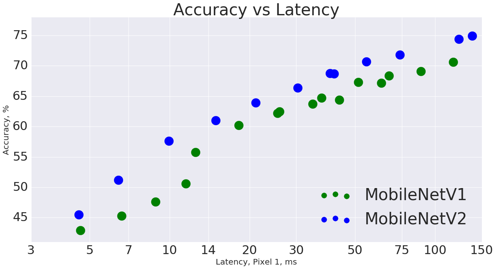
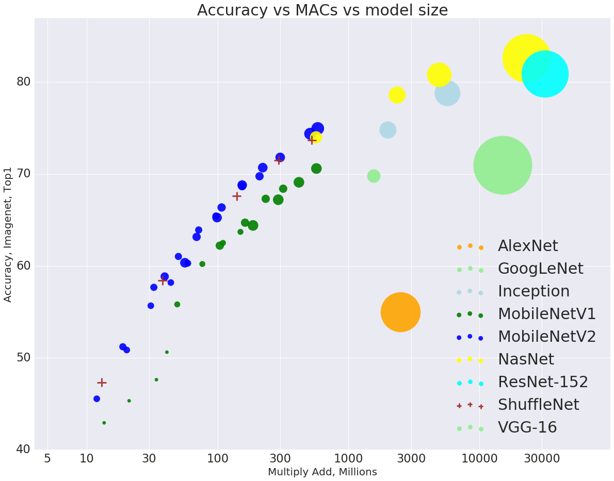

# MobileNetV2
This folder contains building code for MobileNetV2, based on
[MobileNetV2: Inverted Residuals and Linear Bottlenecks](https://arxiv.org/abs/1801.04381)

# Performance
## Latency
This is the timing of [MobileNetV1](../mobilenet_v1.md) vs MobileNetV2 using
TF-Lite on the large core of Pixel 1 phone.

## MACs
MACs, also sometimes known as MADDs - the number of  multiply-accumulates needed
to compute an inference on a single image is a common metric to measure the efficiency of the model.

Below is the graph comparing V2 vs a few selected networks. The size
of each blob represents the number of parameters. Note for [ShuffleNet](https://arxiv.org/abs/1707.01083) there
are no published size numbers. We estimate it to be comparable to MobileNetV2 numbers.

# Pretrained models
## Imagenet  Checkpoints

 Classification Checkpoint | MACs (M)| Parameters (M)| Top 1 Accuracy| Top 5 Accuracy | Mobile CPU  (ms) Pixel 1
---------------------------|---------|---------------|---------|----|-------------
| [mobilenet_v2_1.4_224](https://storage.googleapis.com/mobilenet_v2/checkpoints/mobilenet_v2_1.4_224.tgz) | 582 | 6.06 | 75.0 | 92.5 | 138.0
| [mobilenet_v2_1.3_224](https://storage.googleapis.com/mobilenet_v2/checkpoints/mobilenet_v2_1.3_224.tgz) | 509 | 5.34 | 74.4 | 92.1 | 123.0
| [mobilenet_v2_1.0_224](https://storage.googleapis.com/mobilenet_v2/checkpoints/mobilenet_v2_1.0_224.tgz) | 300 | 3.47 | 71.8 | 91.0 | 73.8
| [mobilenet_v2_1.0_192](https://storage.googleapis.com/mobilenet_v2/checkpoints/mobilenet_v2_1.0_192.tgz) | 221 | 3.47 | 70.7 | 90.1 | 55.1
| [mobilenet_v2_1.0_160](https://storage.googleapis.com/mobilenet_v2/checkpoints/mobilenet_v2_1.0_160.tgz) | 154 | 3.47 | 68.8 | 89.0 | 40.2
| [mobilenet_v2_1.0_128](https://storage.googleapis.com/mobilenet_v2/checkpoints/mobilenet_v2_1.0_128.tgz) | 99 | 3.47 | 65.3 | 86.9 | 27.6
| [mobilenet_v2_1.0_96](https://storage.googleapis.com/mobilenet_v2/checkpoints/mobilenet_v2_1.0_96.tgz) | 56 | 3.47 | 60.3 | 83.2 | 17.6
| [mobilenet_v2_0.75_224](https://storage.googleapis.com/mobilenet_v2/checkpoints/mobilenet_v2_0.75_224.tgz) | 209 | 2.61 | 69.8 | 89.6 | 55.8
| [mobilenet_v2_0.75_192](https://storage.googleapis.com/mobilenet_v2/checkpoints/mobilenet_v2_0.75_192.tgz) | 153 | 2.61 | 68.7 | 88.9 | 41.6
| [mobilenet_v2_0.75_160](https://storage.googleapis.com/mobilenet_v2/checkpoints/mobilenet_v2_0.75_160.tgz) | 107 | 2.61 | 66.4 | 87.3 | 30.4
| [mobilenet_v2_0.75_128](https://storage.googleapis.com/mobilenet_v2/checkpoints/mobilenet_v2_0.75_128.tgz) | 69 | 2.61 | 63.2 | 85.3 | 21.9
| [mobilenet_v2_0.75_96](https://storage.googleapis.com/mobilenet_v2/checkpoints/mobilenet_v2_0.75_96.tgz) | 39 | 2.61 | 58.8 | 81.6 | 14.2
| [mobilenet_v2_0.5_224](https://storage.googleapis.com/mobilenet_v2/checkpoints/mobilenet_v2_0.5_224.tgz) | 97 | 1.95 | 65.4 | 86.4 | 28.7
| [mobilenet_v2_0.5_192](https://storage.googleapis.com/mobilenet_v2/checkpoints/mobilenet_v2_0.5_192.tgz) | 71 | 1.95 | 63.9 | 85.4 | 21.1
| [mobilenet_v2_0.5_160](https://storage.googleapis.com/mobilenet_v2/checkpoints/mobilenet_v2_0.5_160.tgz) | 50 | 1.95 | 61.0 | 83.2 | 14.9
| [mobilenet_v2_0.5_128](https://storage.googleapis.com/mobilenet_v2/checkpoints/mobilenet_v2_0.5_128.tgz) | 32 | 1.95 | 57.7 | 80.8 | 9.9
| [mobilenet_v2_0.5_96](https://storage.googleapis.com/mobilenet_v2/checkpoints/mobilenet_v2_0.5_96.tgz) | 18 | 1.95 | 51.2 | 75.8 | 6.4
| [mobilenet_v2_0.35_224](https://storage.googleapis.com/mobilenet_v2/checkpoints/mobilenet_v2_0.35_224.tgz) | 59 | 1.66 | 60.3 | 82.9 | 19.7
| [mobilenet_v2_0.35_192](https://storage.googleapis.com/mobilenet_v2/checkpoints/mobilenet_v2_0.35_192.tgz) | 43 | 1.66 | 58.2 | 81.2 | 14.6
| [mobilenet_v2_0.35_160](https://storage.googleapis.com/mobilenet_v2/checkpoints/mobilenet_v2_0.35_160.tgz) | 30 | 1.66 | 55.7 | 79.1 | 10.5
| [mobilenet_v2_0.35_128](https://storage.googleapis.com/mobilenet_v2/checkpoints/mobilenet_v2_0.35_128.tgz) | 20 | 1.66 | 50.8 | 75.0 | 6.9
| [mobilenet_v2_0.35_96](https://storage.googleapis.com/mobilenet_v2/checkpoints/mobilenet_v2_0.35_96.tgz) | 11 | 1.66 | 45.5 | 70.4 | 4.5

# Example

See this [ipython notebook](mobilenet_example.ipynb) or open and run the network directly in [Colaboratory](https://colab.research.google.com/github/tensorflow/models/blob/master/research/slim/nets/mobilenet/mobilenet_example.ipynb).

