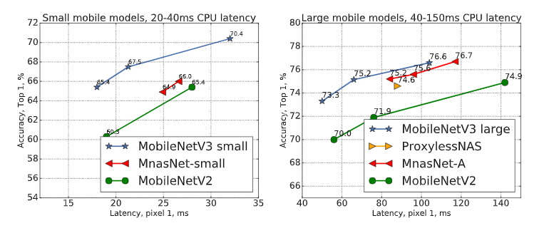
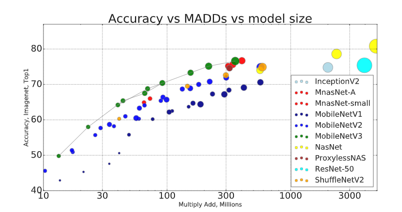
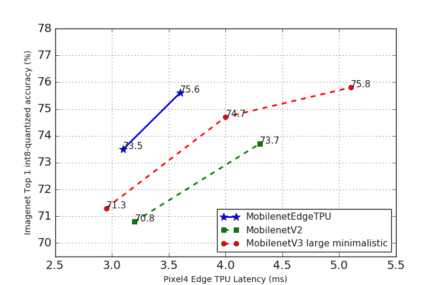

# MobileNet

This folder contains building code for
[MobileNetV2](https://arxiv.org/abs/1801.04381) and
[MobilenetV3](https://arxiv.org/abs/1905.02244) networks. The architectural
definition for each model is located in [mobilenet_v2.py](mobilenet_v2.py) and
[mobilenet_v3.py](mobilenet_v3.py) respectively.

For MobilenetV1 please refer to [this page](../mobilenet_v1.md)

We have also introduced a family of MobileNets customized for the Edge TPU
accelerator found in
[Google Pixel4](https://blog.google/products/pixel/pixel-4/) devices. The
architectural definition for MobileNetEdgeTPU is located in
[mobilenet_v3.py](mobilenet_v3.py)

## Performance

### Mobilenet V3 latency

This is the timing of [MobileNetV2] vs [MobileNetV3] using TF-Lite on the large
core of Pixel 1 phone.



### MACs

MACs, also sometimes known as MADDs - the number of multiply-accumulates needed
to compute an inference on a single image is a common metric to measure the
efficiency of the model. Full size Mobilenet V3 on image size 224 uses ~215
Million MADDs (MMadds) while achieving accuracy 75.1%, while Mobilenet V2 uses
~300MMadds and achieving accuracy 72%. By comparison ResNet-50 uses
approximately 3500 MMAdds while achieving 76% accuracy.

Below is the graph comparing Mobilenets and a few selected networks. The size of
each blob represents the number of parameters. Note for
[ShuffleNet](https://arxiv.org/abs/1707.01083) there are no published size
numbers. We estimate it to be comparable to MobileNetV2 numbers.



### Mobilenet EdgeTPU latency

The figure below shows the Pixel 4 Edge TPU latency of int8-quantized Mobilenet
EdgeTPU compared with MobilenetV2 and the minimalistic variants of MobilenetV3
(see below).



## Pretrained models

### Mobilenet V3 Imagenet Checkpoints

All mobilenet V3 checkpoints were trained with image resolution 224x224. All
phone latencies are in milliseconds, measured on large core. In addition to
large and small models this page also contains so-called minimalistic models,
these models have the same per-layer dimensions characteristic as MobilenetV3
however, they don't utilize any of the advanced blocks (squeeze-and-excite
units, hard-swish, and 5x5 convolutions). While these models are less efficient
on CPU, we find that they are much more performant on GPU/DSP.

| Imagenet Checkpoint | MACs (M) | Params (M) | Top1 | Pixel 1 | Pixel 2 | Pixel 3 |
| ------------------ | -------- | ---------- | ---- | ------- | ------- | ------- |
| [Large dm=1 (float)]    | 217      | 5.4        | 75.2 | 51.2    | 61      | 44      |
| [Large dm=1 (8-bit)]    | 217      | 5.4        | 73.9 | 44      | 42.5    | 32      |
| [Large dm=0.75 (float)] | 155      | 4.0        | 73.3 | 39.8    | 48      | 34      |
| [Small dm=1 (float)]    | 66       | 2.9        | 67.5 | 15.8    | 19.4    | 14.4    |
| [Small dm=1 (8-bit)]    | 66       | 2.9        | 64.9 | 15.5    | 15      | 10.7    |
| [Small dm=0.75 (float)] | 44       | 2.4        | 65.4 | 12.8    | 15.9    | 11.6    |

#### Minimalistic checkpoints:

| Imagenet Checkpoint | MACs (M) | Params (M) | Top1 | Pixel 1 | Pixel 2 | Pixel 3 |
| -------------- | -------- | ---------- | ---- | ------- | ------- | ------- |
| [Large minimalistic (float)]        | 209      | 3.9        | 72.3 | 44.1    | 51      | 35      |
| [Large minimalistic (8-bit)][lm8]   | 209      | 3.9        | 71.3 | 37      | 35      | 27      |
| [Small minimalistic (float)]        | 65       | 2.0        | 61.9 | 12.2    | 15.1    | 11      |

#### Edge TPU checkpoints:

| Imagenet Checkpoint | MACs (M) | Params (M) | Top1 | Pixel 4 Edge TPU | Pixel 4 CPU |
| ----------------- | -------- | ---------- | ---- | ------- | ----------- |
| [MobilenetEdgeTPU dm=0.75 (8-bit)]| 624      | 2.9        | 73.5 | 3.1     | 13.8        |
| [MobilenetEdgeTPU dm=1 (8-bit)] | 990      | 4.0        | 75.6 | 3.6     | 20.6        |


Note: 8-bit quantized versions of the MobilenetEdgeTPU models were obtained
using Tensorflow Lite's
[post training quantization](https://www.tensorflow.org/lite/performance/post_training_quantization)
tool.

[Small minimalistic (float)]: https://storage.googleapis.com/mobilenet_v3/checkpoints/v3-small-minimalistic_224_1.0_float.tgz
[Large minimalistic (float)]: https://storage.googleapis.com/mobilenet_v3/checkpoints/v3-large-minimalistic_224_1.0_float.tgz
[lm8]: https://storage.googleapis.com/mobilenet_v3/checkpoints/v3-large-minimalistic_224_1.0_uint8.tgz
[Large dm=1 (float)]: https://storage.googleapis.com/mobilenet_v3/checkpoints/v3-large_224_1.0_float.tgz
[Small dm=1 (float)]: https://storage.googleapis.com/mobilenet_v3/checkpoints/v3-small_224_1.0_float.tgz
[Large dm=1 (8-bit)]: https://storage.googleapis.com/mobilenet_v3/checkpoints/v3-large_224_1.0_uint8.tgz
[Small dm=1 (8-bit)]: https://storage.googleapis.com/mobilenet_v3/checkpoints/v3-small_224_1.0_uint8.tgz
[Large dm=0.75 (float)]: https://storage.googleapis.com/mobilenet_v3/checkpoints/v3-large_224_0.75_float.tgz
[Small dm=0.75 (float)]: https://storage.googleapis.com/mobilenet_v3/checkpoints/v3-small_224_0.75_float.tgz
[MobilenetEdgeTPU dm=0.75 (8-bit)]: https://storage.cloud.google.com/mobilenet_edgetpu/checkpoints/mobilenet_edgetpu_224_0.75.tgz
[MobilenetEdgeTPU dm=1 (8-bit)]: https://storage.cloud.google.com/mobilenet_edgetpu/checkpoints/mobilenet_edgetpu_224_1.0.tgz

### Mobilenet V2 Imagenet Checkpoints

Classification Checkpoint                   | Quantized                                                               | MACs (M) | Parameters (M) | Top 1 Accuracy | Top 5 Accuracy | Mobile CPU (ms) Pixel 1
------------------------------------------------------------------------------------------------------|-------------- | -------- | -------------- | -------------- | -------------- | -----------------------
[float_v2_1.4_224](https://storage.googleapis.com/mobilenet_v2/checkpoints/mobilenet_v2_1.4_224.tgz)  | [uint8][quantized_v2_1.4_224]  | 582      | 6.06           | 75.0           | 92.5           | 138.0
[float_v2_1.3_224](https://storage.googleapis.com/mobilenet_v2/checkpoints/mobilenet_v2_1.3_224.tgz) |[uint8][quantized_v2_1.3_224]   | 509      | 5.34           | 74.4           | 92.1           | 123.0
[float_v2_1.0_224](https://storage.googleapis.com/mobilenet_v2/checkpoints/mobilenet_v2_1.0_224.tgz)  |[uint8][quantized_v2_1.0_224]  | 300      | 3.47           | 71.8           | 91.0           | 73.8
[float_v2_1.0_192](https://storage.googleapis.com/mobilenet_v2/checkpoints/mobilenet_v2_1.0_192.tgz)  |[uint8][quantized_v2_1.0_192]  | 221      | 3.47           | 70.7           | 90.1           | 55.1
[float_v2_1.0_160](https://storage.googleapis.com/mobilenet_v2/checkpoints/mobilenet_v2_1.0_160.tgz) | [uint8][quantized_v2_1.0_160]  | 154      | 3.47           | 68.8           | 89.0           | 40.2
[float_v2_1.0_128](https://storage.googleapis.com/mobilenet_v2/checkpoints/mobilenet_v2_1.0_128.tgz) |  [uint8][quantized_v2_1.0_128]  | 99       | 3.47           | 65.3           | 86.9           | 27.6
[float_v2_1.0_96](https://storage.googleapis.com/mobilenet_v2/checkpoints/mobilenet_v2_1.0_96.tgz)    | [uint8][quantized_v2_1.0_96]   | 56       | 3.47           | 60.3           | 83.2           | 17.6
[float_v2_0.75_224](https://storage.googleapis.com/mobilenet_v2/checkpoints/mobilenet_v2_0.75_224.tgz)|[uint8][quantized_v2_0.75_224] | 209      | 2.61           | 69.8           | 89.6           | 55.8
[float_v2_0.75_192](https://storage.googleapis.com/mobilenet_v2/checkpoints/mobilenet_v2_0.75_192.tgz)|[uint8][quantized_v2_0.75_192] | 153      | 2.61           | 68.7           | 88.9           | 41.6
[float_v2_0.75_160](https://storage.googleapis.com/mobilenet_v2/checkpoints/mobilenet_v2_0.75_160.tgz)| [uint8][quantized_v2_0.75_160] | 107      | 2.61           | 66.4           | 87.3           | 30.4
[float_v2_0.75_128](https://storage.googleapis.com/mobilenet_v2/checkpoints/mobilenet_v2_0.75_128.tgz)| [uint8][quantized_v2_0.75_128] | 69       | 2.61           | 63.2           | 85.3           | 21.9
[float_v2_0.75_96](https://storage.googleapis.com/mobilenet_v2/checkpoints/mobilenet_v2_0.75_96.tgz)  |[uint8][quantized_v2_0.75_96]  | 39       | 2.61           | 58.8           | 81.6           | 14.2
[float_v2_0.5_224](https://storage.googleapis.com/mobilenet_v2/checkpoints/mobilenet_v2_0.5_224.tgz)  |[uint8][quantized_v2_0.5_224] | 97       | 1.95           | 65.4           | 86.4           | 28.7
[float_v2_0.5_192](https://storage.googleapis.com/mobilenet_v2/checkpoints/mobilenet_v2_0.5_192.tgz)  |[uint8][quantized_v2_0.5_192]  | 71       | 1.95           | 63.9           | 85.4           | 21.1
[float_v2_0.5_160](https://storage.googleapis.com/mobilenet_v2/checkpoints/mobilenet_v2_0.5_160.tgz)  |[uint8][quantized_v2_0.5_160]  | 50       | 1.95           | 61.0           | 83.2           | 14.9
[float_v2_0.5_128](https://storage.googleapis.com/mobilenet_v2/checkpoints/mobilenet_v2_0.5_128.tgz)  |[uint8][quantized_v2_0.5_128]  | 32       | 1.95           | 57.7           | 80.8           | 9.9
[float_v2_0.5_96](https://storage.googleapis.com/mobilenet_v2/checkpoints/mobilenet_v2_0.5_96.tgz)    |[uint8][quantized_v2_0.5_96]   | 18       | 1.95           | 51.2           | 75.8           | 6.4
[float_v2_0.35_224](https://storage.googleapis.com/mobilenet_v2/checkpoints/mobilenet_v2_0.35_224.tgz)|[uint8][quantized_v2_0.35_224] | 59       | 1.66           | 60.3           | 82.9           | 19.7
[float_v2_0.35_192](https://storage.googleapis.com/mobilenet_v2/checkpoints/mobilenet_v2_0.35_192.tgz)| [uint8][quantized_v2_0.35_192] | 43       | 1.66           | 58.2           | 81.2           | 14.6
[float_v2_0.35_160](https://storage.googleapis.com/mobilenet_v2/checkpoints/mobilenet_v2_0.35_160.tgz)|[uint8][quantized_v2_0.35_160] | 30       | 1.66           | 55.7           | 79.1           | 10.5
[float_v2_0.35_128](https://storage.googleapis.com/mobilenet_v2/checkpoints/mobilenet_v2_0.35_128.tgz)|[uint8][quantized_v2_0.35_128] | 20       | 1.66           | 50.8           | 75.0           | 6.9
[float_v2_0.35_96](https://storage.googleapis.com/mobilenet_v2/checkpoints/mobilenet_v2_0.35_96.tgz)  |[uint8][quantized_v2_0.35_96]  | 11       | 1.66           | 45.5           | 70.4           | 4.5

[quantized_v2_1.4_224]: https://storage.googleapis.com/mobilenet_v2/checkpoints/quantized_v2_224_140.tgz
[quantized_v2_1.3_224]: https://storage.googleapis.com/mobilenet_v2/checkpoints/quantized_v2_224_130.tgz
[quantized_v2_1.0_224]: https://storage.googleapis.com/mobilenet_v2/checkpoints/quantized_v2_224_100.tgz
[quantized_v2_1.0_192]: https://storage.googleapis.com/mobilenet_v2/checkpoints/quantized_v2_192_100.tgz
[quantized_v2_1.0_160]: https://storage.googleapis.com/mobilenet_v2/checkpoints/quantized_v2_160_100.tgz
[quantized_v2_1.0_128]: https://storage.googleapis.com/mobilenet_v2/checkpoints/quantized_v2_128_100.tgz
[quantized_v2_1.0_96]: https://storage.googleapis.com/mobilenet_v2/checkpoints/quantized_v2_96_100.tgz
[quantized_v2_0.75_224]: https://storage.googleapis.com/mobilenet_v2/checkpoints/quantized_v2_224_75.tgz
[quantized_v2_0.75_192]: https://storage.googleapis.com/mobilenet_v2/checkpoints/quantized_v2_192_75.tgz
[quantized_v2_0.75_160]: https://storage.googleapis.com/mobilenet_v2/checkpoints/quantized_v2_160_75.tgz
[quantized_v2_0.75_128]: https://storage.googleapis.com/mobilenet_v2/checkpoints/quantized_v2_128_75.tgz
[quantized_v2_0.75_96]: https://storage.googleapis.com/mobilenet_v2/checkpoints/quantized_v2_96_75.tgz
[quantized_v2_0.5_224]: https://storage.googleapis.com/mobilenet_v2/checkpoints/quantized_v2_224_50.tgz
[quantized_v2_0.5_192]: https://storage.googleapis.com/mobilenet_v2/checkpoints/quantized_v2_192_50.tgz
[quantized_v2_0.5_160]: https://storage.googleapis.com/mobilenet_v2/checkpoints/quantized_v2_160_50.tgz
[quantized_v2_0.5_128]: https://storage.googleapis.com/mobilenet_v2/checkpoints/quantized_v2_128_50.tgz
[quantized_v2_0.5_96]: https://storage.googleapis.com/mobilenet_v2/checkpoints/quantized_v2_96_50.tgz
[quantized_v2_0.35_224]: https://storage.googleapis.com/mobilenet_v2/checkpoints/quantized_v2_224_35.tgz
[quantized_v2_0.35_192]: https://storage.googleapis.com/mobilenet_v2/checkpoints/quantized_v2_192_35.tgz
[quantized_v2_0.35_160]: https://storage.googleapis.com/mobilenet_v2/checkpoints/quantized_v2_160_35.tgz
[quantized_v2_0.35_128]: https://storage.googleapis.com/mobilenet_v2/checkpoints/quantized_v2_128_35.tgz
[quantized_v2_0.35_96]: https://storage.googleapis.com/mobilenet_v2/checkpoints/quantized_v2_96_35.tgz


## Training

### V3
The following configuration, achieves 74.6% using 8 GPU setup and 75.2% using
2x2 TPU setup.


Final Top 1 Accuracy        |      74.6         |           |
----------------------------|------------------|-----------|
learning_rate               |   0.16     |Total learning rate. (Per clone learning rate is 0.02) |
rmsprop_momentum            |   0.9      |    |
rmsprop_decay               |   0.9      |    |
rmsprop_epsilon             |   0.002    |    |
learning_rate_decay_factor  |   0.99     |   |
optimizer                   |   RMSProp  | |
warmup_epochs               |   5        | Slim uses per clone epoch, so the the flag value is 0.6  |
num_epochs_per_decay        |   3        | Slim uses per clone epoch, so the  flag value is 0.375 |
batch_size (per chip)       |   192      |                   |
moving_average_decay        |   0.9999   |                   |
weight_decay                |   1e-5     |                   |
init_stddev                 |    0.008   |                   |
dropout_keep_prob           |   0.8      |                   |
bn_moving_average_decay     |   0.997    |                   |
bn_epsilon                  |      0.001 |                   |
label_smoothing             |   0.1      |                   |


### V2

The numbers above can be reproduced using slim's
[`train_image_classifier`](https://github.com/tensorflow/models/blob/master/research/slim/README.md#training-a-model-from-scratch).
Below is the set of parameters that achieves 72.0% for full size MobileNetV2,
after about 700K when trained on 8 GPU. If trained on a single GPU the full
convergence is after 5.5M steps. Also note that learning rate and
num_epochs_per_decay both need to be adjusted depending on how many GPUs are
being used due to slim's internal averaging.

```bash
--model_name="mobilenet_v2"
--learning_rate=0.045 * NUM_GPUS   #slim internally averages clones so we compensate
--preprocessing_name="inception_v2"
--label_smoothing=0.1
--moving_average_decay=0.9999
--batch_size= 96
--num_clones = NUM_GPUS # you can use any number here between 1 and 8 depending on your hardware setup.
--learning_rate_decay_factor=0.98
--num_epochs_per_decay = 2.5 / NUM_GPUS # train_image_classifier does per clone epochs
```

# Example

See this [ipython notebook](mobilenet_example.ipynb) or open and run the network
directly in
[Colaboratory](https://colab.research.google.com/github/tensorflow/models/blob/master/research/slim/nets/mobilenet/mobilenet_example.ipynb).

[MobilenetV2]: https://arxiv.org/abs/1801.04381
[MobilenetV3]: https://arxiv.org/abs/1905.02244
