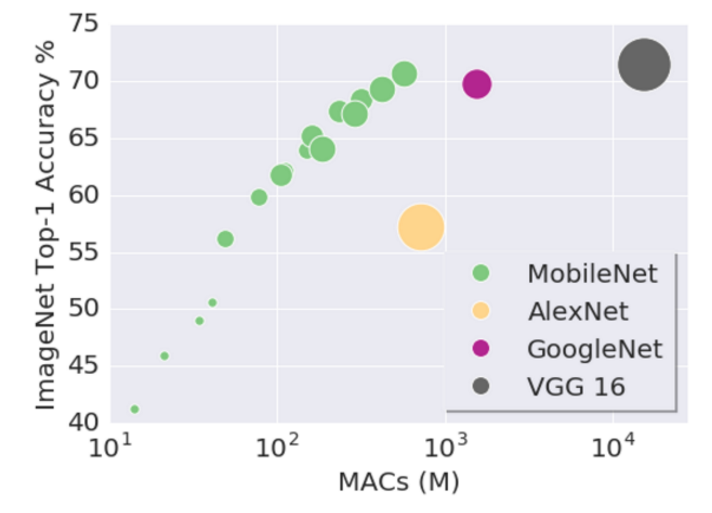

# Mobilenet_v2
For Mobilenet V2 see this file [mobilenet/README.md]

# MobileNet_v1

[MobileNets](https://arxiv.org/abs/1704.04861) are small, low-latency, low-power models parameterized to meet the resource constraints of a variety of use cases. They can be built upon for classification, detection, embeddings and segmentation similar to how other popular large scale models, such as Inception, are used. MobileNets can be run efficiently on mobile devices with [TensorFlow Mobile](https://www.tensorflow.org/mobile/).

MobileNets trade off between latency, size and accuracy while comparing favorably with popular models from the literature.



# Pre-trained Models

Choose the right MobileNet model to fit your latency and size budget. The size of the network in memory and on disk is proportional to the number of parameters. The latency and power usage of the network scales with the number of Multiply-Accumulates (MACs) which measures the number of fused Multiplication and Addition operations. These MobileNet models have been trained on the
[ILSVRC-2012-CLS](http://www.image-net.org/challenges/LSVRC/2012/)
image classification dataset. Accuracies were computed by evaluating using a single image crop.

Model  | Million MACs | Million Parameters | Top-1 Accuracy| Top-5 Accuracy |
:----:|:------------:|:----------:|:-------:|:-------:|
[MobileNet_v1_1.0_224](http://download.tensorflow.org/models/mobilenet_v1_2018_02_22/mobilenet_v1_1.0_224.tgz)|569|4.24|70.9|89.9|
[MobileNet_v1_1.0_192](http://download.tensorflow.org/models/mobilenet_v1_2018_02_22/mobilenet_v1_1.0_192.tgz)|418|4.24|70.0|89.2|
[MobileNet_v1_1.0_160](http://download.tensorflow.org/models/mobilenet_v1_2018_02_22/mobilenet_v1_1.0_160.tgz)|291|4.24|68.0|87.7|
[MobileNet_v1_1.0_128](http://download.tensorflow.org/models/mobilenet_v1_2018_02_22/mobilenet_v1_1.0_128.tgz)|186|4.24|65.2|85.8|
[MobileNet_v1_0.75_224](http://download.tensorflow.org/models/mobilenet_v1_2018_02_22/mobilenet_v1_0.75_224.tgz)|317|2.59|68.4|88.2|
[MobileNet_v1_0.75_192](http://download.tensorflow.org/models/mobilenet_v1_2018_02_22/mobilenet_v1_0.75_192.tgz)|233|2.59|67.2|87.3|
[MobileNet_v1_0.75_160](http://download.tensorflow.org/models/mobilenet_v1_2018_02_22/mobilenet_v1_0.75_160.tgz)|162|2.59|65.3|86.0|
[MobileNet_v1_0.75_128](http://download.tensorflow.org/models/mobilenet_v1_2018_02_22/mobilenet_v1_0.75_128.tgz)|104|2.59|62.1|83.9|
[MobileNet_v1_0.50_224](http://download.tensorflow.org/models/mobilenet_v1_2018_02_22/mobilenet_v1_0.5_224.tgz)|150|1.34|63.3|84.9|
[MobileNet_v1_0.50_192](http://download.tensorflow.org/models/mobilenet_v1_2018_02_22/mobilenet_v1_0.5_192.tgz)|110|1.34|61.7|83.6|
[MobileNet_v1_0.50_160](http://download.tensorflow.org/models/mobilenet_v1_2018_02_22/mobilenet_v1_0.5_160.tgz)|77|1.34|59.1|81.9|
[MobileNet_v1_0.50_128](http://download.tensorflow.org/models/mobilenet_v1_2018_02_22/mobilenet_v1_0.5_128.tgz)|49|1.34|56.3|79.4|
[MobileNet_v1_0.25_224](http://download.tensorflow.org/models/mobilenet_v1_2018_02_22/mobilenet_v1_0.25_224.tgz)|41|0.47|49.8|74.2|
[MobileNet_v1_0.25_192](http://download.tensorflow.org/models/mobilenet_v1_2018_02_22/mobilenet_v1_0.25_192.tgz)|34|0.47|47.7|72.3|
[MobileNet_v1_0.25_160](http://download.tensorflow.org/models/mobilenet_v1_2018_02_22/mobilenet_v1_0.25_160.tgz)|21|0.47|45.5|70.3|
[MobileNet_v1_0.25_128](http://download.tensorflow.org/models/mobilenet_v1_2018_02_22/mobilenet_v1_0.25_128.tgz)|14|0.47|41.5|66.3|
[MobileNet_v1_1.0_224_quant](http://download.tensorflow.org/models/mobilenet_v1_2018_02_22/mobilenet_v1_1.0_224_quant.tgz)|569|4.24|69.7|89.5|
[MobileNet_v1_1.0_192_quant](http://download.tensorflow.org/models/mobilenet_v1_2018_02_22/mobilenet_v1_1.0_192_quant.tgz)|418|4.24|69.0|88.9|
[MobileNet_v1_1.0_160_quant](http://download.tensorflow.org/models/mobilenet_v1_2018_02_22/mobilenet_v1_1.0_160_quant.tgz)|291|4.24|67.3|87.7|
[MobileNet_v1_1.0_128_quant](http://download.tensorflow.org/models/mobilenet_v1_2018_02_22/mobilenet_v1_1.0_128_quant.tgz)|186|4.24|64.0|85.5|
[MobileNet_v1_0.75_224_quant](http://download.tensorflow.org/models/mobilenet_v1_2018_02_22/mobilenet_v1_0.75_224_quant.tgz)|317|2.59|67.9|88.1|
[MobileNet_v1_0.75_192_quant](http://download.tensorflow.org/models/mobilenet_v1_2018_02_22/mobilenet_v1_0.75_192_quant.tgz)|233|2.59|66.2|87.1|
[MobileNet_v1_0.75_160_quant](http://download.tensorflow.org/models/mobilenet_v1_2018_02_22/mobilenet_v1_0.75_160_quant.tgz)|162|2.59|63.9|85.5|
[MobileNet_v1_0.75_128_quant](http://download.tensorflow.org/models/mobilenet_v1_2018_02_22/mobilenet_v1_0.75_128_quant.tgz)|104|2.59|59.8|82.8|
[MobileNet_v1_0.50_224_quant](http://download.tensorflow.org/models/mobilenet_v1_2018_02_22/mobilenet_v1_0.5_224_quant.tgz)|150|1.34|62.2|84.5|
[MobileNet_v1_0.50_192_quant](http://download.tensorflow.org/models/mobilenet_v1_2018_02_22/mobilenet_v1_0.5_192_quant.tgz)|110|1.34|60.4|83.2|
[MobileNet_v1_0.50_160_quant](http://download.tensorflow.org/models/mobilenet_v1_2018_02_22/mobilenet_v1_0.5_160_quant.tgz)|77|1.34|57.7|81.3|
[MobileNet_v1_0.50_128_quant](http://download.tensorflow.org/models/mobilenet_v1_2018_02_22/mobilenet_v1_0.5_128_quant.tgz)|49|1.34|54.9|78.9|
[MobileNet_v1_0.25_224_quant](http://download.tensorflow.org/models/mobilenet_v1_2018_02_22/mobilenet_v1_0.25_224_quant.tgz)|41|0.47|48.2|73.8|
[MobileNet_v1_0.25_192_quant](http://download.tensorflow.org/models/mobilenet_v1_2018_02_22/mobilenet_v1_0.25_192_quant.tgz)|34|0.47|45.8|71.9|
[MobileNet_v1_0.25_160_quant](http://download.tensorflow.org/models/mobilenet_v1_2018_02_22/mobilenet_v1_0.25_160_quant.tgz)|21|0.47|43.5|69.1|
[MobileNet_v1_0.25_128_quant](http://download.tensorflow.org/models/mobilenet_v1_2018_02_22/mobilenet_v1_0.25_128_quant.tgz)|14|0.47|39.9|65.8|

The linked model tar files contain the following:
* Trained model checkpoints
* Eval graph text protos (to be easily viewed)
* Frozen trained models
* Info file containing input and output information
* Converted [TensorFlow Lite](https://www.tensorflow.org/mobile/tflite/) flatbuffer model

Note that quantized model GraphDefs are still float models, they just have FakeQuantization
operation embedded to simulate quantization. These are converted by [TensorFlow Lite](https://www.tensorflow.org/mobile/tflite/)
to be fully quantized. The final effect of quantization can be seen by comparing the frozen fake
quantized graph to the size of the TFLite flatbuffer, i.e. The TFLite flatbuffer is about 1/4
the size.
For more information on the quantization techniques used here, see
[here](https://github.com/tensorflow/tensorflow/tree/master/tensorflow/contrib/quantize).

Here is an example of how to download the MobileNet_v1_1.0_224 checkpoint:

```shell
$ CHECKPOINT_DIR=/tmp/checkpoints
$ mkdir ${CHECKPOINT_DIR}
$ wget http://download.tensorflow.org/models/mobilenet_v1_2018_02_22/mobilenet_v1_1.0_224.tgz
$ tar -xvf mobilenet_v1_1.0_224.tgz
$ mv mobilenet_v1_1.0_224.ckpt.* ${CHECKPOINT_DIR}
```

# MobileNet V1 scripts

This package contains scripts for training floating point and eight-bit fixed
point TensorFlow models.

Quantization tools used are described in [contrib/quantize](https://github.com/tensorflow/tensorflow/tree/master/tensorflow/contrib/quantize).

Conversion to fully quantized models for mobile can be done through [TensorFlow Lite](https://www.tensorflow.org/mobile/tflite/).

## Usage

### Build for GPU

```
$ bazel build -c opt --config=cuda mobilenet_v1_{eval,train}
```

### Running

#### Float Training and Eval

Train:

```
$ ./bazel-bin/mobilenet_v1_train --dataset_dir "path/to/dataset" --checkpoint_dir "path/to/checkpoints"
```

Eval:

```
$ ./bazel-bin/mobilenet_v1_eval --dataset_dir "path/to/dataset" --checkpoint_dir "path/to/checkpoints"
```

#### Quantized Training and Eval

Train from preexisting float checkpoint:

```
$ ./bazel-bin/mobilenet_v1_train --dataset_dir "path/to/dataset" --checkpoint_dir "path/to/checkpoints" \
  --quantize=True --fine_tune_checkpoint=float/checkpoint/path
```

Train from scratch:

```
$ ./bazel-bin/mobilenet_v1_train --dataset_dir "path/to/dataset" --checkpoint_dir "path/to/checkpoints" --quantize=True
```

Eval:

```
$ ./bazel-bin/mobilenet_v1_eval --dataset_dir "path/to/dataset" --checkpoint_dir "path/to/checkpoints" --quantize=True
```

The resulting float and quantized models can be run on-device via [TensorFlow Lite](https://www.tensorflow.org/mobile/tflite/).
