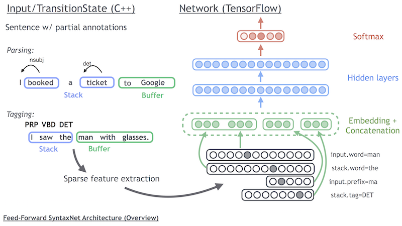
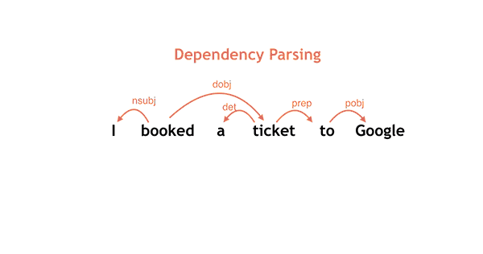
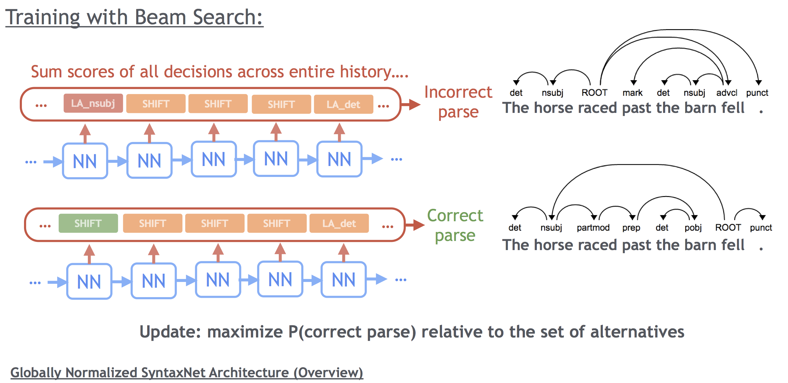

# SyntaxNet Tutorial

## Contents
* [Detailed Tutorial: Building an NLP Pipeline with SyntaxNet](#detailed-tutorial-building-an-nlp-pipeline-with-syntaxnet)
    * [Obtaining Data](#obtaining-data)
    * [Part-of-Speech Tagging](#part-of-speech-tagging)
    * [Training the SyntaxNet POS Tagger](#training-the-syntaxnet-pos-tagger)
    * [Preprocessing with the Tagger](#preprocessing-with-the-tagger)
    * [Dependency Parsing: Transition-Based Parsing](#dependency-parsing-transition-based-parsing)
    * [Training a Parser Step 1: Local Pretraining](#training-a-parser-step-1-local-pretraining)
    * [Training a Parser Step 2: Global Training](#training-a-parser-step-2-global-training)

## Detailed Tutorial: Building an NLP Pipeline with SyntaxNet

In this tutorial, we'll go over how to train new models, and explain in a bit
more technical detail the NLP side of the models. Our goal here is to explain
the NLP pipeline produced by this package.

### Obtaining Data

The included English parser, Parsey McParseface, was trained on the the standard
corpora of the [Penn Treebank](https://catalog.ldc.upenn.edu/LDC99T42) and
[OntoNotes](https://catalog.ldc.upenn.edu/LDC2013T19), as well as the [English
Web Treebank](https://catalog.ldc.upenn.edu/LDC2012T13), but these are
unfortunately not freely available.

However, the [Universal Dependencies](http://universaldependencies.org/) project
provides freely available treebank data in a number of languages. SyntaxNet can
be trained and evaluated on any of these corpora.

### Part-of-Speech Tagging

Consider the following sentence, which exhibits several ambiguities that affect
its interpretation:

> I saw the man with glasses.

This sentence is composed of words: strings of characters that are segmented
into groups (e.g. "I", "saw", etc.) Each word in the sentence has a *grammatical
function* that can be useful for understanding the meaning of language. For
example, "saw" in this example is a past tense of the verb "to see". But any
given word might have different meanings in different contexts: "saw" could just
as well be a noun (e.g., a saw used for cutting) or a present tense verb (using
a saw to cut something).

A logical first step in understanding language is figuring out these roles for
each word in the sentence. This process is called *Part-of-Speech (POS)
Tagging*. The roles are called POS tags. Although a given word might have
multiple possible tags depending on the context, given any one interpretation of
a sentence each word will generally only have one tag.

One interesting challenge of POS tagging is that the problem of defining a
vocabulary of POS tags for a given language is quite involved. While the concept
of nouns and verbs is pretty common, it has been traditionally difficult to
agree on a standard set of roles across all languages. The [Universal
Dependencies](http://www.universaldependencies.org) project aims to solve this
problem.

### Training the SyntaxNet POS Tagger

In general, determining the correct POS tag requires understanding the entire
sentence and the context in which it is uttered. In practice, we can do very
well just by considering a small window of words around the word of interest.
For example, words that follow the word ‘the’ tend to be adjectives or nouns,
rather than verbs.

To predict POS tags, we use a simple setup. We process the sentences
left-to-right. For any given word, we extract features of that word and a window
around it, and use these as inputs to a feed-forward neural network classifier,
which predicts a probability distribution over POS tags. Because we make
decisions in left-to-right order, we also use prior decisions as features in
subsequent ones (e.g. "the previous predicted tag was a noun.").

All the models in this package use a flexible markup language to define
features. For example, the features in the POS tagger are found in the
`brain_pos_features` parameter in the `TaskSpec`, and look like this (modulo
spacing):

```
stack(3).word stack(2).word stack(1).word stack.word input.word input(1).word input(2).word input(3).word;
input.digit input.hyphen;
stack.suffix(length=2) input.suffix(length=2) input(1).suffix(length=2);
stack.prefix(length=2) input.prefix(length=2) input(1).prefix(length=2)
```

Note that `stack` here means "words we have already tagged." Thus, this feature
spec uses three types of features: words, suffixes, and prefixes. The features
are grouped into blocks that share an embedding matrix, concatenated together,
and fed into a chain of hidden layers. This structure is based upon the model
proposed by [Chen and Manning (2014)]
(http://cs.stanford.edu/people/danqi/papers/emnlp2014.pdf).

We show this layout in the schematic below: the state of the system (a stack and
a buffer, visualized below for both the POS and the dependency parsing task) is
used to extract sparse features, which are fed into the network in groups. We
show only a small subset of the features to simplify the presentation in the
schematic:



In the configuration above, each block gets its own embedding matrix and the
blocks in the configuration above are delineated with a semi-colon. The
dimensions of each block are controlled in the `brain_pos_embedding_dims`
parameter. **Important note:** unlike many simple NLP models, this is *not* a
bag of words model. Remember that although certain features share embedding
matrices, the above features will be concatenated, so the interpretation of
`input.word` will be quite different from `input(1).word`. This also means that
adding features increases the dimension of the `concat` layer of the model as
well as the number of parameters for the first hidden layer.

To train the model, first edit `syntaxnet/context.pbtxt` so that the inputs
`training-corpus`, `tuning-corpus`, and `dev-corpus` point to the location of
your training data. You can then train a part-of-speech tagger with:

```shell
bazel-bin/syntaxnet/parser_trainer \
  --task_context=syntaxnet/context.pbtxt \
  --arg_prefix=brain_pos \  # read from POS configuration
  --compute_lexicon \       # required for first stage of pipeline
  --graph_builder=greedy \  # no beam search
  --training_corpus=training-corpus \  # names of training/tuning set
  --tuning_corpus=tuning-corpus \
  --output_path=models \  # where to save new resources
  --batch_size=32 \       # Hyper-parameters
  --decay_steps=3600 \
  --hidden_layer_sizes=128 \
  --learning_rate=0.08 \
  --momentum=0.9 \
  --seed=0 \
  --params=128-0.08-3600-0.9-0  # name for these parameters
```

This will read in the data, construct a lexicon, build a tensorflow graph for
the model with the specific hyperparameters, and train the model. Every so often
the model will be evaluated on the tuning set, and only the checkpoint with the
highest accuracy on this set will be saved. **Note that you should never use a
corpus you intend to test your model on as your tuning set, as you will inflate
your test set results.**

For best results, you should repeat this command with at least 3 different
seeds, and possibly with a few different values for `--learning_rate` and
`--decay_steps`. Good values for `--learning_rate` are usually close to 0.1, and
you usually want `--decay_steps` to correspond to about one tenth of your
corpus. The `--params` flag is only a human readable identifier for the model
being trained, used to construct the full output path, so that you don't need to
worry about clobbering old models by accident.

The `--arg_prefix` flag controls which parameters should be read from the task
context file `context.pbtxt`. In this case `arg_prefix` is set to `brain_pos`,
so the paramters being used in this training run are
`brain_pos_transition_system`, `brain_pos_embedding_dims`, `brain_pos_features`
and, `brain_pos_embedding_names`. To train the dependency parser later
`arg_prefix` will be set to `brain_parser`.

### Preprocessing with the Tagger

Now that we have a trained POS tagging model, we want to use the output of this
model as features in the parser. Thus the next step is to run the trained model
over our training, tuning, and dev (evaluation) sets. We can use the
parser_eval.py` script for this.

For example, the model `128-0.08-3600-0.9-0` trained above can be run over the
training, tuning, and dev sets with the following command:

```shell
PARAMS=128-0.08-3600-0.9-0
for SET in training tuning dev; do
  bazel-bin/syntaxnet/parser_eval \
    --task_context=models/brain_pos/greedy/$PARAMS/context \
    --hidden_layer_sizes=128 \
    --input=$SET-corpus \
    --output=tagged-$SET-corpus \
    --arg_prefix=brain_pos \
    --graph_builder=greedy \
    --model_path=models/brain_pos/greedy/$PARAMS/model
done
```

**Important note:** This command only works because we have created entries for
you in `context.pbtxt` that correspond to `tagged-training-corpus`,
`tagged-dev-corpus`, and `tagged-tuning-corpus`. From these default settings,
the above will write tagged versions of the training, tuning, and dev set to the
directory `models/brain_pos/greedy/$PARAMS/`. This location is chosen because
the `input` entries do not have `file_pattern` set: instead, they have `creator:
brain_pos/greedy`, which means that `parser_trainer.py` will construct *new*
files when called with `--arg_prefix=brain_pos --graph_builder=greedy` using the
`--model_path` flag to determine the location.

For convenience, `parser_eval.py` also logs POS tagging accuracy after the
output tagged datasets have been written.

### Dependency Parsing: Transition-Based Parsing

Now that we have a prediction for the grammatical role of the words, we want to
understand how the words in the sentence relate to each other. This parser is
built around the *head-modifier* construction: for each word, we choose a
*syntactic head* that it modifies according to some grammatical role.

An example for the above sentence is as follows:


Below each word in the sentence we see both a fine-grained part-of-speech
(*PRP*, *VBD*, *DT*, *NN* etc.), and a coarse-grained part-of-speech (*PRON*,
*VERB*, *DET*, *NOUN*, etc.). Coarse-grained POS tags encode basic grammatical
categories, while the fine-grained POS tags make further distinctions: for
example *NN* is a singular noun (as opposed, for example, to *NNS*, which is a
plural noun), and *VBD* is a past-tense verb. For more discussion see [Petrov et
al. (2012)](http://www.lrec-conf.org/proceedings/lrec2012/pdf/274_Paper.pdf).

Crucially, we also see directed arcs signifying grammatical relationships
between different words in the sentence. For example *I* is the subject of
*saw*, as signified by the directed arc labeled *nsubj* between these words;
*man* is the direct object (dobj) of *saw*; the preposition *with* modifies
*man* with a prep relation, signifiying modification by a prepositional phrase;
and so on. In addition the verb *saw* is identified as the *root* of the entire
sentence.

Whenever we have a directed arc between two words, we refer to the word at the
start of the arc as the *head*, and the word at the end of the arc as the
*modifier*. For example we have one arc where the head is *saw* and the modifier
is *I*, another where the head is *saw* and the modifier is *man*, and so on.

The grammatical relationships encoded in dependency structures are directly
related to the underlying meaning of the sentence in question. They allow us to
easily recover the answers to various questions, for example *whom did I see?*,
*who saw the man with glasses?*, and so on.

SyntaxNet is a **transition-based** dependency parser [Nivre (2007)]
(http://www.mitpressjournals.org/doi/pdfplus/10.1162/coli.07-056-R1-07-027) that
constructs a parse incrementally. Like the tagger, it processes words
left-to-right. The words all start as unprocessed input, called the *buffer*. As
words are encountered they are put onto a *stack*. At each step, the parser can
do one of three things:

1.  **SHIFT:** Push another word onto the top of the stack, i.e. shifting one
    token from the buffer to the stack.
1.  **LEFT_ARC:** Pop the top two words from the stack. Attach the second to the
    first, creating an arc pointing to the **left**. Push the **first** word
    back on the stack.
1.  **RIGHT_ARC:** Pop the top two words from the stack. Attach the second to
    the first, creating an arc point to the **right**. Push the **second** word
    back on the stack.

At each step, we call the combination of the stack and the buffer the
*configuration* of the parser. For the left and right actions, we also assign a
dependency relation label to that arc. This process is visualized in the
following animation for a short sentence:



Note that this parser is following a sequence of actions, called a
**derivation**, to produce a "gold" tree labeled by a linguist. We can use this
sequence of decisions to learn a classifier that takes a configuration and
predicts the next action to take.

### Training a Parser Step 1: Local Pretraining

As described in our [paper](http://arxiv.org/abs/1603.06042), the first
step in training the model is to *pre-train* using *local* decisions. In this
phase, we use the gold dependency to guide the parser, and train a softmax layer
to predict the correct action given these gold dependencies. This can be
performed very efficiently, since the parser's decisions are all independent in
this setting.

Once the tagged datasets are available, a locally normalized dependency parsing
model can be trained with the following command:

```shell
bazel-bin/syntaxnet/parser_trainer \
  --arg_prefix=brain_parser \
  --batch_size=32 \
  --projectivize_training_set \
  --decay_steps=4400 \
  --graph_builder=greedy \
  --hidden_layer_sizes=200,200 \
  --learning_rate=0.08 \
  --momentum=0.85 \
  --output_path=models \
  --task_context=models/brain_pos/greedy/$PARAMS/context \
  --seed=4 \
  --training_corpus=tagged-training-corpus \
  --tuning_corpus=tagged-tuning-corpus \
  --params=200x200-0.08-4400-0.85-4
```

Note that we point the trainer to the context corresponding to the POS tagger
that we picked previously. This allows the parser to reuse the lexicons and the
tagged datasets that were created in the previous steps. Processing data can be
done similarly to how tagging was done above. For example if in this case we
picked parameters `200x200-0.08-4400-0.85-4`, the training, tuning and dev sets
can be parsed with the following command:

```shell
PARAMS=200x200-0.08-4400-0.85-4
for SET in training tuning dev; do
  bazel-bin/syntaxnet/parser_eval \
    --task_context=models/brain_parser/greedy/$PARAMS/context \
    --hidden_layer_sizes=200,200 \
    --input=tagged-$SET-corpus \
    --output=parsed-$SET-corpus \
    --arg_prefix=brain_parser \
    --graph_builder=greedy \
    --model_path=models/brain_parser/greedy/$PARAMS/model
done
```

### Training a Parser Step 2: Global Training

As we describe in the paper, there are several problems with the locally
normalized models we just trained. The most important is the *label-bias*
problem: the model doesn't learn what a good parse looks like, only what action
to take given a history of gold decisions. This is because the scores are
normalized *locally* using a softmax for each decision.

In the paper, we show how we can achieve much better results using a *globally*
normalized model: in this model, the softmax scores are summed in log space, and
the scores are not normalized until we reach a final decision. When the parser
stops, the scores of each hypothesis are normalized against a small set of
possible parses (in the case of this model, a beam size of 8). When training, we
force the parser to stop during parsing when the gold derivation falls off the
beam (a strategy known as early-updates).

We give a simplified view of how this training works for a [garden path
sentence](https://en.wikipedia.org/wiki/Garden_path_sentence), where it is
important to maintain multiple hypotheses. A single mistake early on in parsing
leads to a completely incorrect parse; after training, the model learns to
prefer the second (correct) parse.



Parsey McParseface correctly parses this sentence. Even though the correct parse
is initially ranked 4th out of multiple hypotheses, when the end of the garden
path is reached, Parsey McParseface can recover due to the beam; using a larger
beam will get a more accurate model, but it will be slower (we used beam 32 for
the models in the paper).

Once you have the pre-trained locally normalized model, a globally normalized
parsing model can now be trained with the following command:

```shell
bazel-bin/syntaxnet/parser_trainer \
  --arg_prefix=brain_parser \
  --batch_size=8 \
  --decay_steps=100 \
  --graph_builder=structured \
  --hidden_layer_sizes=200,200 \
  --learning_rate=0.02 \
  --momentum=0.9 \
  --output_path=models \
  --task_context=models/brain_parser/greedy/$PARAMS/context \
  --seed=0 \
  --training_corpus=projectivized-training-corpus \
  --tuning_corpus=tagged-tuning-corpus \
  --params=200x200-0.02-100-0.9-0 \
  --pretrained_params=models/brain_parser/greedy/$PARAMS/model \
  --pretrained_params_names=\
embedding_matrix_0,embedding_matrix_1,embedding_matrix_2,\
bias_0,weights_0,bias_1,weights_1
```

Training a beam model with the structured builder will take a lot longer than
the greedy training runs above, perhaps 3 or 4 times longer. Note once again
that multiple restarts of training will yield the most reliable results.
Evaluation can again be done with `parser_eval.py`. In this case we use
parameters `200x200-0.02-100-0.9-0` to evaluate on the training, tuning and dev
sets with the following command:

```shell
PARAMS=200x200-0.02-100-0.9-0
for SET in training tuning dev; do
  bazel-bin/syntaxnet/parser_eval \
    --task_context=models/brain_parser/structured/$PARAMS/context \
    --hidden_layer_sizes=200,200 \
    --input=tagged-$SET-corpus \
    --output=beam-parsed-$SET-corpus \
    --arg_prefix=brain_parser \
    --graph_builder=structured \
    --model_path=models/brain_parser/structured/$PARAMS/model
done
```

Hooray! You now have your very own cousin of Parsey McParseface, ready to go out
and parse text in the wild.
