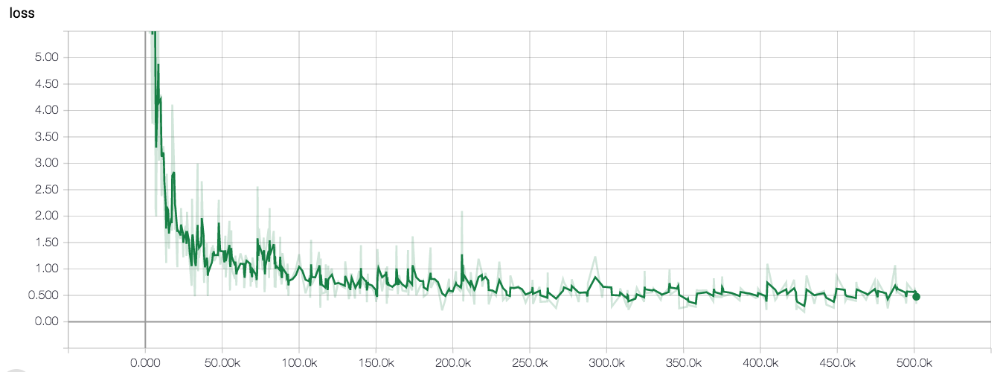
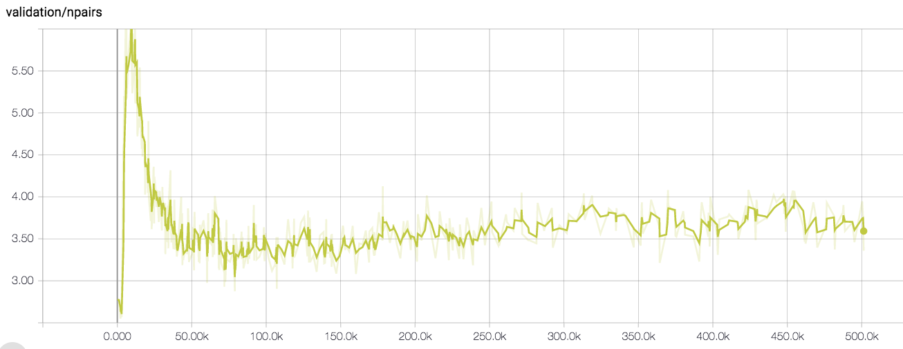
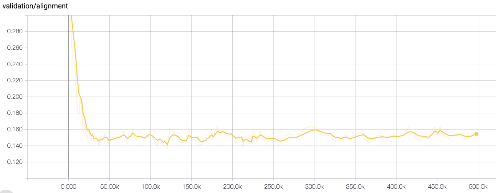
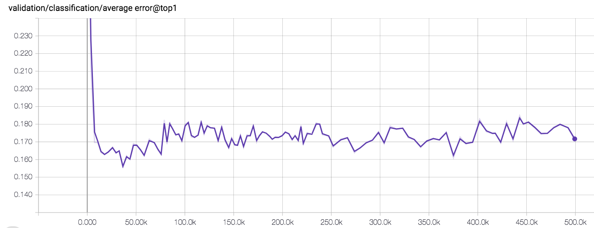
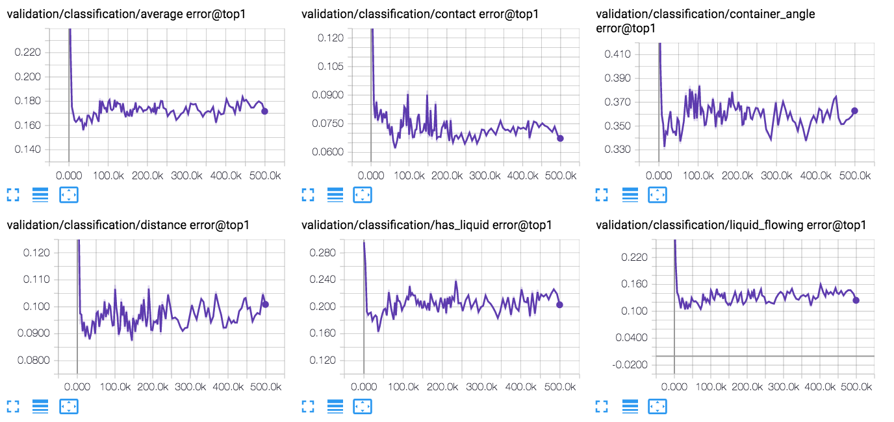
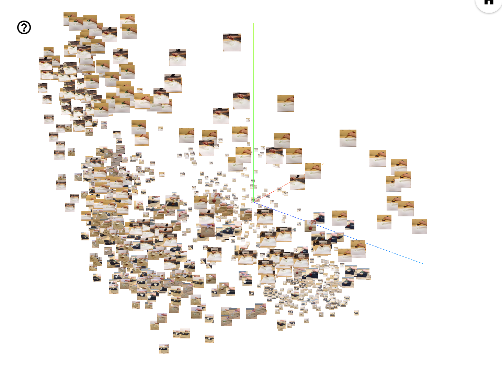

# Time Contrastive Networks

This implements ["Time Contrastive Networks"](https://arxiv.org/abs/1704.06888),
which is part of the larger [Self-Supervised Imitation
Learning](https://sermanet.github.io/imitation/) project.


## Contacts

Maintainers of TCN:

*   Corey Lynch: [github](https://github.com/coreylynch),
    [twitter](https://twitter.com/coreylynch)
*   Pierre Sermanet: [github](https://github.com/sermanet),
    [twitter](https://twitter.com/psermanet)

## Contents

*   [Getting Started](#getting-started)
    *   [Install Dependencies](#install-dependencies)
    *   [Download the Inception v3
        Checkpoint](#download-pretrained-inceptionv3-checkpoint)
    *   [Run all the tests](#run-all-the-tests)
*   [Concepts](#concepts)
    *   [Multi-view Webcam Video](#multi-view-webcam-video)
    *   [Data Pipelines](#data-pipelines)
    *   [Estimators](#estimators)
    *   [Models](#models)
    *   [Losses](#losses)
    *   [Inference](#inference)
    *   [Configuration](#configuration)
    *   [Monitoring Training](#monitoring-training)
        *   [KNN Classification Error](#knn-classification-error)
        *   [KNN Classification Error](#multi-view-alignment)
    *   [Visualization](#visualization)
        *   [Nearest Neighbor Imitation
            Videos](#nearest-neighbor-imitation-videos)
        *   [PCA & T-SNE Visualization](#pca-t-sne-visualization)
*   [Tutorial Part I: Collecting Multi-View Webcam
    Videos](#tutorial-part-i-collecting-multi-view-webcam-videos)
    *   [Collect Webcam Videos](#collect-webcam-videos)
    *   [Create TFRecords](#create-tfrecords)
*   [Tutorial Part II: Training, Evaluation, and
    Visualization](#tutorial-part-ii-training-evaluation-and-visualization)
    *   [Download Data](#download-data)
    *   [Download the Inception v3
        Checkpoint](#download-pretrained-inceptionv3-checkpoint)
    *   [Define a Config](#define-a-config)
    *   [Train](#train)
    *   [Evaluate](#evaluate)
    *   [Monitor training](#monior-training)
    *   [Visualize](#visualize)
        *   [Generate Imitation Videos](#generate-imitation-videos)
        *   [Run PCA & T-SNE Visualization](#t-sne-pca-visualization)

## Getting started

### Install Dependencies

*   [Tensorflow nightly build](https://pypi.python.org/pypi/tf-nightly-gpu) or
    via `pip install tf-nightly-gpu`.
*   [Bazel](http://bazel.io/docs/install.html)
*   matplotlib
*   sklearn
*   opencv

### Download Pretrained InceptionV3 Checkpoint

Run the script that downloads the pretrained InceptionV3 checkpoint:

```bash
cd tensorflow-models/tcn
python download_pretrained.py
```

### Run all the tests

```bash
bazel test :all
```

## Concepts

### Multi-View Webcam Video

We provide utilities to collect your own multi-view videos in dataset/webcam.py.
See the [webcam tutorial](#tutorial-part-i-collecting-multi-view-webcam-videos)
for an end to end example of how to collect multi-view webcam data and convert
it to the TFRecord format expected by this library.

## Data Pipelines

We use the [tf.data.Dataset
API](https://www.tensorflow.org/guide/datasets) to construct input
pipelines that feed training, evaluation, and visualization. These pipelines are
defined in `data_providers.py`.

## Estimators

We define training, evaluation, and inference behavior using the
[tf.estimator.Estimator
API](https://www.tensorflow.org/api_docs/python/tf/estimator/Estimator). See
`estimators/mvtcn_estimator.py` for an example of how multi-view TCN training,
evaluation, and inference is implemented.

## Models

Different embedder architectures are implemented in model.py. We used the
`InceptionConvSSFCEmbedder` in the pouring experiments, but we're also
evaluating `Resnet` embedders.

## Losses

We use the
[tf.contrib.losses.metric_learning](https://www.tensorflow.org/versions/master/api_docs/python/tf/contrib/losses/metric_learning)
library's implementations of triplet loss with semi-hard negative mining and
npairs loss. In our experiments, npairs loss has better empirical convergence
and produces the best qualitative visualizations, and will likely be our choice
for future experiments. See the
[paper](http://www.nec-labs.com/uploads/images/Department-Images/MediaAnalytics/papers/nips16_npairmetriclearning.pdf)
for details on the algorithm.

## Inference

We support 3 modes of inference for trained TCN models:

*   Mode 1: Input is a tf.Estimator input_fn (see
    [this](https://www.tensorflow.org/api_docs/python/tf/estimator/Estimator#predict)
    for details). Output is an iterator over embeddings and additional metadata.
    See `labeled_eval.py` for a usage example.

*   Mode 2: Input is a TFRecord or (or list of TFRecords). This returns an
    iterator over tuples of (embeddings, raw_image_strings, sequence_name),
    where embeddings is the [num views, sequence length, embedding size] numpy
    array holding the full embedded sequence (for all views), raw_image_strings
    is a [num views, sequence length] string array holding the jpeg-encoded raw
    image strings, and sequence_name is the name of the sequence. See
    `generate_videos.py` for a usage example.

*   Mode 3: Input is a numpy array of size [num images, height, width, num
    channels]. This returns a tuple of (embeddings, raw_image_strings), where
    embeddings is a 2-D float32 numpy array holding [num_images, embedding_size]
    image embeddings, and raw_image_strings is a 1-D string numpy array holding
    [batch_size] jpeg-encoded image strings. This can be used as follows:

    ```python
    images = np.random.uniform(0, 1, size=(batch_size, 1080, 1920, 3))
    embeddings, _ = estimator.inference(
        images, checkpoint_path=checkpoint_path)
    ```

See `estimators/base_estimator.py` for details.

## Configuration

Data pipelines, training, eval, and visualization are all configured using
key-value parameters passed as [YAML](https://en.wikipedia.org/wiki/YAML) files.
Configurations can be nested, e.g.:

```yaml
learning:
  optimizer: 'adam'
  learning_rate: 0.001
```

### T objects

YAML configs are converted to LuaTable-like `T` object (see
`utils/luatables.py`), which behave like a python `dict`, but allow you to use
dot notation to access (nested) keys. For example we could access the learning
rate in the above config snippet via `config.learning.learning_rate`.

### Multiple Configs

Multiple configs can be passed to the various binaries as a comma separated list
of config paths via the `--config_paths` flag. This allows us to specify a
default config that applies to all experiments (e.g. how often to write
checkpoints, default embedder hyperparams) and one config per experiment holding
the just hyperparams specific to the experiment (path to data, etc.).

See `configs/tcn_default.yml` for an example of our default config and
`configs/pouring.yml` for an example of how we define the pouring experiments.

Configs are applied left to right. For example, consider two config files:

default.yml

```yaml
learning:
  learning_rate: 0.001 # Default learning rate.
  optimizer: 'adam'
```

myexperiment.yml

```yaml
learning:
  learning_rate: 1.0 # Experiment learning rate (overwrites default).
data:
  training: '/path/to/myexperiment/training.tfrecord'
```

Running

```bash
bazel run train.py --config_paths='default.yml,myexperiment.yml'
```

results in a final merged config called final_training_config.yml

```yaml
learning:
  optimizer: 'adam'
  learning_rate: 1.0
data:
  training: '/path/to/myexperiment/training.tfrecord'
```

which is created automatically and stored in the experiment log directory
alongside model checkpoints and tensorboard summaries. This gives us a record of
the exact configs that went into each trial.

## Monitoring training

We usually look at two validation metrics during training: knn classification
error and multi-view alignment.

### KNN-Classification Error

In cases where we have labeled validation data, we can compute the average
cross-sequence KNN classification error (1.0 - recall@k=1) over all embedded
labeled images in the validation set. See `labeled_eval.py`.

### Multi-view Alignment

In cases where there is no labeled validation data, we can look at the how well
our model aligns multiple views of same embedded validation sequences. That is,
for each embedded validation sequence, for all cross-view pairs, we compute the
scaled absolute distance between ground truth time indices and knn time indices.
See `alignment.py`.

## Visualization

We visualize the embedding space learned by our models in two ways: nearest
neighbor imitation videos and PCA/T-SNE.

### Nearest Neighbor Imitation Videos

One of the easiest way to evaluate the understanding of your model is to see how
well the model can semantically align two videos via nearest neighbors in
embedding space.

Consider the case where we have multiple validation demo videos of a human or
robot performing the same task. For example, in the pouring experiments, we
collected many different multiview validation videos of a person pouring the
contents of one container into another, then setting the container down. If we'd
like to see how well our embeddings generalize across viewpoint, object/agent
appearance, and background, we can construct what we call "Nearest Neighbor
Imitation" videos, by embedding some validation query sequence `i` from view 1,
and finding the nearest neighbor for each query frame in some embedded target
sequence `j` filmed from view 1.
[Here's](https://sermanet.github.io/tcn/docs/figs/pouring_human.mov.gif) an
example of the final product.

See `generate_videos.py` for details.

### PCA & T-SNE Visualization

We can also embed a set of images taken randomly from validation videos and
visualize the embedding space using PCA projection and T-SNE in the tensorboard
projector. See `visualize_embeddings.py` for details.

## Tutorial Part I: Collecting Multi-View Webcam Videos

Here we give an end-to-end example of how to collect your own multiview webcam
videos and convert them to the TFRecord format expected by training.

Note: This was tested with up to 8 concurrent [Logitech c930e
webcams](https://www.logitech.com/en-us/product/c930e-webcam) extended with
[Plugable 5 Meter (16 Foot) USB 2.0 Active Repeater Extension
Cables](https://www.amazon.com/gp/product/B006LFL4X0/ref=oh_aui_detailpage_o05_s00?ie=UTF8&psc=1).

### Collect webcam videos

Go to dataset/webcam.py

1.  Plug your webcams in and run

    ```bash
    ls -ltrh /dev/video*
    ```

    You should see one device listed per connected webcam.

2.  Define some environment variables describing the dataset you're collecting.

    ```bash
    dataset=tutorial  # Name of the dataset.
    mode=train  # E.g. 'train', 'validation', 'test', 'demo'.
    num_views=2 # Number of webcams.
    viddir=/tmp/tcn/videos # Output directory for the videos.
    tmp_imagedir=/tmp/tcn/tmp_images # Temp directory to hold images.
    debug_vids=1 # Whether or not to generate side-by-side debug videos.
    export DISPLAY=:0.0  # This allows real time matplotlib display.
    ```

3.  Run the webcam.py script.

    ```bash
    bazel build -c opt --copt=-mavx webcam && \
    bazel-bin/webcam \
    --dataset $dataset \
    --mode $mode \
    --num_views $num_views \
    --tmp_imagedir $tmp_imagedir \
    --viddir $viddir \
    --debug_vids 1
    ```

4.  Hit Ctrl-C when done collecting, upon which the script will compile videos
    for each view and optionally a debug video concatenating multiple
    simultaneous views.

5.  If `--seqname` flag isn't set, the script will name the first sequence '0',
    the second sequence '1', and so on (meaning you can just keep rerunning step
    3.). When you are finished, you should see an output viddir with the
    following structure:

    ```bash
    videos/0_view0.mov
    videos/0_view1.mov
    ...
    videos/0_viewM.mov
    videos/1_viewM.mov
    ...
    videos/N_viewM.mov
    for N sequences and M webcam views.
    ```

### Create TFRecords

Use `dataset/videos_to_tfrecords.py` to convert the directory of videos into a
directory of TFRecords files, one per multi-view sequence.

```bash
viddir=/tmp/tcn/videos
dataset=tutorial
mode=train
videos=$viddir/$dataset

bazel build -c opt videos_to_tfrecords && \
bazel-bin/videos_to_tfrecords --logtostderr \
--input_dir $videos/$mode \
--output_dir ~/tcn_data/$dataset/$mode \
--max_per_shard 400
```

Setting `--max_per_shard` > 0 allows you to shard training data. We've observed
that sharding long training sequences provides better performance in terms of
global steps/sec.

This should be left at the default of 0 for validation / test data.

You should now have a directory of TFRecords files with the following structure:

```bash
output_dir/0.tfrecord
...
output_dir/N.tfrecord

1 TFRecord file for each of N multi-view sequences.
```

Now we're ready to move on to part II: training, evaluation, and visualization.

## Tutorial Part II: Training, Evaluation, and Visualization

Here we give an end-to-end example of how to train, evaluate, and visualize the
embedding space learned by TCN models.

### Download Data

We will be using the 'Multiview Pouring' dataset, which can be downloaded using
the download.sh script
[here.](https://sites.google.com/site/brainrobotdata/home/multiview-pouring)

The rest of the tutorial will assume that you have your data downloaded to a
folder at `~/tcn_data`.

```bash
mkdir ~/tcn_data
mv ~/Downloads/download.sh ~/tcn_data
./download.sh
```

You should now have the following path containing all the data:

```bash
ls ~/tcn_data/multiview-pouring
labels  README.txt  tfrecords  videos
```

### Download Pretrained Inception Checkpoint

If you haven't already, run the script that downloads the pretrained InceptionV3
checkpoint:

```bash
python download_pretrained.py
```

### Define A Config

For our experiment, we create 2 configs:

*   `configs/tcn_default.yml`: This contains all the default hyperparameters
    that generally don't vary across experiments.
*   `configs/pouring.yml`: This contains all the hyperparameters that are
    specific to the pouring experiment.

Important note about `configs/pouring.yml`:

*   data.eval_cropping: We use 'pad200' for the pouring dataset, which was
    filmed rather close up on iphone cameras. A better choice for data filmed on
    webcam is likely 'crop_center'. See preprocessing.py for options.

### Train

Run the training binary:

```yaml
logdir=/tmp/tcn/pouring
c=configs
configs=$c/tcn_default.yml,$c/pouring.yml

bazel build -c opt --copt=-mavx --config=cuda train && \
bazel-bin/train \
--config_paths $configs --logdir $logdir
```

### Evaluate

Run the binary that computes running validation loss. Set `export
CUDA_VISIBLE_DEVICES=` to run on CPU.

```bash
bazel build -c opt --copt=-mavx eval && \
bazel-bin/eval \
--config_paths $configs --logdir $logdir
```

Run the binary that computes running validation cross-view sequence alignment.
Set `export CUDA_VISIBLE_DEVICES=` to run on CPU.

```bash
bazel build -c opt --copt=-mavx alignment && \
bazel-bin/alignment \
--config_paths $configs --checkpointdir $logdir --outdir $logdir
```

Run the binary that computes running labeled KNN validation error. Set `export
CUDA_VISIBLE_DEVICES=` to run on CPU.

```bash
bazel build -c opt --copt=-mavx labeled_eval && \
bazel-bin/labeled_eval \
--config_paths $configs --checkpointdir $logdir --outdir $logdir
```

### Monitor training

Run `tensorboard --logdir=$logdir`. After a bit of training, you should see
curves that look like this:

#### Training loss



#### Validation loss



#### Validation Alignment



#### Average Validation KNN Classification Error



#### Individual Validation KNN Classification Errors



### Visualize

To visualize the embedding space learned by a model, we can:

#### Generate Imitation Videos

```bash
# Use the automatically generated final config file as config.
configs=$logdir/final_training_config.yml
# Visualize checkpoint 40001.
checkpoint_iter=40001
# Use validation records for visualization.
records=~/tcn_data/multiview-pouring/tfrecords/val
# Write videos to this location.
outdir=$logdir/tcn_viz/imitation_vids
```

```bash
bazel build -c opt --config=cuda --copt=-mavx generate_videos && \
bazel-bin/generate_videos \
--config_paths $configs \
--checkpointdir $logdir \
--checkpoint_iter $checkpoint_iter \
--query_records_dir $records \
--target_records_dir $records \
--outdir $outdir
```

After the script completes, you should see a directory of videos with names
like:

`$outdir/qtrain_clearodwalla_to_clear1_realv1_imtrain_clearsoda_to_white13_realv0.mp4`

that look like this: 

#### T-SNE / PCA Visualization

Run the binary that generates embeddings and metadata.

```bash
outdir=$logdir/tcn_viz/embedding_viz
bazel build -c opt --config=cuda --copt=-mavx visualize_embeddings && \
bazel-bin/visualize_embeddings \
--config_paths $configs \
--checkpointdir $logdir \
--checkpoint_iter $checkpoint_iter \
--embedding_records $records \
--outdir $outdir \
--num_embed 1000 \
--sprite_dim 64
```

Run tensorboard, pointed at the embedding viz output directory.

```
tensorboard --logdir=$outdir
```

You should see something like this in tensorboard.

