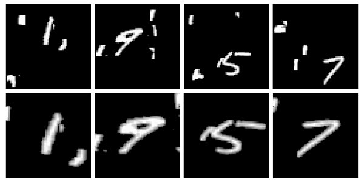
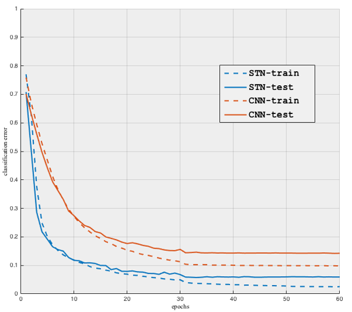

# Spatial Transformer Networks

This example demonstrates the use of a Spatial Transformer Network
for classifying distorted MNIST digits in clutter. 
The source files used in this examples can be found in the 
`examples/spatial_transformer` directory.

The spatial transformer network is defined in the `cnn_stn_cluttered_mnist.m`
file. It has three components: (1) a localization network which
predicts six affine transformation parameters for an input image,
(2) a bilinear sampler which applies the above transformation
to the input image, and (3) a classification network which classifies the 
output of the bilinear sampler.

The picture below shows input images and their transformed versions as determined
by the STN. Note how the STN has learned to rectify the input image.

The following graph compares the training and test errors of two CNNs:
a STN and, a plain classification CNN (with the same configuration as the
classification component of the STN). We note that the STN performs significantly
better (STN test-error = 5.7%, CNN test-error = 14.2%).

