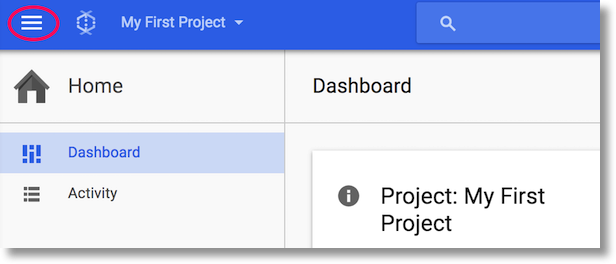
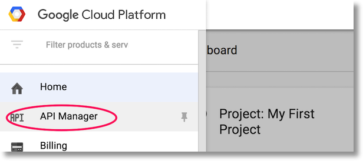
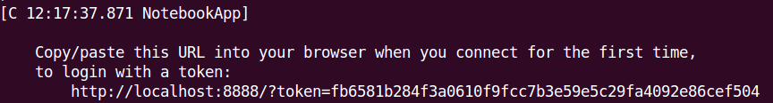
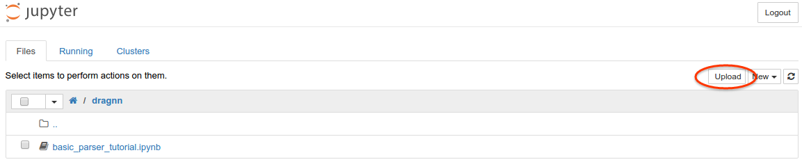
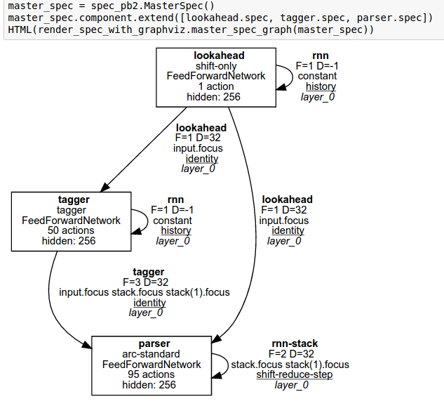
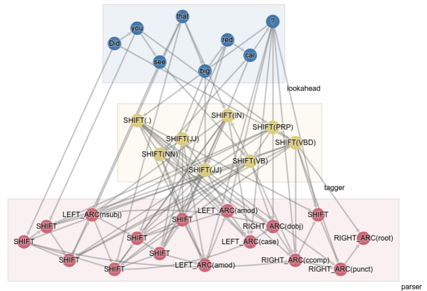
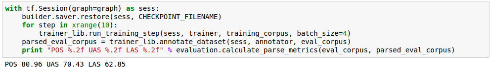

# Running DRAGNN docker image on the Cloud

These instructions will show you how to start a Google Compute Engine (GCE) VM
with Docker installed, and how to run the DRAGNN container there.

## Initial setup

### 1. Create a Google Cloud Platform account

Sign up for a [free trial](https://cloud.google.com/free-trial/) of Google Cloud
Platform (GCP). You will need a credit card to sign up, and you will receive
$300 of free credits. *Note: you will not be billed, unless you decide to renew
after the trial ends.*

**Important note:** If you prefer, feel free to use an alternative Cloud
provider.

#### 1.1 Enable the necessary APIs

1.  Go to the Google Cloud console: console.cloud.google.com
1.  Select or create a project using the project drop-down at upper-left ('My
    First Project' in image below)
1.  Click on the “hamburger” menu at upper-left, and then “API Manager”.
1.  On the left nav, choose "Dashboard" if not already selected, then choose
    "+Enable API" in the top-middle of page.
1.  Enter "Google Compute Engine API" in the search box and click it when it
    appears in the list of results.
1.  Click on “Enable” (top-middle of page).





### 2. Connect to your project's Cloud Shell

Click on the Cloud Shell icon (leftmost icon in the set of icons at top-right of
the page).


Click on "Start Cloud Shell" on the bottom right of the pop-up screen. You
should now see a terminal at the bottom of your window for the Cloud Shell with
the text "Welcome to Cloud Shell! Type "help" to get started."

### 3. Create a container-optimized image in GCE

Run this command in the Cloud Shell.

```shell
gcloud compute instances create dragnn-instance \
    --image-family gci-stable \
    --image-project google-containers \
    --zone us-central1-b --boot-disk-size=100GB \
    --machine-type n1-standard-1
```

After you run this command, you can ignore the "I/O performance warning for
disks < 200GB".

### 4. Set up a firewall rule for your project that will allow access to the IPython notebook server

```shell
gcloud compute firewall-rules create dragnn-ipython --allow tcp:8888
```

### 5. SSH into the new GCE instance, in a new browser window

-   Click on the “hamburger” menu at upper-left, and then “Compute Engine”
-   Find your instance in the list (mid-page)
-   Write down the "External IP", this is the IP of your Cloud instance
-   Logon to instance by clicking on the “SSH” pulldown menu on the right.
    Select “Open in browser window”.
-   A new browser window will open, with a command line into your GCE instance.
    Confirm that you wish to initiate an SSH connection to the instance.

### 6. Start the Docker container in the GCE image (in the newly opened SSH browser window):

Run this command to download and run the container, setting up the port
forwarding to be able to access the notebook.

```shell
sudo docker run --rm -ti -p 8888:8888 tensorflow/syntaxnet
```

### 7. Connect to the server, load the IPython Notebook

Connect to the server, using the link in the Docker log output. Replace
`localhost` with the "External IP" from step #5 followed by :8888, i.e.
`<External_IP>:8888` in the address bar.



Upload your data if necessary:




### 8. Run the notebook

You can build the DRAGNN network and visualize its architecture:



Unroll the network dynamically on a given input:



Run training and evaluation:


