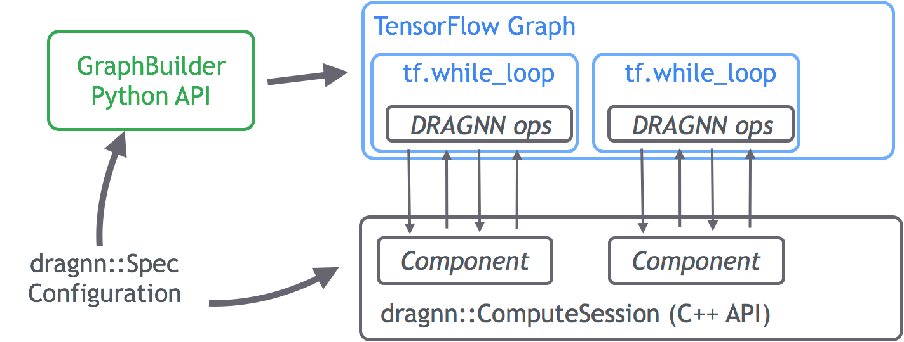
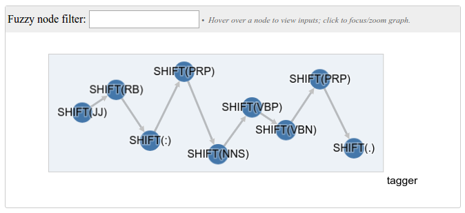
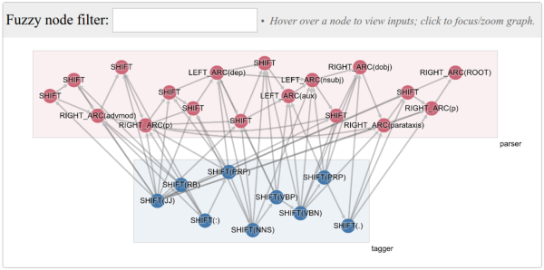

# DRAGNN Documentation

## Overview

TensorFlow DRAGNN (Dynamic Recurrent Acyclic Graphical Neural Network) is a
toolbox to build and learn fully dynamic neural computation graphs in
TensorFlow. Unlike a traditional recursive neural network (for example, dynamic
batching models such as [TensorFlow
Fold](https://www.google.com/url?q=https://github.com/tensorflow/fold&sa=D&ust=1489097582751000&usg=AFQjCNHQ3g8z3CBAYwkjZHULMPR4woQIXA)),
a DRAGNN uses a learned policy to add recurrent edges to a computation graph on
the fly, as a function of both input and outputs of the network.

Why do we need fully dynamic computation graphs? As it turns out, such models
arise naturally when utilizing deep learning to build a pipelines of reusable
components. For example, natural language understanding can be broken down into
separately useful stages:

-   A _segmentation_ module first breaks a string of characters into discrete
    words, along with vector representations of those words.
-   A _tagging_ module labels each word with properties such as part-of-speech,
    morphological tags, or links to external knowledge bases, as injects
    grounded knowledge into the vector representation.
-   A _parsing_ module uses the word representations to construct phrases and
    generates vector representations for each phrase.
-   _Sentence-level reasoning_ modules reason about the meaning of phrases --
    for example, sentiment or semantic roles, and construct semantic
    representations of the sentence.

The DRAGNN library provides a framework to define and train such a pipeline in a
single TensorFlow graph. This graph must necessarily be dynamic in order to
account for the discrete intermediate structures, such as parse trees, phrases,
and spans. Furthermore, the library allows joint models to be trained in a
multi-task framework, even when annotations for particular intermediate tasks
are missing.

## How DRAGNN works

Given that TensorFlow doesn’t support fully dynamic computation efficiently out
of the box, how do we add it? DRAGNN adds a C++ API, the dragnn::ComputeSession,
that exists alongside the TensorFlow graph. The ComputeSession is responsible
for managing the discrete dynamics of the computation graph. We introduce new
TensorFlow Ops that can read and write to the ComputeSession that are used
inside of vanilla TensorFlow conditional operations:

To build this TensorFlow graph, we define a modular API, called the DRAGNN
GraphBuilder. This takes as input a master configuration file, the `dragnn.Spec`
protocol buffer, and constructs the TensorFlow graph with the appropriate DRAGNN
ops. Once built, the TensorFlow graph never changes, much like how TensorFlow
Fold works.

## Defining a DRAGNN graph (concepts)

DRAGNN is a modular framework: unlike vanilla TensorFlow RNN’s, DRAGNN’s must be
defined in terms of re-usable pieces. To define a complete model, we first
specify how these pieces should be connected to construct the model we want, and
then we pass this specification to the GraphBuilder.  

At the highest level, a DRAGNN is a series of connected pieces called
Components. Each Component represents some neural net processing of a complete
pass over a batch of input data. How much processing, how to interpret the input
and extract features, and the internal structure of the neural network, are all
properties of the component

> **SyntaxNet running example** (`examples/dragnn/tutorial_1.py`): A SyntaxNet
> Part-of-Speech (POS) tagger is a single Component that accepts a batch of
> `syntaxnet::Sentence` protocol buffers, iterates over each token, extracts
> features, feeds them into a feed-forward neural network, and predicts a POS
> tag to each token.

Because DRAGNN connects multiple Components in a single TensorFlow graph,
multiple annotation tasks can be pipelined together. Each Component operates on
the same batch of serialized data, and the output of the graph is the final
annotated result.

> **SyntaxNet running example** (`examples/dragnn/tutorial_2.py`): Parsey
> McParseface first performs POS tagging, followed by dependency parsing. Both
> tasks can be modeled by two Components which operate over the same batch of
> `syntaxnet::Sentence` protocol buffers. The first performs POS tagging, while
> the second uses the predicted POS tags as features (written to the underlying
> protobufs by the POS tagger) and predicts dependency parse trees.

However, the real power of DRAGNN is the ability of one Component to learn
representations that are useful for downstream Components. As each Component
iterates over the data, it writes intermediate representations to a
`tf.TensorArray` object. Downstream Components can then read the representations
populated by upstream ones. During training, errors are back-propagated from
downstream Components to tune the representations from upstream ones. This
process is called
[stack-propagation](https://www.google.com/url?q=https://arxiv.org/abs/1603.06598&sa=D&ust=1489097582771000&usg=AFQjCNHkjmnbfR2lEbGntcWbpE40lR157A).

> **SyntaxNet running example** (`TBD`): Instead of
> using the predicted POS tags from the POS tagger component, ParseySaurus
> reads the learned representations from the POS tagger directly. These
> representations contain all the information needed to predict the POS tags, so
> the parser still obtains the benefit of POS tagging. However, the parser is no
> longer sensitive to individual POS tag predictions, and is therefore more
> robust.

Finally, while Components may produce annotations, they are not required to.
Components can be defined purely to traverse the input in a particular manner
and produce representations for later components.

> **SyntaxNet running example** (`TBD`): A shift-only
> SyntaxNet Component doesn’t predict any annotations, but just consumes one
> token or character at a time. This is useful when the Component is running a
> LSTM: the LSTM can consume characters to form word representations, or consume
> words right-to-left to compute representations for the upcoming words when
> parsing. ParseySaurus uses such a LSTM-based Component to preprocess
> the data in right-to-left order and obtain richer input representations.

### How Components work

A Component has the following properties:

-   A global C++ backend configuration
-   Task-specific configuration for the Transition System
-   Configuration for feature extraction
-   Configuration for dynamic edge creation
-   Configuration for the Python GraphBuilder to construct the network cell
    inside a tf.while\_loop.

For more information on Components and their use, see the documentation in the
g3doc/dragnn/ directory.

## Feeding your DRAGNN data

A DRAGNN graph is fed with strings, and each Component determines how to
interpret them. For example, the SyntaxNetComponent expects each string to be a
serialized Sentence protocol buffer. (If you want to operate on Sentence
objects, it probably makes sense to add more `syntaxnet::TransitionSystem`
classes than write a new Component from scratch.)

If you want to to read other types of data, you will need to sub-class
InputBatchCache, a container which holds the strings and deserializes them into
typed data on demand. Usage is fairly straightforward; see the SyntaxNet
implementation for how to use it.

**Note: all Component's in the graph should use a single InputBatchCache
sub-class. If you need multiple data types, you'll want to have a single
InputBatchCache that has fields for each of your data types.**
